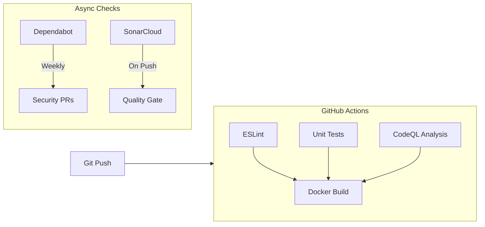

# DevOps Philosophy & Architecture

## Guiding Principles

### 1. Trunk-Based Development (Velocity)
We avoid long-lived feature branches.
-   **Commit Small, Commit Often**: Merge to `main` frequently.
-   **Main is Production**: The `main` branch is always in a deployable state.
-   **Feature Flags**: If a feature isn't ready, hide it behind a flag rather than keeping it in a stale branch.

### 2. Immutable Infrastructure (Reliability)
We never patch running servers.
-   **Artifacts**: The Docker image is the single source of truth.
-   **Promotion**: The *exact same image* that passed tests in CI is the one that runs in production. We don't rebuild for production; we just configure it differently.

### 3. Configuration as Code (12-Factor)
-   **Code**: Stored in Git.
-   **Config**: Stored in Environment Variables.
-   **Secrets**: Injected at runtime, never built into the image.

### 4. Open Source First (Accessibility)
We want Grocerun to be easy to self-host.
-   **Zero-Config Defaults**: The container should run with sensible defaults.
-   **Docker Compose**: We provide a `docker-compose.yml` that spins up the App + DB with one command.
-   **Public Registry**: Images are published to GHCR (GitHub Container Registry) so users don't need to build them manually.

## Deployment Architecture

### The "Build Once, Run Anywhere" Pipeline

1.  **Developer**: Pushes code to `main`.
2.  **CI (GitHub Actions)**:
    -   Runs tests/lints.
    -   Builds the Docker image (Multi-stage).
    -   Pushes to **GHCR** (`ghcr.io/chaixdev/grocerun:latest` and `:sha-xyz`).
3.  **CD (Deployment)**:
    -   **SaaS**: Auto-deploys to our staging/prod environment (e.g., via Watchtower or Webhook).
    -   **Self-Hosters**: Pull the latest image via `docker compose pull && docker compose up -d`.

### Deployment View

```mermaid
graph TD
    subgraph "Source (GitHub)"
        Dev[Developer] -->|Push Code| Repo[Main Branch]
    end

    subgraph "CI Pipeline (GitHub Actions)"
        Repo -->|Trigger| Test[Unit Tests & Lint]
        Test -->|Success| Build[Docker Build]
        Build -->|Publish| Registry[GitHub Container Registry (GHCR)]
    end

    subgraph "Production / Self-Hosted"
        Registry -->|Pull Image| Server[Docker Host]
        
        subgraph "Docker Compose Group"
            Server -->|Runs| App[Grocerun Container]
            Server -->|Runs| DB[(Postgres/SQLite)]
        end
        
        Env[".env file"] -->|Configures| App
    end

    classDef primary fill:#2563eb,stroke:#1d4ed8,color:white;
    classDef secondary fill:#475569,stroke:#334155,color:white;
    class Registry,App,DB primary;
    class Repo,Test,Build secondary;
```

## Self-Hosting Strategy
To support the open-source community, we will maintain a `docker-compose.prod.yml` in the root of the repo.

**Example User Workflow:**
```bash
# 1. Download compose file
curl -O https://raw.githubusercontent.com/chaixdev/grocerun/main/docker-compose.prod.yml

# 2. Configure (optional)
touch .env # Add secrets

# 3. Run
docker compose -f docker-compose.prod.yml up -d
```

## Continuous Quality & Security (DevSecOps)

To maintain "Enterprise Grade" quality in an open-source project, we leverage the GitHub ecosystem.

### 1. Static Application Security Testing (SAST)
*   **Tool**: **GitHub CodeQL**
*   **Why**: It's the industry standard for semantic code analysis. It finds vulnerabilities (SQLi, XSS) that linters miss. It runs natively in GitHub Actions.

### 2. Dependency Scanning (SCA)
*   **Tool**: **GitHub Dependabot**
*   **Why**: Automatically detects vulnerable dependencies (CVEs) and opens PRs to fix them. Zero friction.

### 3. Code Quality & Linting
*   **Tool**: **ESLint** (Strict Mode) + **SonarCloud** (Optional)
*   **Why**: ESLint catches syntax/style issues. SonarCloud provides "Quality Gates" (e.g., "New code must have 80% coverage", "No cognitive complexity > 15").

### 4. AI Code Review
*   **Tool**: **CodeRabbit**
*   **Why**: Provides immediate, high-level feedback on PRs, summarizing changes and catching logical errors before a human reviews.

### Pipeline Integration

