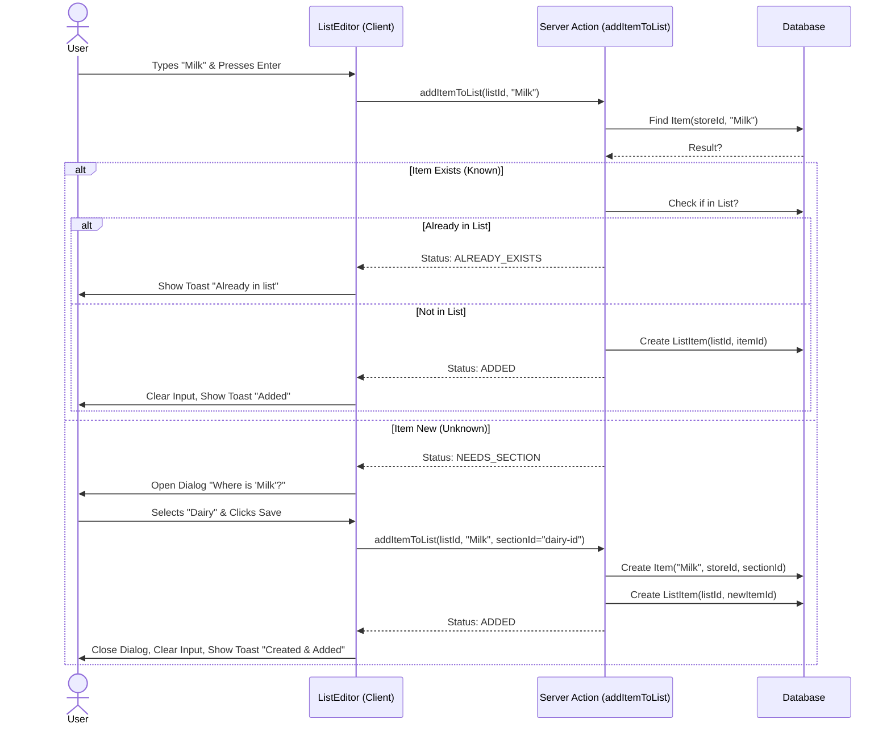

# Item Addition Flow (Organic Catalog)

```mermaid
sequenceDiagram
    actor User
    participant UI as ListEditor (Client)
    participant Server as Server Action (addItemToList)
    participant DB as Database

    User->>UI: Types "Milk" & Presses Enter
    UI->>Server: addItemToList(listId, "Milk")
    
    Server->>DB: Find Item(storeId, "Milk")
    DB-->>Server: Result?

    alt Item Exists (Known)
        Server->>DB: Check if in List?
        alt Already in List
            Server-->>UI: Status: ALREADY_EXISTS
            UI->>User: Show Toast "Already in list"
        else Not in List
            Server->>DB: Create ListItem(listId, itemId)
            Server-->>UI: Status: ADDED
            UI->>User: Clear Input, Show Toast "Added"
        end
    
    else Item New (Unknown)
        Server-->>UI: Status: NEEDS_SECTION
        UI->>User: Open Dialog "Where is 'Milk'?"
        User->>UI: Selects "Dairy" & Clicks Save
        
        UI->>Server: addItemToList(listId, "Milk", sectionId="dairy-id")
        Server->>DB: Create Item("Milk", storeId, sectionId)
        Server->>DB: Create ListItem(listId, newItemId)
        Server-->>UI: Status: ADDED
        UI->>User: Close Dialog, Clear Input, Show Toast "Created & Added"
    end
```
