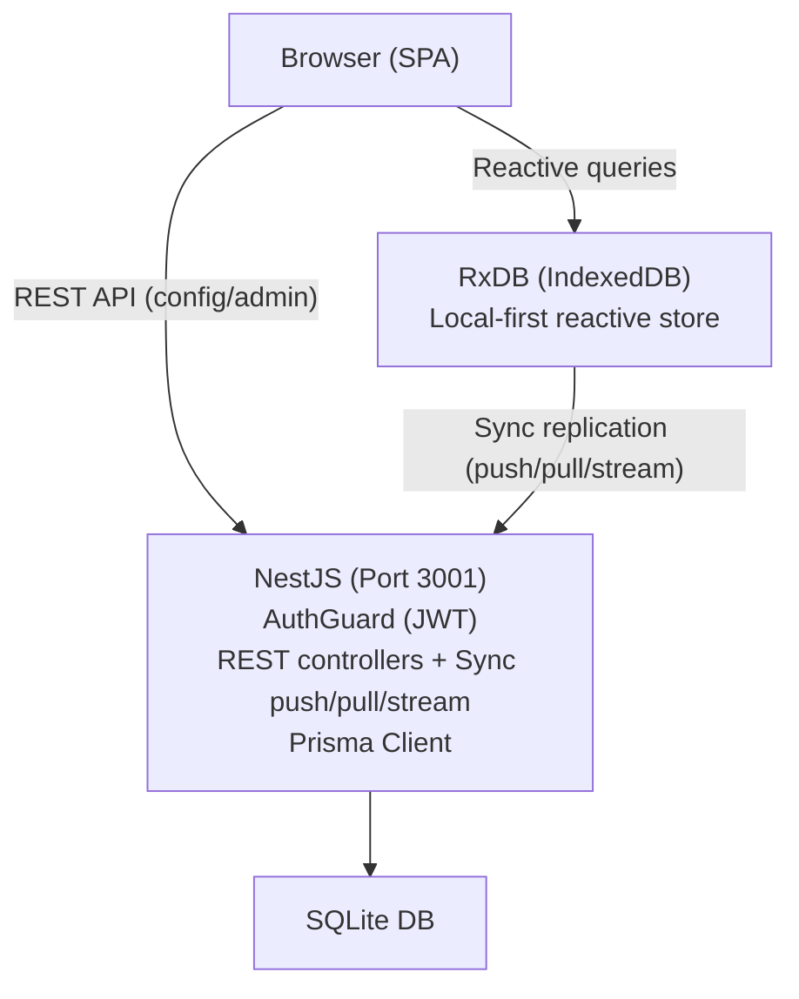

# Grocerun Project Status

## Executive Summary

This document provides a comprehensive overview of the Grocerun project's current state, ongoing work, and next steps. This is designed to enable seamless continuation of work across different machines or sessions.

---

## Project Vision

**Grocerun** is a household grocery list management application that is being transformed from a traditional client-server architecture to a **Local-First** application using an evolutive migration strategy.

### Core Objectives

1. **Local-First Architecture**: Enable offline-first functionality with RxDB for local storage
2. **Real-time Sync**: Implement bidirectional synchronization between local RxDB and cloud backend
3. **Scalability**: Separate frontend (Next.js) from backend (NestJS) with clear API boundaries
4. **Maintainability**: Use monorepo structure with independent deployable services
5. **Zero Downtime**: Maintain working application at every migration step

---

## Current Architecture

### Workspace Structure

```
grocerun/
├── apps/
│   ├── web/          # Next.js frontend (port 3000)
│   ├── server/       # NestJS backend (port 3001)
│   └── e2e/          # Playwright end-to-end tests
├── packages/
│   └── dto/          # Shared DTOs (Zod schemas)
├── wiki/             # Canonical documentation (truth)
│   ├── adr/          # Architecture Decision Records
│   ├── architecture/ # System architecture docs
│   ├── rules/        # Coding standards & conventions
│   ├── patterns/     # Stable implementation mechanisms
│   ├── concepts/     # Durable domain abstractions
│   └── development/  # Developer guides & workflows
├── planning/         # Work-in-progress & speculative
│   ├── tickets/      # Phase plans, user stories, designs
│   ├── brainstorm/   # Solution exploration
│   └── reviews/      # Code review output
├── .opencode/        # Agent skills, commands, config
└── AGENTS.md         # Agent guide
```

### Technology Stack

| Component | Technology | Version | Purpose |
|-----------|-----------|---------|---------|
| Frontend | Next.js | 16.x | React framework with RxDB local-first |
| Local DB | RxDB + Dexie.js | - | Offline-first reactive storage |
| Backend | NestJS | 10.0.0 | Node.js REST + Sync API framework |
| Database | SQLite | - | Relational database (Prisma ORM) |
| ORM | Prisma | 7.2.0 | Database client and migrations |
| Auth | oidc-spa | 1.x | Google OIDC authentication (Google-only) |
| Node.js | Node.js | 22.21.1 | Runtime (managed via .nvmrc) |
| Workspace | NPM Workspaces | - | Monorepo management |
| Version | 1.0.0-rc.1 | - | All workspace packages |

### Current State Diagram



**Key Characteristics:**
- **Local-first**: All reads from RxDB (IndexedDB); writes go local-first, then sync to server
- **Sync protocol**: Push/pull/stream per collection with SSE real-time broadcast
- **Auth**: JWT via `/api/token`, stored in memory, Bearer in API + sync connections
- **Offline support**: Reads always available from local DB; writes queue offline, sync on reconnect
- **React Query removed** — all data fetching via RxDB reactive queries
- **Server Actions removed** — `actions/` directory deleted

---

## Migration Journey: The Evolutive Approach

### Why "Evolutive"?

We abandoned a ground-up rewrite approach in favor of incremental migration to:
- Keep the application functional at every step
- Reduce risk of breaking existing features
- Enable continuous testing and validation
- Allow for course correction during migration

### 5-Phase Migration Plan

#### ✅ **Phase 1: Monorepo Foundation** (COMPLETED)

**Goal:** Restructure workspace to support independent frontend and backend

**What We Did:**
- Moved legacy Next.js app to `apps/web`
- Kept existing NestJS backend in `apps/server`
- Deleted experimental Vite client (`apps/client`)
- Created `.nvmrc` to lock Node.js version to 22
- Configured Next.js reverse proxy for `/api/v1/*` → NestJS
- Applied Prisma migrations (8 existing + 1 new "reposition" migration)
- Fixed Google OAuth to work with new structure
- Created comprehensive documentation ([monorepo-architecture.md](apps/web/wiki/developer-guide/monorepo-architecture.md))

**Validation:**
- ✅ Frontend accessible at http://localhost:3000
- ✅ Backend running at http://localhost:3001
- ✅ Google OAuth login working
- ✅ Database operational (apps/web/dev.db)

**Git Commit:** `c81a72f` on branch `feature/evolutive-architecture`  
**Key Changes:** Monorepo restructure, feature flags, documentation organization

---

#### ✅ **Phase 2: API Proxy Layer** (COMPLETED)

**Goal:** Decouple frontend from database by introducing API boundary

**What Was Done:**
- All 37 server actions migrated from direct Prisma calls to NestJS REST API
- Feature flag system used for incremental migration, then removed
- API client utility created (`api-client.ts`) with Zod validation
- JWT authentication between Next.js and NestJS via `AUTH_SECRET`
- All NestJS controllers/services built with AuthGuard + membership verification
- Database consolidated (NestJS owns Prisma, Next.js accesses via API)

**Branch:** `feature/phase-2-api-migration` (merged)  
**ADRs:** 001 (API approach), 003 (JWT authentication)

---

#### ✅ **Phase 3: Client Fetch** (COMPLETED)

**Goal:** Replace Server Actions with client-side data fetching via React Query

**What Was Done:**
- React Query (`@tanstack/react-query`) installed with 30s stale time
- Token endpoint (`/api/token`) returns signed JWT for browser use
- Client-side API client (`api.ts`) with Bearer auth and 401 retry
- All 7 routes migrated to client-rendered pages with React Query hooks
- 10 hook files: 8 queries, 18 mutations, 2 plain async functions
- Auth middleware (`proxy.ts`) protects routes, redirects to `/login`
- Server actions directory deleted (-1103 lines)
- Smoke test bugs fixed: section rename, household cache invalidation, trip navigation
- UX quick wins: list card width, autocomplete badge clarity

**Branch:** `feature/phase-3-client-fetch` (19 commits: `a07bd74`..`3b6d7f1`)  
**ADRs:** 006 (auth strategy)  
**Detailed Plan:** [PHASE-3-MIGRATION.md](PHASE-3-MIGRATION.md)

---

#### ✅ **Phase 4: RxDB Local-First** (COMPLETED)

**Goal:** Achieve Local-First architecture with offline support

**What Was Done:**
- Installed RxDB + Dexie.js (free tier) in frontend
- Created RxDB schemas for all 6 domain models (Household, Store, Section, Item, List, ListItem)
- Built sync endpoints on NestJS (pull/push/stream per collection)
- Added soft-delete to all domain models (`deleted` + `deletedAt` columns)
- Implemented SSE broadcast for real-time cross-tab sync
- Established conflict resolution (server-wins + shopping lock + guard rails)
- Replaced React Query hooks with RxDB reactive queries
- Enabled offline-first reads and writes with background sync

**Branch:** `feature/phase-4-rxdb` → `feature/phase-5-sync-simplification` (merged)  
**ADRs:** 007 (Local-First strategy)  
**Detailed Plan:** [PHASE-4-MIGRATION.md](PHASE-4-MIGRATION.md)

---

#### 🔄 **Phase 5: Sync Simplification + Audit Fixes** (IN PROGRESS)

**Goal:** Harden the sync protocol, fix domain model gaps, and reduce technical debt

**What Was Done (so far):**

*Phase 5a — Sync stabilization:*
- Simplified sync invalidation — single notification path, removed duplicate RESYNC
- Narrow subscriptions + flush debounced writes on unmount
- Stabilized sync auth, notifications, locks, and timestamp conflicts
- Fixed sync tombstone delivery for cascaded deletes
- Removed dead push handlers and React Query scaffolding
- Added `findFirst`-then-clear pattern for empty-push detection

*Phase 5b — Domain model audit fixes (17 findings resolved):*

| Group | Items | Status |
|-------|-------|--------|
| A | Unique constraints + P2002 simplification + regression tests | ✅ |
| B | `lastPurchased` in RxDB, status enum, `createdAt` doc | ✅ |
| C | DTO naming (`itemId`→`listItemId`), JS fallback removal, lazy-expire | ✅ |
| D | Cascade soft-delete extraction, AccessService extraction, NotificationService | ✅ |
| E | `ownerId` non-nullable, FK indexes, Invitation + `defaultUnit` comments | ✅ |

*Extracted shared services:*
- `shared/cascade-soft-delete.ts` — FK-safe cascade delete for Store/Household
- `shared/access.service.ts` — `verifyStoreAccess()` / `verifyHouseholdAccess()`
- `shared/notification.service.ts` — Fire-and-forget SSE broadcast helpers
- `shared/shared.module.ts` — `@Global()` module registering all shared services

*Schema hardening:*
- 4 new migrations: unique constraint fix, ownerId backfill + non-nullable, FK indexes
- `--accept-data-loss` flag on `prisma db push` for staging deploys

**Branch:** `feature/phase-5-sync-simplification` (12 commits for audit fixes, ~65 total)  
**Tests:** 15/15 pass (3 suites)  
**Version:** `1.0.0-rc.1`  
**Audit:** [domain-model-audit.md](../../planning/reviews/2026-06-10_domain-model-audit.md)  
**Fix Plan:** [domain-model-audit-fixes.md](2026-06-10T003629_domain-model-audit-fixes.md)  
**Migration Strategy:** [data-migration-strategy.md](2026-06-10T230536_data-migration-strategy.md)

---

## Current Working State

### Environment Setup

**Node.js Version:** 22.21.1 (managed via `.nvmrc` in project root)

**How to Run:**
```bash
# From project root
nvm use          # Activates Node 22.21.1
npm install      # Install dependencies
npm run dev      # Starts both apps via concurrently
```

This will start:
- Next.js on http://localhost:3000 (Turbopack dev server)
- NestJS on http://localhost:3001 (watch mode)

### Environment Variables

**apps/web/.env:**
```
DATABASE_URL="file:./dev.db"
```

**apps/server/.env:**
```
DATABASE_URL="file:./dev.db"
PORT=3001
```

### Database State

**Current Database:** `apps/server/dev.db` (SQLite, owned by NestJS/Prisma)

**Schema:** 11 models
- Auth: User, Account, Session, VerificationToken (managed by JWT + Prisma)
- Domain: Household, Store, Section, Item, List, ListItem, Invitation

**Migrations Applied:** 14+ migrations (see `apps/server/prisma/migrations/`)

**Key schema features:**
- Soft-delete on all domain models (`deleted: Boolean @default(false)`, `deletedAt: DateTime?`)
- Unique constraints include `deleted` column (allows same-name re-creation after soft-delete)
- Explicit FK indexes on `storeId`, `listId`, `sectionId`, `itemId`
- `Household.ownerId` is non-nullable (backfilled for legacy data)

---

## Key Files & Locations

### Documentation
- [planning/tickets/](planning/tickets/) - Migration plans (this file, Phase 2-5 plans)
- [wiki/adr/](../../wiki/adr/) - Architecture Decision Records (001-007)
- [wiki/development/agentic-workflow.md](wiki/development/agentic-workflow.md) - AI agent SOP

### Configuration
- [package.json](package.json) - Root workspace configuration
- [apps/web/package.json](apps/web/package.json) - Frontend dependencies
- [apps/server/package.json](apps/server/package.json) - Backend dependencies
- [apps/web/next.config.mjs](apps/web/next.config.mjs) - Next.js config (includes reverse proxy)
- [.nvmrc](.nvmrc) - Node version lock

### Core Code — Frontend
- [apps/web/src/core/rxdb/](apps/web/src/core/rxdb/) — RxDB schemas, database singleton, replication config
- [apps/web/src/features/](apps/web/src/features/) — Feature components + local-first hooks
- [apps/web/src/core/](apps/web/src/core/) — Auth, API client, shared utilities
- [apps/web/src/core/lib/api.ts](apps/web/src/core/lib/api.ts) — REST API client (Bearer JWT, config/admin ops)
- [apps/web/src/core/lib/auth-token.ts](apps/web/src/core/lib/auth-token.ts) — In-memory JWT token manager
- [apps/web/src/components/](apps/web/src/components/) — Shared UI components + providers

### Core Code — Backend
- [apps/server/src/](apps/server/src/) — NestJS application (controllers, services, guards)
- [apps/server/src/sync/](apps/server/src/sync/) — Sync engine (push/pull/stream + SSE broadcast)
- [apps/server/src/sync/collections/](apps/server/src/sync/collections/) — Per-collection sync handlers
- [apps/server/src/shared/](apps/server/src/shared/) — Extracted shared services (AccessService, CascadeSoftDelete, NotificationService)
- [apps/server/prisma/schema.prisma](apps/server/prisma/schema.prisma) — Database schema
- [apps/server/src/auth/auth.guard.ts](apps/server/src/auth/auth.guard.ts) — JWT validation

---

## Issues Resolved (Historical)

| # | Problem | Solution | Phase |
|---|---------|----------|-------|
| 1 | Node version mismatch (better-sqlite3 binary) | Created `.nvmrc` with "22", `npm rebuild` | 1 |
| 2 | Port conflicts (Next.js + NestJS) | Next.js on 3000, NestJS on 3001, reverse proxy | 1 |
| 3 | Google OAuth 404 | Changed proxy to only forward `/api/v1/*`, preserving NextAuth routes | 1 |
| 4 | Database missing ("table main.Account does not exist") | Ran `npx prisma migrate dev` | 1 |
| 5 | Database consolidation | Both apps point to `apps/server/dev.db` | 2 |
| 6 | Client auth for API requests | Token endpoint (`/api/token`) returns JWT for browser use (ADR 006) | 3 |

---

## Open Questions

### Phase 5 Remaining Work

| # | Item | Status |
|---|------|--------|
| 1 | Deploy to staging and smoke test | ⬜ Not done |
| 2 | Production data migration strategy | 📋 Planned (see ticket) |
| 3 | Dependency cleanup audit | 📋 Planned (see ticket) |
| 4 | Add unit tests for shared services | ⬜ Not done |

---

## Next Steps

1. **Deploy to staging** — smoke-test the domain model audit fixes end-to-end
2. **Update PROJECT-STATUS.md** after any new changes (this file is the source of truth)
3. **Data migration strategy** — plan production migration from pre-Phase-1 schema to current (see [data-migration-strategy.md](2026-06-10T230536_data-migration-strategy.md))
4. **Potential next audits** — dependency cleanup (see [dependency-cleanup-audit.md](2026-06-09T225645_dependency-cleanup-audit.md))
5. **Improve test coverage** — add unit tests for shared services (`AccessService`, `NotificationService`, `cascadeSoftDelete`)

---

## Git Repository State

**Current Branch:** `feature/phase-5-sync-simplification`

**Last Commit:** `88e3b5f` — "refactor: extract notifyHouseholdMembers into NotificationService + document SyncService exception semantics"

**Branch History:**
- `feature/evolutive-architecture` — Phase 1 + Phase 2 (merged)
- `feature/phase-3-client-fetch` — Phase 3 (19 commits, merged)
- `feature/phase-4-rxdb` — Phase 4 (merged into phase-5)
- `feature/phase-5-sync-simplification` — Phase 5 (12 commits for audit fixes on top of ~53 sync/phase-4 commits, current)

**Working Tree:** Clean (all audit fixes committed)

---

## Troubleshooting Common Issues

### Dev Server Won't Start
```bash
# Kill any zombie processes
fuser -k 3000/tcp
fuser -k 3001/tcp

# Rebuild native modules
npm rebuild
```

### Prisma Client Out of Sync
```bash
cd apps/server
npx prisma generate
npx prisma migrate dev
```

---

## Success Metrics

### Phase 1 (Complete)
- ✅ Monorepo structure established
- ✅ Both apps running independently
- ✅ Google OAuth working
- ✅ Database operational

### Phase 2 (Complete)
- ✅ API client utility created
- ✅ All domains have NestJS endpoints
- ✅ All Server Actions use API (no direct Prisma)
- ✅ UI functionality unchanged
- ✅ Database consolidated to apps/server

### Phase 3 (Complete)
- ✅ React Query integrated
- ✅ All data fetching client-side
- ✅ Loading states & error handling implemented
- ✅ Auth middleware protecting all routes
- ✅ Server actions deleted

### Phase 4 (Complete)
- ✅ RxDB integrated with Dexie.js
- ✅ Local-first reads working (all 6 collections)
- ✅ Offline writes with background sync
- ✅ Sync protocol implemented (push/pull/stream)
- ✅ SSE real-time broadcast working
- ✅ Soft-delete on all domain models
- ✅ Conflict resolution working (server-wins)

### Phase 5 (In Progress)
- ✅ Sync invalidation simplified (single path)
- ✅ Tombstone delivery for cascaded deletes
- ✅ Domain model audit: 17/17 findings resolved
- ✅ Shared services extracted (Access, Cascade, Notify)
- ✅ Schema hardening (non-null ownerId, FK indexes)
- ✅ 15/15 tests passing (3 suites)
- [ ] Deploy to staging and smoke test
- [ ] Production data migration strategy executed

---

## Contact & Context

**Last Updated:** June 10, 2026  
**Current Phase:** Phase 5 — Sync Simplification + Domain Model Audit Fixes  
**Documentation:** All documentation in `wiki/`

For details on specific phases:
- [PHASE-2-MIGRATION.md](PHASE-2-MIGRATION.md) — Phase 2 migration checklist
- [PHASE-3-MIGRATION.md](PHASE-3-MIGRATION.md) — Phase 3 migration plan and decisions
- [PHASE-4-MIGRATION.md](PHASE-4-MIGRATION.md) — Phase 4 migration plan and decision gates
- [PHASE-5-SIMPLIFICATION.md](PHASE-5-SIMPLIFICATION.md) — Phase 5 sync simplification plan
- [2026-06-10T003629_domain-model-audit-fixes.md](2026-06-10T003629_domain-model-audit-fixes.md) — Domain model audit fix plan
- [2026-06-10T230536_data-migration-strategy.md](2026-06-10T230536_data-migration-strategy.md) — Production migration strategy
- [../adr/](../adr/) — Architecture Decision Records (001-007)
