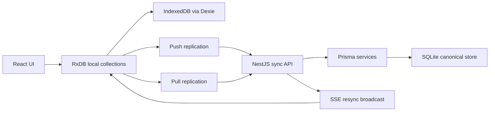
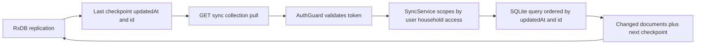
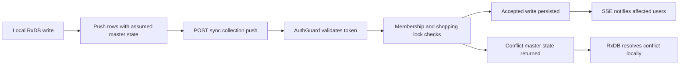
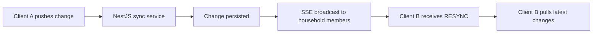
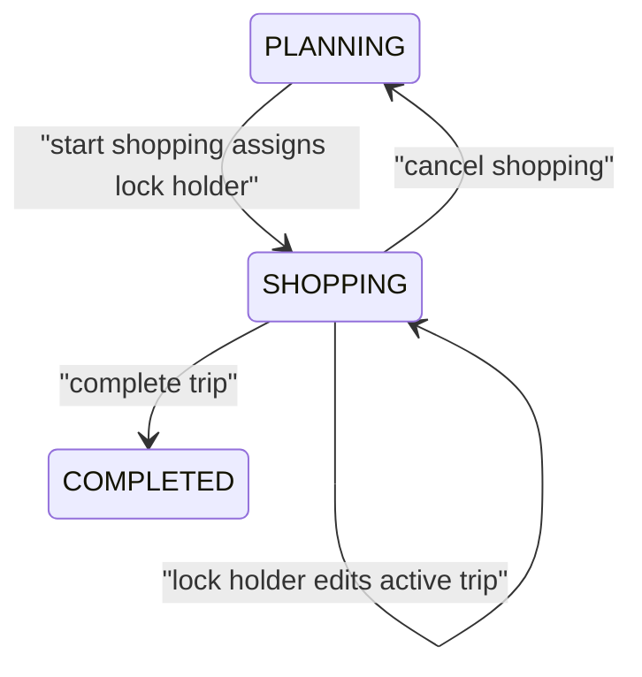

# Data Sync and Concurrency

This view explains how Grocerun keeps shopping data usable locally while syncing
to the server and supporting multiple household members.

## Goals

- Fast reads from local browser storage.
- Server-authoritative persistence and authorization.
- Multi-device and multi-user convergence through sync.
- Simple conflict behavior that is understandable and testable.
- Shopping-mode locking to avoid competing edits during an active trip.

## Local and Server Responsibilities



| Layer | Responsibilities |
|---|---|
| RxDB / IndexedDB | Local reads, optimistic local writes, reactive UI updates, queued replication. |
| NestJS sync API | Auth, household scoping, server validation, conflict/tombstone responses. |
| SQLite / Prisma | Durable canonical store, updatedAt/id checkpoints, soft-delete flags. |
| SSE stream | Notify connected clients to resync after changes. |

## Replicated Collections

The browser defines RxDB schemas in `apps/web/src/core/rxdb/schema.ts` for the
local-first collections currently used by shopping flows:

- sections
- items
- lists
- list items
- households
- stores

The server sync layer exposes pull/push/stream endpoints under
`/api/v1/sync/*`.

## Pull Protocol



Pull replication asks the server for documents changed after the last checkpoint.

Checkpoint shape:

```ts
{ updatedAt: string; id: string }
```

The `(updatedAt, id)` pair gives deterministic pagination when multiple rows
share the same timestamp. Server models include indexes on `(updatedAt, id)` to
support this access pattern.

## Push Protocol



RxDB sends changed rows to the server. The server either accepts the write or
returns conflicting master states. Push handlers should return conflicts rather
than throwing for expected domain rejections, matching the RxDB replication
protocol.

Important conflict sources:

- missing household/store/list access
- shopping lock violations
- stale or deleted parent records
- unique constraints involving soft-delete state

## SSE Resync



`apps/server/src/sync/sync.controller.ts` exposes SSE stream endpoints. The
client cannot attach Authorization headers to `EventSource`, so sync stream auth
uses the restricted query-token fallback described in
[Security and Auth](./security-and-auth.md).

The server sends an initial `RESYNC` event when the stream opens and later
broadcasts changes to affected household members. Clients respond by triggering
RxDB pull replication.

## Concurrency Model

### Multiple devices

Each browser/device owns its local IndexedDB state. Convergence happens through
push/pull replication and SSE-triggered resync.

### Multiple household members

Household membership determines access to stores, lists, and replicated data.
Server-side authorization is mandatory for both REST and sync endpoints.

### Active shopping



Shopping lists have a lifecycle:

1. `PLANNING`
2. `SHOPPING`
3. `COMPLETED`

When a list is in `SHOPPING`, `assignedTo` stores the Google OIDC subject of the
lock holder. The frontend can compare this value against the current auth
subject without needing the internal database user ID.

Shopping lock checks must be enforced consistently across REST and sync paths.

## Offline and Reconnect Behavior

- Local reads remain available from IndexedDB.
- Local writes can be staged by RxDB and later replicated.
- Network failures should not clear local state.
- Auth failures (`401`) clear invalid cached auth and require re-authentication.
- Reconnect or visibility changes can trigger resync.

## Implementation Hotspots

- Client database: `apps/web/src/core/rxdb/database.ts`
- Client schemas: `apps/web/src/core/rxdb/schema.ts`
- Server sync controller: `apps/server/src/sync/sync.controller.ts`
- Server sync service: `apps/server/src/sync/sync.service.ts`
- Shopping lock helper: `apps/server/src/shared/shopping-lock.ts`
- Prisma schema: `apps/server/prisma/schema.prisma`

## Relevant Decisions and Rules

- [ADR 007: Phase 4 Local-First Strategy](../adr/007-phase4-local-first-strategy.md)
- [ADR 008: Testing Strategy Revision](../adr/008-testing-strategy-revision.md)
- [Coding Standards: RxDB and Local-First](../rules/coding-standards.md)
