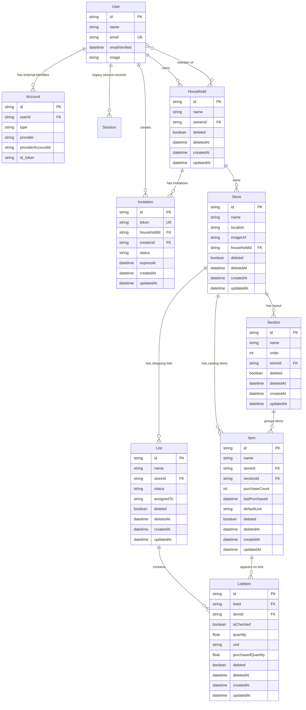

# Domain Model

This view describes Grocerun's durable grocery-domain entities and their core
relationships. The source of truth for fields and constraints is
`apps/server/prisma/schema.prisma`.

## Core Entities and Relationships



## Entity Groups

### Identity

- `User` is Grocerun's local user record.
- `Account` links an external identity provider account to a local user. Current
  production auth is Google OIDC through `oidc-spa`.
- `Session` and `VerificationToken` remain in the schema from earlier auth eras,
  but the active app auth path validates Google ID tokens via NestJS `AuthGuard`.

### Collaboration

- `Household` is the primary collaboration boundary.
- A household has one owner (`ownerId`) and many member users.
- Stores, invitations, and shopping data are scoped through households.

### Store Layout and Catalog

- `Store` belongs to a household.
- `Section` models a store's physical layout and ordering.
- `Item` is the store-scoped catalog item. It replaced older `CatalogItem`
  language in previous docs.
- Items may belong to a section and accumulate usage signals such as
  `purchaseCount` and `lastPurchased`.

### Shopping

- `List` represents a shopping list for a store.
- `List.status` follows the `PLANNING -> SHOPPING -> COMPLETED` lifecycle.
- `List.assignedTo` stores the Google OIDC subject of the active shopping lock
  holder, not the internal database user ID.
- `ListItem` joins a list to an item and records checked/purchased state.

### Invitations

- `Invitation` uses an explicit status lifecycle:
  `ACTIVE`, `COMPLETED`, `EXPIRED`, `REVOKED`.
- Invitations are not soft-deleted because terminal statuses already model their
  lifecycle.

## Cross-Cutting Model Rules

### Household as collaboration boundary

All domain access must be scoped by household membership. Server services must
verify access before returning or mutating household-owned data.

### Store-specific catalogs

Items are scoped to stores because grocery layouts and product habits differ per
store. The same item name in two stores is represented as two `Item` records.

### Soft-delete as default domain lifecycle

The main domain models (`Household`, `Store`, `Section`, `Item`, `List`,
`ListItem`) use `deleted` and `deletedAt`. Queries must filter active records
unless explicitly dealing with tombstones/sync.

### Sync checkpoint compatibility

Replicated models include `(updatedAt, id)` indexes. Sync pull uses that pair for
deterministic pagination.

### Shopping lock identity

Shopping lock ownership uses Google OIDC `sub` because the frontend can compare
it directly against the decoded ID token. Server services map Google identity to
internal user IDs for persistence/authorization, but the lock holder remains an
OIDC subject.

## Example Journeys

### New User

```text
1. User signs in with Google.
2. Auth service resolves or creates local User and Account records.
3. System creates or exposes the user's household membership.
4. User creates a Store.
5. User creates Sections and Items for that store.
6. User creates a List and adds ListItems.
```

### Active Shopping

```text
1. Household member starts a List.
2. List status changes from PLANNING to SHOPPING.
3. assignedTo is set to that member's Google OIDC subject.
4. Lock holder checks off ListItems during the trip.
5. Other household members can observe changes through sync, but lock checks
   prevent competing active-trip edits.
6. Lock holder completes or cancels the trip.
```

## Related Architecture Views

- [System Overview](./system-overview.md)
- [Data Sync and Concurrency](./data-sync-and-concurrency.md)
- [Security and Auth](./security-and-auth.md)

---

**Last Updated:** June 15, 2026
