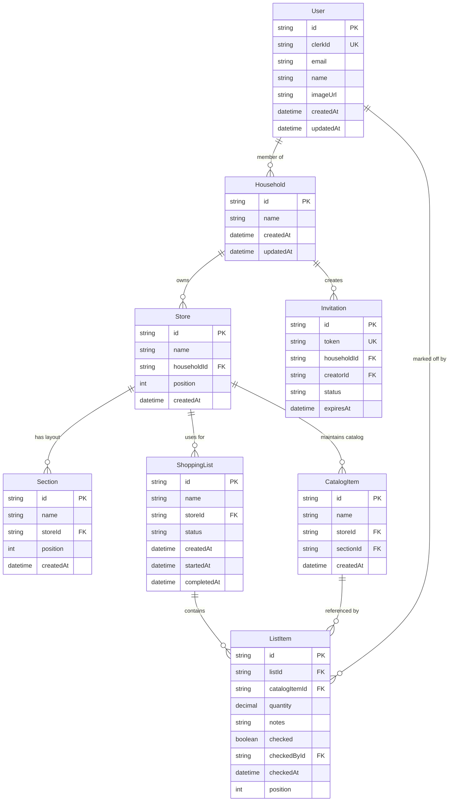

# Domain Model

## Core Entities & Relationships



## Design Decisions

### 1. Household as Collaboration Unit
- **Why**: Families and roommates share grocery shopping responsibilities.
- **Implication**: All stores, lists, and catalog items are scoped to a household.
- **Multi-tenancy**: Users can belong to multiple households (e.g., home + shared apartment).

### 2. Store as Layout Anchor
- **Why**: Physical store layouts differ (Trader Joe's ≠ Costco ≠ local grocer).
- **Implication**: Each store has its own sections and catalog, optimized for that location.
- **Routing**: Lists are created for a specific store to leverage its layout.

### 3. Catalog Growth Strategy
- **Initial State**: Empty catalog when store is created.
- **Growth Mechanism**: As users add items to shopping lists, they enter item names. System creates catalog entries automatically.
- **Intelligence**: Over time, the system learns which section items belong to (either from user input or smart suggestions).
- **Reusability**: Once in catalog, items can be quickly added to future lists.

### 4. Position-Based Ordering
- **Sections**: Positioned to match physical store flow (produce → dairy → checkout).
- **List Items**: Positioned within list to match section order for efficient shopping.
- **User Control**: Users can reorder sections to match their preferred shopping path.

### 5. Shopping State Machine
Shopping lists follow a lifecycle:
1. **PLANNING**: Default state, items can be freely added/removed.
2. **SHOPPING**: Active shopping session, items checked off in real-time.
3. **COMPLETED**: List archived, serves as history/template.

### 6. Identity & Authentication
- **Google OIDC Integration**: Uses Google OIDC (oidc-spa) for authentication. Currently Google-only.
- **User Creation**: First-time users automatically get a default household.
- **Invitation System**: Token-based invitations for household sharing (see [household-invitation-system](../design/household-invitation-system.md)).

## Entity Lifecycle Examples

### New User Journey
```
1. User signs in with Google → User record created
2. System creates default Household "My Household"
3. User creates first Store "Trader Joe's"
4. User creates ShoppingList for that Store
5. User adds "milk" → CatalogItem created → ListItem references it
6. User assigns "milk" to "Dairy" section
7. Next time: "milk" auto-suggests from catalog
```

### Multi-User Shopping
```
1. User A creates list, adds items
2. User A starts shopping (status: SHOPPING)
3. User B (same household) opens same list
4. User B checks off "bread" → checkedById = User B
5. User A's view updates in real-time
6. User A completes shopping → status: COMPLETED
```

---

**Last Updated:** January 9, 2026
