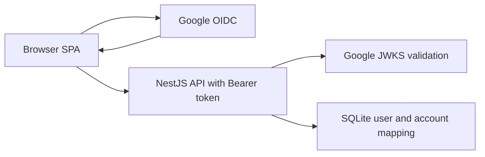

# Security and Auth

This view explains Grocerun's current authentication and authorization model,
including accepted SPA trade-offs and the mobile session restoration fallback.

## Current Model

Grocerun uses Google-only OIDC through `oidc-spa`.

## Client Responsibilities

| Component | Responsibility |
|---|---|
| `core/auth/oidc.ts` | Singleton oidc-spa utilities and token shape validation. |
| `routes/__root.tsx` | Bootstraps OIDC and persists live session data into the app auth facade. |
| `core/auth/session.ts` | Central app auth facade for token/user access, refresh, and logout clearing. |
| `core/auth/token-cache.ts` | Bounded mobile restoration cache and logout re-seed guard. |
| `core/auth/guard.ts` | Route guard accepting live OIDC or a fresh cached token. |
| `core/lib/api.ts` | REST client attaching Bearer tokens. |
| `core/rxdb/database.ts` | Sync token usage and SSE query-token construction. |

## Server Responsibilities

| Component | Responsibility |
|---|---|
| `auth/oidc-server.ts` | oidc-spa/server bootstrap and decoded token schema validation. |
| `auth/auth.guard.ts` | Bearer token extraction, Google JWKS validation, SSE query-token exception, current-user attachment. |
| `auth/auth.service.ts` | Google subject/email to local user/account resolution. |
| Controllers/services | Domain authorization after identity is resolved. |

## Token Usage

- Browser obtains Google OIDC tokens through `oidc-spa`.
- The Google ID token is used as the API Bearer token.
- NestJS validates it with `oidc-spa/server` against Google's issuer/JWKS.
- `OIDC_AUDIENCE` must match the Google OAuth client ID in production.

This is an accepted Google-only SPA trade-off documented by existing planning
and review work. Backend sessions/BFF auth are not part of the current
architecture.

## Mobile Restoration Fallback

On Android, `oidc-spa` full-page restoration can fail after browser close and
reopen. To preserve the SPA architecture without adding server-managed sessions,
Grocerun caches the last valid ID token and minimal user fields in localStorage.

Constraints:

- Cache is accepted only until JWT `exp`, with a 60-second skew.
- Malformed or expired cache is cleared.
- `401` responses clear cached auth.
- Explicit logout clears cached auth and fallback flags.
- A short logout-in-progress marker prevents late API responses from re-seeding
  the cache during logout.

See [ADR 009: Mobile Auth Session Restoration](../adr/009-mobile-auth-session-restoration.md).

## SSE Query-Token Exception

`EventSource` cannot send custom headers. For SSE stream endpoints only, the
client appends the token as a query parameter. The server accepts query-token
auth only for sync stream endpoint patterns and continues to require the normal
Authorization header for pull/push and REST endpoints.

## Accepted Risks and Controls

| Risk | Control |
|---|---|
| Browser-visible Google client secret / SPA OIDC trade-off | Accepted in current Google-only model; do not generalize to arbitrary providers without revisiting auth architecture. |
| ID token in localStorage for mobile fallback | Bounded by token expiry, cleared on 401/logout, documented in ADR 009. |
| Query token in SSE URL | Restricted to SSE stream endpoints and sent only over HTTPS in production. |
| XSS would expose browser-held credentials | Never log tokens/PII, keep dependencies reviewed, prefer strict CSP when introduced. |

## Authorization Rules

- All protected API endpoints must use `AuthGuard` unless explicitly public.
- Services must verify household/store/list membership before returning or
  mutating domain data.
- Sync endpoints must enforce the same authorization as REST endpoints.
- Shopping lock identity uses Google OIDC `sub` for frontend-comparable lock
  ownership.

## Relevant Decisions and Rules

- [ADR 003: JWT Authentication](../adr/003-jwt-authentication.md) — superseded history.
- [ADR 006: Phase 3 Auth Strategy](../adr/006-phase3-auth-strategy.md) — superseded history.
- [ADR 009: Mobile Auth Session Restoration](../adr/009-mobile-auth-session-restoration.md)
- [Coding Standards: Auth](../rules/coding-standards.md)
