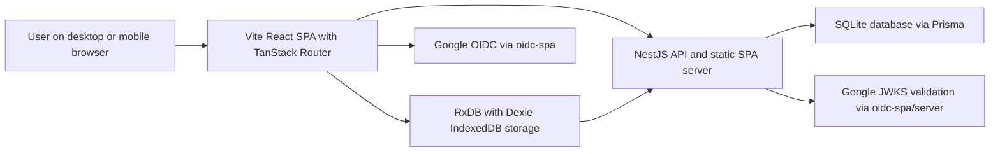

# System Overview

This view explains the main Grocerun runtime shape and how the pieces interact.
For data correctness and concurrent editing details, see
[Data Sync and Concurrency](./data-sync-and-concurrency.md). For auth details,
see [Security and Auth](./security-and-auth.md).

## Runtime Shape

## Main Components

| Component | Responsibility |
|---|---|
| `apps/web` | Vite SPA, TanStack Router routes, UI, RxDB local-first reads/writes, auth bootstrap. |
| `apps/web/src/core/rxdb` | Browser database singleton, RxDB schemas, replication setup, SSE resync handling. |
| `apps/web/src/core/auth` | oidc-spa singleton, app auth facade, mobile token-cache fallback, route auth guard. |
| `apps/server` | NestJS REST API, sync API, static SPA serving in production, auth validation. |
| `apps/_shared/dtos` | Shared Zod DTOs for API boundary validation. |
| `apps/server/prisma` | SQLite schema, migrations, Prisma client generation. |
| `apps/e2e` | Playwright critical journeys. |

## Runtime Flows

### Initial app load

1. Browser loads the Vite SPA.
2. `apps/web/src/routes/__root.tsx` bootstraps `oidc-spa`.
3. Root shell waits behind `OidcInitializationGate`.
4. Protected routes use the app auth guard.
5. UI reads local data from RxDB where available.

### REST API flow

1. Browser code calls `apps/web/src/core/lib/api.ts`.
2. The app auth facade resolves a Bearer token from live oidc-spa or a fresh
   mobile restoration cache.
3. Request goes to `/api/v1/*`.
4. NestJS `AuthGuard` validates the token and resolves Google identity to a
   local user.
5. Controllers/services enforce domain authorization and return JSON.

### Local-first sync flow

1. RxDB collections persist data locally in IndexedDB.
2. Replication pulls server changes with `(updatedAt, id)` checkpoints.
3. Replication pushes local writes to collection-specific sync endpoints.
4. The server returns conflicts when writes are rejected.
5. SSE emits resync notifications so clients pull after remote changes.

### Production deployment flow

1. Docker image builds web and server artifacts.
2. Runtime entrypoint prepares SQLite, backs up existing DB, applies Prisma
   migrations, and writes `apps/web/dist/config.js`.
3. NestJS serves both `/api/v1/*` and the built SPA assets.
4. SQLite lives on the mounted `/app/data` volume.

## Key Constraints

- Browser is the primary application runtime; no Next.js/BFF layer is active.
- NestJS owns server-side persistence and API authorization.
- Shared DTOs in `apps/_shared/dtos` define API input/output contracts.
- Local-first behavior depends on IndexedDB availability and RxDB replication.
- Google OIDC is currently the only supported identity provider.
- Production must set `OIDC_AUDIENCE` to the Google client ID.
- SQLite is the deployment database; backup/migration behavior happens on
  container startup.

## Relevant Decisions and Docs

- [ADR 007: Phase 4 Local-First Strategy](../adr/007-phase4-local-first-strategy.md)
- [ADR 008: Testing Strategy Revision](../adr/008-testing-strategy-revision.md)
- [ADR 009: Mobile Auth Session Restoration](../adr/009-mobile-auth-session-restoration.md)
- [Coding Standards](../rules/coding-standards.md)
- [Agentic Development Workflow](../development/agentic-workflow.md)
