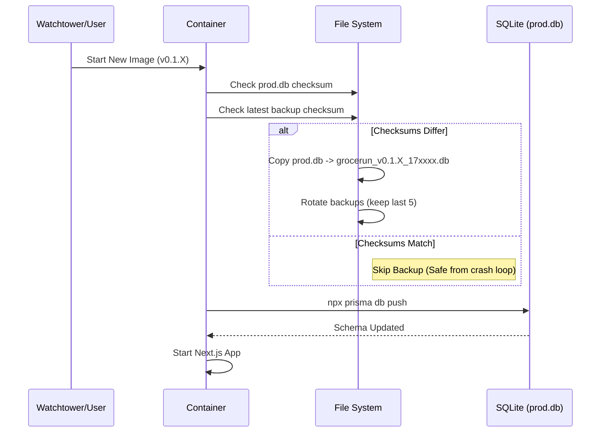

# Container Startup & Data Safety

## Overview
This document describes the initialization procedure executed by the application container (`scripts/docker-entrypoint.sh`). The goal is to ensure database schema synchronization (`prisma db push`) while providing robust data safety mechanisms (backup & rotation) to prevent data loss during failed migrations or crash loops.

## Startup Logic

The entrypoint script performs the following steps on every container start:

1.  **Health Checks**:
    *   **Permissions**: Verifies that `/app/data` is writable. Fails fast if volume permissions are incorrect.
2.  **Check for Existing Database**: Looks for `/app/data/prod.db`.
3.  **Safety Backup (Conditional)**:
    *   **Deduplication**: Calculates `md5sum` of the current `prod.db` and compares it to the most recent backup.
    *   **Skip**: If checksums match, backup is skipped (prevents creating infinite duplicates during a restart loop).
    *   **Create**: If checksums differ, a copy is created at `/app/data/grocerun_[VERSION]_[TIMESTAMP].db`.
    *   **Integrity**: Explicitly checks if the `cp` command succeeds. Fails fast on disk space issues.
4.  **Rotation**:
    *   Maintains the **5 most recent** backups matching the `grocerun_*.db` pattern.
    *   Older backups are effectively deleted to preserve disk space.
5.  **Schema Synchronization**:
    *   Executes `npx prisma db push` with explicit error handling.
    *   This ensures the database structure always matches the application code in the container.

## Rollback Procedure (Manual)

If a deployment introduces a bug or corrupts data, a manual rollback is required:

1.  **Stop the Container**: `docker stop <container_id>`
2.  **Identify Backup**: Check `/app/data` for the last known good backup (timestamped before the bad deploy).
3.  **Restore File**:
    ```bash
    cp /app/data/grocerun_v0.1.X_1234567890.db /app/data/prod.db
    ```
4.  **Redeploy Previous Image**: Start the container using the previous docker tag (e.g., `v0.1.X`).

## Sequence Diagram

### Happy Path

