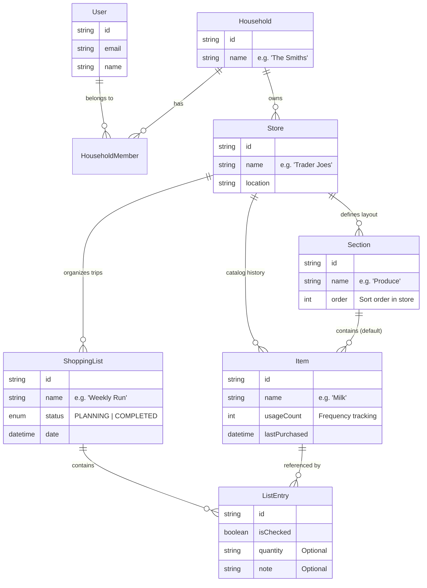

# 🏗️ Grocerun Domain Model

Based on the [Product Vision](pitch.md) and the goal of "seamless household collaboration".

## Core Entities & Relationships

## Key Design Decisions

### 1. The `Household` as the Unit of Collaboration
Instead of sharing individual lists, we group Users into a **Household**.
- **Why?** Grocery shopping is typically a household activity.
- **Benefit:** Sharing a Household automatically shares all **Stores**, **History**, and **Lists**. No need to re-invite your partner to every new list.

### 2. `Store` as the Anchor
Everything revolves around the Store.
- **Sections** are specific to a Store (Layout).
- **Items** are specific to a Store (Catalog). *Buying "Milk" at Costco is different from "Milk" at 7-Eleven.*
- **Lists** are specific to a Store.

### 3. `Item` vs `ListEntry`
- **Item (Catalog):** The persistent record of a product in a store (e.g., "Sourdough Bread" at "Whole Foods"). Holds the *default section* and *history stats*.
- **ListEntry (Transaction):** A specific instance of an item on a specific shopping list. Holds *current status* (checked/unchecked) and *trip-specific notes*.

### 4. Organic Catalog Growth
The Catalog (`Item` table) is not pre-seeded. It grows organically as users add items to lists.
- **New Item:** User types "Kimchi". System creates `Item("Kimchi")` + `ListEntry`.
- **Existing Item:** User types "Kimchi". System links `ListEntry` to existing `Item("Kimchi")`.

### 5. Cross-Store Identity (The "Milk" Question)
Items are distinct per store (Store A "Milk" != Store B "Milk").
- **To find "where we buy Milk":** We query all Items across the Household's stores where `name == "Milk"`.
- **Trade-off:** Relies on consistent naming. "Milk" and "Whole Milk" are treated as different products.
- **Decision:** Accepted for simplicity (KISS). Avoids managing a complex "Global Master Catalog" of products.
