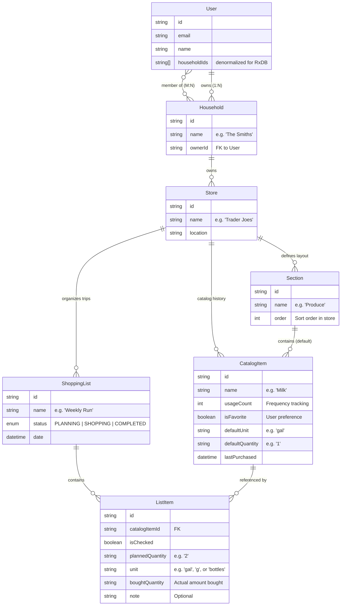

# 🏗️ Grocerun Domain Model

Based on the [Product Vision](../planning/product-evolution-spec.md) and the goal of "seamless household collaboration".

## Core Entities & Relationships

## Key Design Decisions

### 1. The `Household` as the Unit of Collaboration
Instead of sharing individual lists, we group Users into a **Household**.
- **Why?** Grocery shopping is typically a household activity.
- **Benefit:** Sharing a Household automatically shares all **Stores**, **History**, and **Lists**. No need to re-invite your partner to every new list.
- **Implementation:** M:N relationship between User and Household. A user can belong to multiple households (family home, shared apartment, etc.). Each Household has an `ownerId` for permission management.

### 2. `Store` as the Anchor
Everything revolves around the Store.
- **Sections** are specific to a Store (Layout).
- **Items** are specific to a Store (Catalog). *Buying "Milk" at Costco is different from "Milk" at 7-Eleven.*
- **Lists** are specific to a Store.

### 3. `CatalogItem` vs `ListItem`
- **CatalogItem (Knowledge):** The persistent record of a product in a store (e.g., "Sourdough Bread" at "Whole Foods"). Holds the *default section*, *history stats*, and *smart defaults* (unit/quantity).
- **ListItem (Transaction):** A specific instance of an item on a specific shopping list. Holds *current status* (checked/unchecked), *planned quantity/unit*, *bought quantity*, and *trip-specific notes*. Links back to `CatalogItem`.

### 4. Organic Catalog Growth & Smart Defaults
The Catalog (`CatalogItem` table) grows organically.
- **New Item:** User types "Kimchi". System creates `CatalogItem("Kimchi")` + `ListItem`.
- **Existing Item:** User types "Kimchi". System links `ListItem` to existing `CatalogItem("Kimchi")` and pre-fills `quantity`/`unit` from defaults.
- **Learning:** When a list is **COMPLETED**, the system updates `CatalogItem` defaults based on what was actually bought.

### 5. Cross-Store Identity (The "Milk" Question)
Items are distinct per store (Store A "Milk" != Store B "Milk").
- **To find "where we buy Milk":** We query all `CatalogItems` across the Household's stores where `name == "Milk"`.
- **Trade-off:** Relies on consistent naming. "Milk" and "Whole Milk" are treated as different products.
- **Decision:** Accepted for simplicity (KISS). Avoids managing a complex "Global Master Catalog" of products.

### 6. The Shopping Lifecycle
Lists move through distinct states to support the user's context:
- **PLANNING:** Default state. Optimized for adding items and sorting by section.
- **SHOPPING:** Active in-store state. Optimized for execution (large checkboxes, wake lock).
- **COMPLETED:** Trip finished. Read-only history. (Serves as the Archive).
