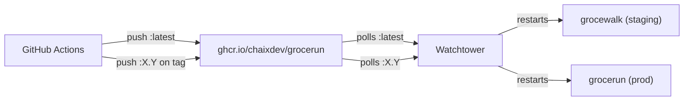
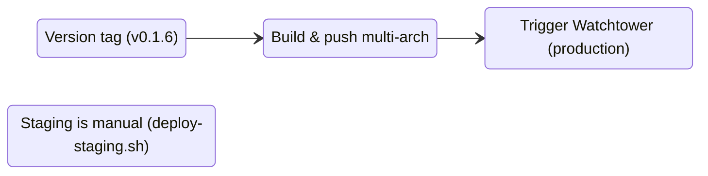

# Deployment Model

How Grocerun images land on staging and production.

## Purpose

Document the image tagging strategy, the staging/production split, and Watchtower's
role so that nobody accidentally deploys a branch build to production or confuses
the two environments.

## Image Tag Strategy

Every image lives at `ghcr.io/chaixdev/grocerun`. Tags follow semver with floating
aliases for automated updates:

| Tag | Type | Purpose |
|-----|------|---------|
| `latest` | floating | Bleeding edge — pushed manually via `deploy-staging.sh` |
| `X` | floating | Latest `X.y.z` — bumped with each release in the `X` major series |
| `X.Y` | floating | Latest `X.Y.z` — bumped with each patch release |
| `X.Y.Z` | immutable | Pinned release — never overwritten |

**Source:** `.github/workflows/docker-build.yml:43-48` (semver tag generation)

On every release, CI pushes the specific version tag and bumps the floating tags:

```
VERSION=1.2.3
docker tag grocerun ghcr.io/chaixdev/grocerun:$VERSION   # immutable
docker tag grocerun ghcr.io/chaixdev/grocerun:1.2          # bump
docker tag grocerun ghcr.io/chaixdev/grocerun:1             # bump (if still 1.x)
```

## Staging / Production Split



| | grocewalk (staging) | grocerun (prod) |
|---|---|---|
| **Domain** | grocewalk.pi9.noisecraft.me | grocerun.pi9.noisecraft.me |
| **Watched tag** | `:latest` | `:0.1` |
| **Database** | staging.db | prod.db |
| **Updates** | Automatic (Watchtower) | Automatic within same floating tag (Watchtower) |
| **OIDC** | Same as prod (shared vault secrets) | — |

**Watchtower polls each container's exact tag digest.** When `:latest` digest changes
→ grocewalk restarts. When `:0.1` digest changes → grocerun restarts. They are
independent targets — no cross-contamination.

## CI Pipeline

**Source:** `.github/workflows/docker-build.yml`



Docker builds only run on version tags. PRs use `test.yml` (lint + test)
as the quality gate — no Docker image is built for pull requests.

| Trigger | Tags pushed | Watchtower effect |
|---------|------------|-------------------|
| Tag `v0.1.6` | `0.1.6`, `0.1`, `0` | grocerun restarts (watches `:0.1`) |
| Push to `main` | none | nothing |
| PR to `main` | none | nothing (lint + test only) |

Staging deploys are intentional and manual — there is no automated staging
deploy from CI. This keeps the incentive to test before merging.

## When Things Update

| Change | grocewalk | grocerun | Action required |
|--------|-----------|----------|-----------------|
| Push `:0.1.6`, bump `:0.1` | ❌ | ✅ auto | Nothing (Watchtower) |
| Push `:0.2.0`, bump `:0.2` | ❌ | ❌ | Edit `group_vars`: `grocerun.image` to `:0.2`, redeploy |
| Run `deploy-staging.sh` | ✅ manual | ❌ | Nothing (manual trigger) |
| Major bump `1.0.0` | ❌ | ❌ | Edit `group_vars`, redeploy, manual verification |

## Manual Deployment Commands

For immediate deploys (bypassing Watchtower's 300s poll interval) or major version
bumps:

```bash
# Staging redeploy
ansible-playbook playbooks/homelab-deploy-apps.yml --tags=grocewalk

# Prod redeploy (after updating group_vars)
ansible-playbook playbooks/homelab-deploy-apps.yml --tags=grocerun
```

## RC Deployments

Release candidates follow the standard flow — merge to `main` and they deploy to
staging automatically via the `:latest` tag. No separate RC tagging is needed.

The existing `deploy-staging.sh` script (root of repo) is the manual equivalent
for local development; CI replaces it for automated main→staging deploys.

## Shared OIDC Caveat

Both containers share the same Google OIDC credentials (`vault.homelab.grocerun.*`).
A staging deploy won't break production, but if a new version changes the redirect
URI format, both environments are affected since they share the same Google client
ID. Consider separate OAuth apps for staging eventually.

## Related

- [DevOps Philosophy](./devops-philosophy.md)
- [CI Workflow](../../.github/workflows/docker-build.yml)
- [Deploy Script](../../deploy-staging.sh)
