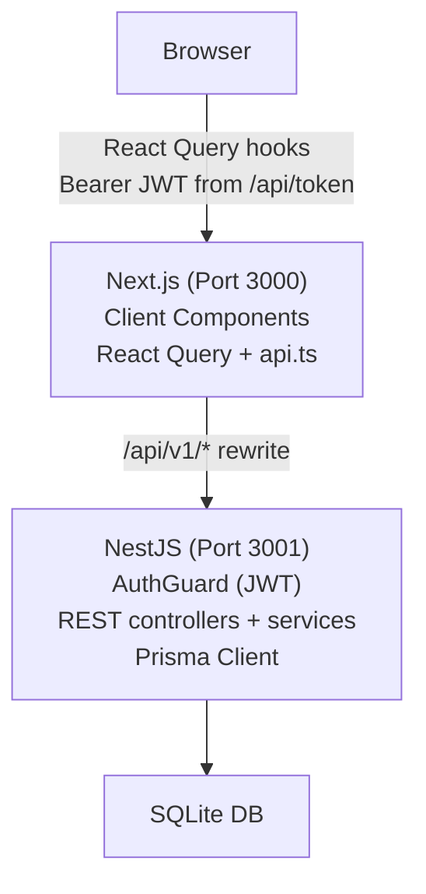

# Grocerun Project Status

## Executive Summary

This document provides a comprehensive overview of the Grocerun project's current state, ongoing work, and next steps. This is designed to enable seamless continuation of work across different machines or sessions.

---

## Project Vision

**Grocerun** is a household grocery list management application that is being transformed from a traditional client-server architecture to a **Local-First** application using an evolutive migration strategy.

### Core Objectives

1. **Local-First Architecture**: Enable offline-first functionality with RxDB for local storage
2. **Real-time Sync**: Implement bidirectional synchronization between local RxDB and cloud backend
3. **Scalability**: Separate frontend (Next.js) from backend (NestJS) with clear API boundaries
4. **Maintainability**: Use monorepo structure with independent deployable services
5. **Zero Downtime**: Maintain working application at every migration step

---

## Current Architecture

### Workspace Structure

```
grocerun/
├── apps/
│   ├── web/          # Next.js frontend (port 3000)
│   └── server/       # NestJS backend (port 3001)
├── packages/         # Shared code (future)
└── wiki/             # Documentation
```

### Technology Stack

| Component | Technology | Version | Purpose |
|-----------|-----------|---------|---------|
| Frontend | Next.js | 16.0.10 | React framework with App Router |
| Backend | NestJS | 10.0.0 | Node.js REST API framework |
| Database | SQLite | - | Relational database (Prisma ORM) |
| ORM | Prisma | 7.2.0 | Database client and migrations |
| Auth | NextAuth | 5.0.0-beta.30 | Authentication (Google OAuth) |
| Node.js | Node.js | 22.21.1 | Runtime (managed via .nvmrc) |
| Workspace | NPM Workspaces | - | Monorepo management |

### Current State Diagram



**Key Characteristics:**
- All data fetching via React Query hooks (8 queries, 18 mutations)
- Auth: `/api/token` endpoint signs JWT, stored in memory, sent as Bearer
- Auth middleware (`proxy.ts`) protects all routes, redirects unauthenticated to `/login`
- Server Actions fully removed — `actions/` directory deleted
- No offline support yet (Phase 4 goal)

---

## Migration Journey: The Evolutive Approach

### Why "Evolutive"?

We abandoned a ground-up rewrite approach in favor of incremental migration to:
- Keep the application functional at every step
- Reduce risk of breaking existing features
- Enable continuous testing and validation
- Allow for course correction during migration

### 4-Phase Migration Plan

#### ✅ **Phase 1: Monorepo Foundation** (COMPLETED)

**Goal:** Restructure workspace to support independent frontend and backend

**What We Did:**
- Moved legacy Next.js app to `apps/web`
- Kept existing NestJS backend in `apps/server`
- Deleted experimental Vite client (`apps/client`)
- Created `.nvmrc` to lock Node.js version to 22
- Configured Next.js reverse proxy for `/api/v1/*` → NestJS
- Applied Prisma migrations (8 existing + 1 new "reposition" migration)
- Fixed Google OAuth to work with new structure
- Created comprehensive documentation ([monorepo-architecture.md](apps/web/wiki/developer-guide/monorepo-architecture.md))

**Validation:**
- ✅ Frontend accessible at http://localhost:3000
- ✅ Backend running at http://localhost:3001
- ✅ Google OAuth login working
- ✅ Database operational (apps/web/dev.db)

**Git Commit:** `c81a72f` on branch `feature/evolutive-architecture`  
**Key Changes:** Monorepo restructure, feature flags, documentation organization

---

#### ✅ **Phase 2: API Proxy Layer** (COMPLETED)

**Goal:** Decouple frontend from database by introducing API boundary

**What Was Done:**
- All 37 server actions migrated from direct Prisma calls to NestJS REST API
- Feature flag system used for incremental migration, then removed
- API client utility created (`api-client.ts`) with Zod validation
- JWT authentication between Next.js and NestJS via `AUTH_SECRET`
- All NestJS controllers/services built with AuthGuard + membership verification
- Database consolidated (NestJS owns Prisma, Next.js accesses via API)

**Branch:** `feature/phase-2-api-migration` (merged)  
**ADRs:** 001 (API approach), 003 (JWT authentication)

---

#### ✅ **Phase 3: Client Fetch** (COMPLETED)

**Goal:** Replace Server Actions with client-side data fetching via React Query

**What Was Done:**
- React Query (`@tanstack/react-query`) installed with 30s stale time
- Token endpoint (`/api/token`) returns signed JWT for browser use
- Client-side API client (`api.ts`) with Bearer auth and 401 retry
- All 7 routes migrated to client-rendered pages with React Query hooks
- 10 hook files: 8 queries, 18 mutations, 2 plain async functions
- Auth middleware (`proxy.ts`) protects routes, redirects to `/login`
- Server actions directory deleted (-1103 lines)
- Smoke test bugs fixed: section rename, household cache invalidation, trip navigation
- UX quick wins: list card width, autocomplete badge clarity

**Branch:** `feature/phase-3-client-fetch` (19 commits: `a07bd74`..`3b6d7f1`)  
**ADRs:** 006 (auth strategy)  
**Detailed Plan:** [PHASE-3-MIGRATION.md](PHASE-3-MIGRATION.md)

---

#### 🔄 **Phase 4: RxDB Integration** (PLANNING)

**Goal:** Achieve Local-First architecture with offline support

**Approach:**
- Install RxDB + Dexie.js (free tier) in frontend
- Create RxDB schemas for 6 domain models
- Build sync endpoints on NestJS (pull/push/stream per collection)
- Add soft-delete to all models (required for sync tombstones)
- Implement conflict resolution (server-wins + guard rails)
- Replace React Query hooks with RxDB reactive queries
- Enable offline mode with network status indicator

**What Will Change:**

```
BEFORE (Phase 3):
Component → useQuery → API → NestJS → SQLite

AFTER (Phase 4):
Component → RxDB (local) ⟷ Sync Protocol ⟷ NestJS → SQLite (cloud)
```

**Detailed Plan:** [PHASE-4-MIGRATION.md](PHASE-4-MIGRATION.md)  
**Estimated Effort:** 16–25 working days

---

## Current Working State

### Environment Setup

**Node.js Version:** 22.21.1 (managed via `.nvmrc` in project root)

**How to Run:**
```bash
# From project root
nvm use          # Activates Node 22.21.1
npm run dev      # Starts both apps via concurrently
```

This will start:
- Next.js on http://localhost:3000 (Turbopack dev server)
- NestJS on http://localhost:3001 (watch mode)

### Environment Variables

**apps/web/.env:**
```
DATABASE_URL="file:./dev.db"
AUTH_SECRET="[generated secret]"
AUTH_URL="http://localhost:3000"
AUTH_GOOGLE_ID="[your-google-oauth-client-id]"
AUTH_GOOGLE_SECRET="[your-google-oauth-client-secret]"
```

**apps/server/.env:**
```
DATABASE_URL="file:./dev.db"
PORT=3001
```

### Database State

**Current Database:** `apps/server/dev.db` (SQLite, owned by NestJS/Prisma)

**Schema:** 11 models
- Auth: User, Account, Session, VerificationToken (NextAuth-managed)
- Domain: Household, Store, Section, Item, List, ListItem, Invitation

**Migrations Applied:** 9 migrations (see `apps/server/prisma/migrations/`)

---

## Key Files & Locations

### Documentation
- [wiki/planning/](wiki/planning/) - Migration plans (this file, Phase 2-4 plans)
- [wiki/adr/](wiki/adr/) - Architecture Decision Records (001-006)
- [wiki/development/agentic-workflow.md](wiki/development/agentic-workflow.md) - AI agent SOP

### Configuration
- [package.json](package.json) - Root workspace configuration
- [apps/web/package.json](apps/web/package.json) - Frontend dependencies
- [apps/server/package.json](apps/server/package.json) - Backend dependencies
- [apps/web/next.config.mjs](apps/web/next.config.mjs) - Next.js config (includes reverse proxy)
- [.nvmrc](.nvmrc) - Node version lock

### Core Code — Frontend
- [apps/web/src/features/](apps/web/src/features/) - Feature components + React Query hooks
- [apps/web/src/core/](apps/web/src/core/) - Auth, API client, shared utilities
- [apps/web/src/core/lib/api.ts](apps/web/src/core/lib/api.ts) - Client-side API client (Bearer JWT)
- [apps/web/src/core/lib/auth-token.ts](apps/web/src/core/lib/auth-token.ts) - In-memory JWT token manager
- [apps/web/src/components/](apps/web/src/components/) - Shared UI components + providers
- [apps/web/src/app/api/token/route.ts](apps/web/src/app/api/token/route.ts) - Token endpoint (ADR 006)

### Core Code — Backend
- [apps/server/src/](apps/server/src/) - NestJS application (controllers, services, guards)
- [apps/server/prisma/schema.prisma](apps/server/prisma/schema.prisma) - Database schema
- [apps/server/src/auth/auth.guard.ts](apps/server/src/auth/auth.guard.ts) - JWT validation

---

## Issues Resolved (Historical)

| # | Problem | Solution | Phase |
|---|---------|----------|-------|
| 1 | Node version mismatch (better-sqlite3 binary) | Created `.nvmrc` with "22", `npm rebuild` | 1 |
| 2 | Port conflicts (Next.js + NestJS) | Next.js on 3000, NestJS on 3001, reverse proxy | 1 |
| 3 | Google OAuth 404 | Changed proxy to only forward `/api/v1/*`, preserving NextAuth routes | 1 |
| 4 | Database missing ("table main.Account does not exist") | Ran `npx prisma migrate dev` | 1 |
| 5 | Database consolidation | Both apps point to `apps/server/dev.db` | 2 |
| 6 | Client auth for API requests | Token endpoint (`/api/token`) returns JWT for browser use (ADR 006) | 3 |

---

## Open Questions

### Phase 4 Decision Gates

All 6 gates resolved. See [ADR 007](../adr/007-phase4-local-first-strategy.md).

| # | Decision | Resolution |
|---|----------|------------|
| 1 | RxDB vs. alternatives | RxDB + Dexie.js (free tier) |
| 2 | Soft-delete migration strategy | Big bang — single migration for all 6 models |
| 3 | Conflict resolution strategy | Server wins + shopping lock + guard rails |
| 4 | What stays server-authoritative? | See ADR 007 §Decision 3 |
| 5 | Migration approach | Collection-by-collection (Section → Item/List/ListItem → Store/Household) |
| 6 | React Query coexistence | Same hook interface, swap implementation behind it |

---

## Next Steps

1. **Begin Phase 4 implementation** — create branch `feature/phase-4-rxdb`
2. **Backend: soft-delete migration** — single Prisma migration adding `deleted`/`deletedAt` to all 6 domain models, convert all `prisma.*.delete()` calls, add `where: { deleted: false }` filters
3. **Backend: sync endpoints** — generic pull/push/stream handler, prototype with Section
4. **Frontend: RxDB setup** — install, schemas, DB init, replication config for Section
5. **Frontend: swap `useSections` hook** — same interface, RxDB implementation

---

## Git Repository State

**Current Branch:** `feature/phase-3-client-fetch`

**Last Commit:** `3b6d7f1` — "fix list card width and autocomplete badge confusion"

**Branch History:**
- `feature/evolutive-architecture` — Phase 1 + Phase 2 (merged)
- `feature/phase-3-client-fetch` — Phase 3 (19 commits, current)
- `feature/phase-4-rxdb` — Phase 4 (not yet created)

**Working Tree:** Modified (Phase 4 planning docs in progress)

---

## Troubleshooting Common Issues

### Dev Server Won't Start
```bash
# Kill any zombie processes
fuser -k 3000/tcp
fuser -k 3001/tcp

# Rebuild native modules
npm rebuild
```

### Prisma Client Out of Sync
```bash
cd apps/server
npx prisma generate
npx prisma migrate dev
```

### Google Auth Not Working
- Verify `AUTH_URL=http://localhost:3000` in `apps/web/.env`
- Check Google Cloud Console: Authorized redirect URIs include `http://localhost:3000/api/auth/callback/google`

---

## Success Metrics

### Phase 1 (Complete)
- ✅ Monorepo structure established
- ✅ Both apps running independently
- ✅ Google OAuth working
- ✅ Database operational

### Phase 2 (Complete)
- ✅ API client utility created
- ✅ All domains have NestJS endpoints
- ✅ All Server Actions use API (no direct Prisma)
- ✅ UI functionality unchanged
- ✅ Database consolidated to apps/server

### Phase 3 (Complete)
- ✅ React Query integrated
- ✅ All data fetching client-side
- ✅ Loading states & error handling implemented
- ✅ Auth middleware protecting all routes
- ✅ Server actions deleted

### Phase 4 (Planning)
- [ ] RxDB integrated
- [ ] Offline mode working
- [ ] Sync protocol implemented
- [ ] Conflict resolution working

---

## Contact & Context

**Last Updated:** March 23, 2026  
**Current Phase:** Phase 4 — RxDB Local-First (Planning, decision gates in progress)  
**Documentation:** All documentation in `wiki/`

For details on specific phases:
- [PHASE-2-MIGRATION.md](PHASE-2-MIGRATION.md) — Phase 2 migration checklist
- [PHASE-3-MIGRATION.md](PHASE-3-MIGRATION.md) — Phase 3 migration plan and decisions
- [PHASE-4-MIGRATION.md](PHASE-4-MIGRATION.md) — Phase 4 migration plan and decision gates
- [../adr/](../adr/) — Architecture Decision Records (001-006)
