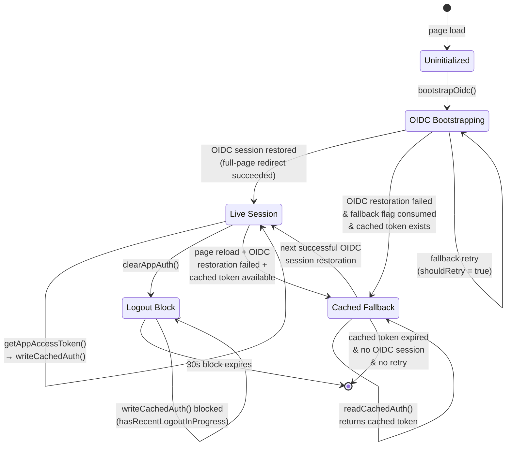
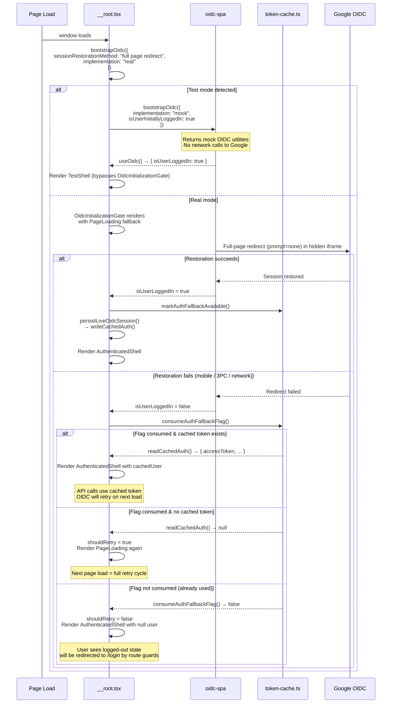
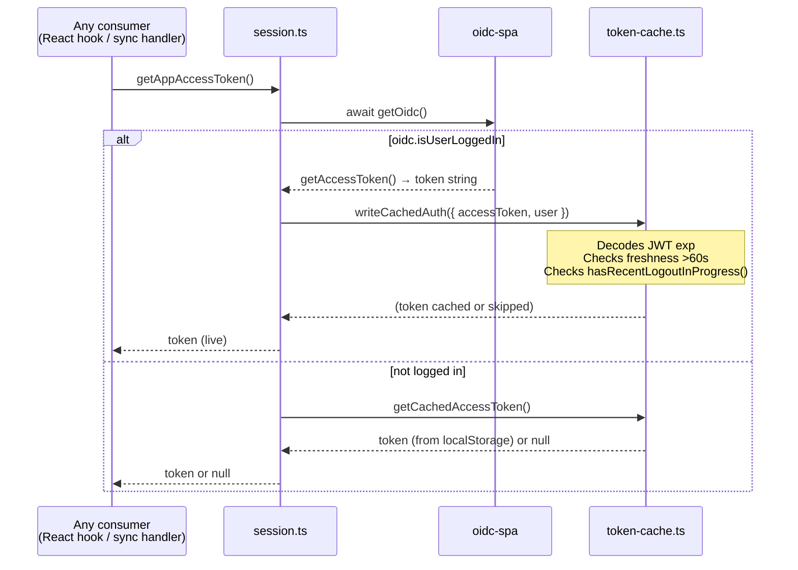
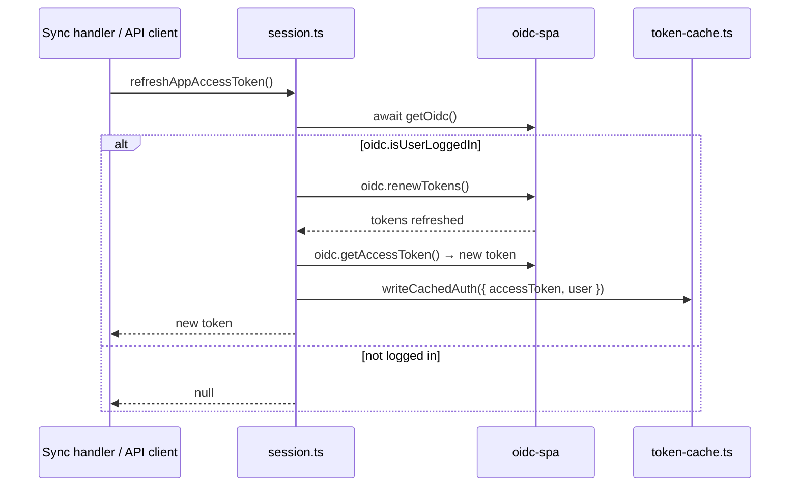
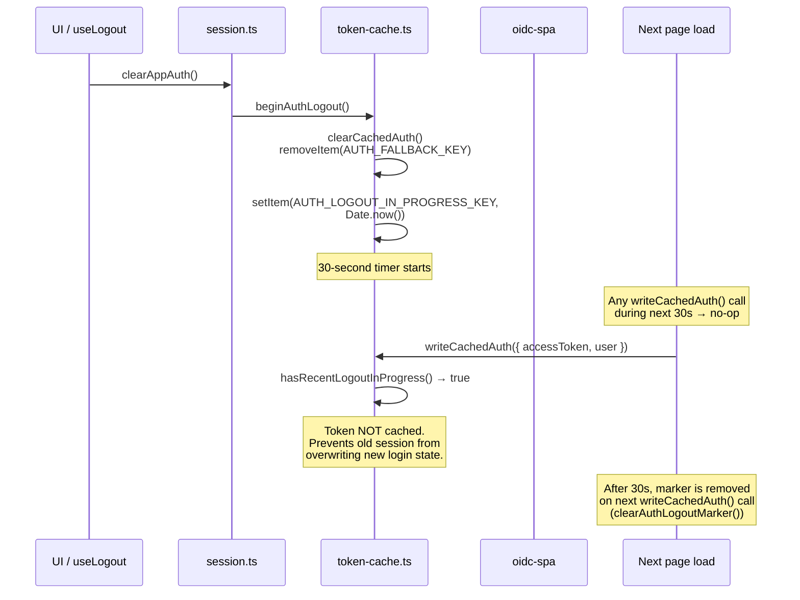
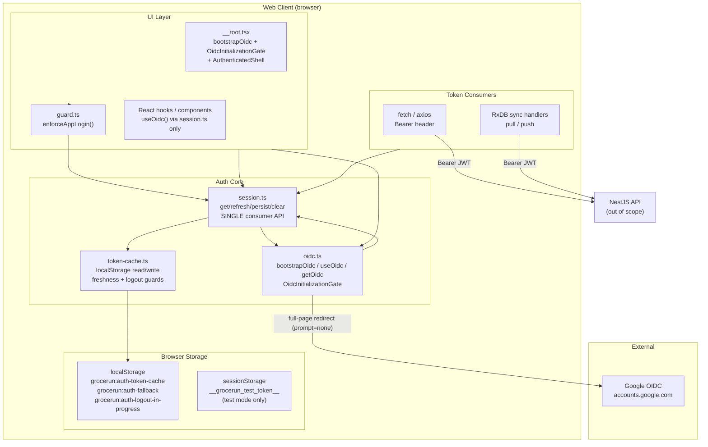

# Auth Restoration and Token Cache Fallback

## Purpose

Grocerun authenticates users via Google OIDC using `oidc-spa`. After the initial
login, every subsequent page load triggers a session restoration attempt — a full-page
redirect through Google's `prompt=none` flow in a hidden iframe that restores the
OIDC session without user interaction. On mobile devices, this redirect can fail
silently (network conditions, third-party cookie restrictions, or interrupted
redirect cycles).

The token cache fallback fills the gap between a failed session restoration and the
next successful retry. It persists the current access token (a Google ID token used
as a Bearer token) to `localStorage` so that API requests can proceed with the cached
token while `oidc-spa` continues retrying session restoration in the background.

This document describes the three-tier auth model — live OIDC session, cached token
fallback, and the logout guard — and the timing rules that prevent race conditions
between login, logout, and token refresh.

## Scope and Non-Goals

### In scope

- The `bootstrapOidc` configuration: Google OIDC issuer, `sessionRestorationMethod:
  "full page redirect"`, `__unsafe_useIdTokenAsAccessToken: true`.
- The `OidcInitializationGate` and test-mode mock OIDC bootstrap.
- The `session.ts` facade: the single consumer-facing API that wraps `useOidc()`
  and token-cache read/write.
- The `token-cache.ts` implementation: `localStorage` keys, freshness checks,
  fallback flag, and the 30-second logout re-seed block.
- The route guard (`guard.ts`) that combines live session + cached token checks.
- The `AuthenticatedShell` logic: retry fallback flag consumption and session
  persistence on successful login.

### Out of scope / non-goals

- **OIDC protocol internals**: How `oidc-spa` negotiates the redirect is assumed
  knowledge. See [oidc-spa documentation](https://github.com/garronej/oidc-spa).
- **Backend token validation**: The server decodes and verifies the JWT on every
  request. That logic lives in `apps/server/src/shared/auth-guard.ts` and is not
  covered here.
- **Sync handler token refresh**: The RxDB sync layer calls
  `refreshAppAccessToken()` on 401 responses. That flow is documented in
  [`wiki/technical-design/rxdb-sync-protocol.md`](./rxdb-sync-protocol.md).
- **E2E test token setup**: Playwright injects `sessionStorage.__grocerun_test_token__`
  via `page.addInitScript()`. That is a testing concern, not part of the auth
  restoration mechanism.

## Auth State Model



### State definitions

| State | Meaning | Duration |
|-------|---------|----------|
| **Uninitialized** | Page loaded, no OIDC state exists. | Single event → `bootstrapOidc()` |
| **OIDC Bootstrapping** | `OidcInitializationGate` is showing `PageLoading` while `oidc-spa` attempts session restoration via full-page redirect. | Until success or failure + fallback |
| **Live Session** | `oidc.isUserLoggedIn === true`. Token is in memory. `getAccessToken()` returns immediately. | Until logout, token expiry (silent refresh), or page navigation |
| **Cached Fallback** | OIDC restoration failed, but `readCachedAuth()` returned a valid token from `localStorage`. API requests use `getCachedAccessToken()`. | Until OIDC restoration succeeds or cached token expires |
| **Logout Block** | `beginAuthLogout()` called. `localStorage` cleared. `writeCachedAuth()` returns immediately for 30 seconds. | 30 seconds from `beginAuthLogout()` call |

### Transition rules summary

| From | To | Trigger | Key guard |
|------|----|---------|-----------|
| `UNINIT` | `BOOT` | `bootstrapOidc()` called in `__root.tsx` | None |
| `BOOT` | `LIVE` | `oidc-spa` completes full-page redirect successfully | `oidc.isUserLoggedIn === true` |
| `BOOT` | `CACHED` | Restoration failed; `consumeAuthFallbackFlag()` returns `true`; `readCachedAuth()` returns non-null | `shouldRetry` state in `AuthenticatedShell` |
| `BOOT` | `BOOT` (retry) | Restoration failed; fallback flag consumed but no cached token | `shouldRetry === true` causes `PageLoading` re-render |
| `LIVE` | `CACHED` | Page reload → OIDC restoration fails; cached token exists from previous `persistLiveOidcSession()` | Same as `BOOT → CACHED` |
| `LIVE` | `LOGOUT` | `clearAppAuth()` → `beginAuthLogout()` | User-initiated logout |
| `CACHED` | `LIVE` | Next page reload → OIDC restoration succeeds | `oidc.isUserLoggedIn === true` |
| `CACHED` | `[*]` | Cached token expired → `readCachedAuth()` returns `null`; no OIDC session; no retry flag | `expiresAt <= Date.now() + 60_000` |
| `LOGOUT` | `[*]` | 30-second re-seed block expires | `Date.now() - startedAt > AUTH_LOGOUT_RESEED_BLOCK_MS` |

## Call Sequence

### Session restoration on page load



### Token access during live session



### Token refresh on 401



### Logout flow



## Layer Boundaries



### Boundary rules

1. **Single consumer-facing API**: Every piece of code that needs an access token or
   auth state calls `session.ts` — never `useOidc()` directly. This ensures the
   cache write/read logic is consistently applied.

2. **OIDC owns the live session; token-cache owns the fallback**. `oidc-spa` manages
   the Google OIDC session in memory. The token-cache is purely a bounded fallback
   — it never initiates login, never refreshes tokens, and never triggers logout.

3. **Session facade never exposes cache internals**. Consumers receive `string | null`
   from `getAppAccessToken()` and have no knowledge of `localStorage`, fallback flags,
   or logout blocks.

4. **Route guards are dual-source**. `hasAppAuth()` checks both `oidc.isUserLoggedIn`
   and `readCachedAuth()`, so routes guarded by `enforceAppLogin()` remain accessible
   during cached fallback.

5. **Test mode bypasses all of the above**. When `sessionStorage.__grocerun_test_token__`
   is set, `bootstrapOidc` receives `implementation: "mock"` and
   `isUserInitiallyLoggedIn: true`. The `OidcInitializationGate` is not rendered;
   `TestShell` is used instead.

## Key Types and Objects

### `CachedAuth` (`apps/web/src/core/auth/token-cache.ts:8-12`)

```typescript
type CachedAuth = {
  accessToken: string
  user: CachedAuthUser
  expiresAt: number    // JWT exp * 1000 (ms since epoch)
}
```

### `CachedAuthUser` (`apps/web/src/core/auth/token-cache.ts:1-6`)

```typescript
type CachedAuthUser = {
  sub: string
  name?: string
  email?: string
  picture?: string
}
```

### `AppAuthUser` (`apps/web/src/core/auth/session.ts:11-16`)

```typescript
export type AppAuthUser = {
  sub: string
  name?: string
  email?: string
  picture?: string
}
```

### `localStorage` keys

| Key | Value | Set by | Description |
|-----|-------|--------|-------------|
| `grocerun:auth-token-cache` | JSON: `{ accessToken, user, expiresAt }` | `writeCachedAuth()` | Bounded fallback token |
| `grocerun:auth-fallback` | `"true"` | `markAuthFallbackAvailable()` | One-shot flag; consumed by `consumeAuthFallbackFlag()` |
| `grocerun:auth-logout-in-progress` | `String(Date.now())` (timestamp ms) | `beginAuthLogout()` | Blocks cache writes for 30s |

### Session facade API (`apps/web/src/core/auth/session.ts`)

| Function | Returns | Behaviour |
|----------|---------|-----------|
| `getCachedAppUser()` | `AppAuthUser \| null` | Delegates to `getCachedUser()` (token-cache) |
| `hasAppAuth()` | `Promise<boolean>` | `oidc.isUserLoggedIn \|\| readCachedAuth() !== null` |
| `getAppAccessToken()` | `Promise<string \| null>` | Live token from oidc if logged in → caches; else cached token |
| `refreshAppAccessToken()` | `Promise<string \| null>` | `oidc.renewTokens()` → re-cache; null if not logged in |
| `persistLiveOidcSession()` | `Promise<void>` | Snapshots current OIDC session to localStorage cache |
| `clearAppAuth()` | `void` | `beginAuthLogout()` — clears cache, sets 30s block |
| `clearInvalidAppAuth()` | `void` | `clearCachedAuth()` only — used on 401 from sync |

### Token cache internal functions (`apps/web/src/core/auth/token-cache.ts`)

| Function | Returns | Behaviour |
|----------|---------|-----------|
| `decodeJwtPayload(token)` | `Record \| null` | Decodes JWT base64 body; returns `null` on malformed input |
| `getTokenExpiresAt(token)` | `number \| null` | Extracts `exp * 1000` from decoded payload |
| `isFresh(expiresAt)` | `boolean` | `expiresAt > Date.now() + 60_000` |
| `hasRecentLogoutInProgress()` | `boolean` | Checks 30s window since logout marker |
| `beginAuthLogout()` | `void` | Clears cache, removes fallback flag, writes logout marker |
| `writeCachedAuth(params)` | `void` | Guards: logout block → return; not fresh → clear else write |
| `readCachedAuth()` | `CachedAuth \| null` | Validates shape + freshness; clears cache on failure |
| `consumeAuthFallbackFlag()` | `boolean` | One-shot read of `grocerun:auth-fallback` |

### Route guard (`apps/web/src/core/auth/guard.ts`)

```typescript
export async function enforceAppLogin() {
  if (await hasAppAuth()) return
  throw redirect({ to: '/login' })
}
```

### Bootstrap configuration (`apps/web/src/routes/__root.tsx:35-57`)

```typescript
// Real mode config
{
  implementation: "real",
  issuerUri: "https://accounts.google.com",
  clientId: oidcConfig.clientId,
  __unsafe_clientSecret: oidcConfig.clientSecret,
  __unsafe_useIdTokenAsAccessToken: true,
  sessionRestorationMethod: "full page redirect",
  BASE_URL: import.meta.env.BASE_URL,
  scopes: ["profile", "email"],
}

// Test mode config
{
  implementation: "mock",
  isUserInitiallyLoggedIn: true,
  BASE_URL: import.meta.env.BASE_URL,
  decodedIdToken_mock: {
    sub: 'test-playwright-user',
    name: 'Playwright Test User',
    email: 'test@playwright.dev',
  },
}
```

## Failure Modes

### Session restoration failures

| Scenario | Detection | Behaviour | Source |
|----------|-----------|-----------|--------|
| Full-page redirect fails (mobile / 3PC) | `oidc.isUserLoggedIn === false` after bootstrap | `consumeAuthFallbackFlag()` → if true and cached token exists → render with cached user. If no cached token → `shouldRetry = true` → `PageLoading` (retry on next load). | `__root.tsx:124-135` |
| Fallback flag already consumed (previous load) | `consumeAuthFallbackFlag()` returns `false` | `shouldRetry = false`. Render `AuthenticatedShell` with `null` user. Route guards redirect to `/login`. | `__root.tsx:132` |
| Fallback flag consumed but no cached token | `readCachedAuth()` returns `null` | `shouldRetry = true` → `PageLoading` render. Next page load triggers full retry. | `__root.tsx:131, 160-162` |
| OIDC state shows "explicitly logged out" | `getOidcSpaAuthState()` includes `'explicitly logged out'` | `shouldRetry = false`. No retry. No fallback. User must re-authenticate. | `__root.tsx:128-129` |

### Token cache failures

| Scenario | Detection | Behaviour | Source |
|----------|-----------|-----------|--------|
| Cached token expired | `isFresh(expiresAt)` returns `false` | `readCachedAuth()` clears cache and returns `null`. `getCachedAccessToken()` returns null. | `token-cache.ts:121-124` |
| Cached token malformed (missing fields) | Shape validation fails | `readCachedAuth()` clears cache and returns `null`. | `token-cache.ts:112-119` |
| `localStorage` unavailable (private browsing) | `try/catch` on all `localStorage` calls | Functions silently no-op. Cache reads return `null`. Auth falls back to live OIDC session only. | Every `localStorage` call in `token-cache.ts` |
| JWT body unparseable | `decodeJwtPayload()` returns `null` | `getTokenExpiresAt()` returns `null`. `writeCachedAuth()` clears cache (no exp to check). | `token-cache.ts:20-28` |
| Token cached but almost expired (≤60s remaining) | `isFresh(expiresAt)` returns `false` | `writeCachedAuth()` clears cache instead of writing. No fallback available for nearly-expired tokens. | `token-cache.ts:92-94` |

### Logout race conditions

| Scenario | Detection | Behaviour | Source |
|----------|-----------|-----------|--------|
| New login after logout within 30s | `hasRecentLogoutInProgress()` returns `true` | `writeCachedAuth()` returns immediately. The fresh token from the new session is NOT cached. Next page load will attempt OIDC restoration (which should succeed since new session is live). | `token-cache.ts:90` |
| Logout marker stale (>30s) | `Date.now() - startedAt > 30_000` | `hasRecentLogoutInProgress()` removes marker and returns `false`. Normal cache operation resumes. | `token-cache.ts:67-69` |
| Concurrent tabs — one logs out, other tries to cache | `hasRecentLogoutInProgress()` checks shared `localStorage` | Correctly blocks. The logout marker is visible to all tabs. | `token-cache.ts:58-75` |

### Token refresh failures

| Scenario | Detection | Behaviour | Source |
|----------|-----------|-----------|--------|
| `oidc.renewTokens()` fails (network) | Promise rejection | `refreshAppAccessToken()` propagates the error. Caller (sync handler) receives exception. | `session.ts:36-44` |
| User not logged in during refresh attempt | `oidc.isUserLoggedIn === false` | `refreshAppAccessToken()` returns `null`. No cache write occurs. | `session.ts:38` |
| `getAccessToken()` returns token that fails freshness | `writeCachedAuth()` called after successful `renewTokens()` | Token decoded, `exp` checked. If not fresh, cache is cleared. Very unlikely (newly refreshed token should be fresh). | `session.ts:42`, `token-cache.ts:89-104` |

### Configuration failures

| Scenario | Detection | Behaviour | Source |
|----------|-----------|-----------|--------|
| Missing `clientId` / `clientSecret` in both `window.__GROCERUN_CONFIG__` and Vite env | `oidcConfig` has `undefined` values | `bootstrapOidc` receives `undefined` client credentials. `oidc-spa` will fail to initialise. User sees infinite `PageLoading`. | `__root.tsx:27-30` |
| `BASE_URL` misconfigured | `oidc-spa` redirect URL doesn't match | Full-page redirect from Google returns to wrong URL. Restoration never completes. Fallback to cached token works if one exists. | `__root.tsx:53` |
| Test mode but no mock token | `isTestMode` checks `sessionStorage.__grocerun_test_token__` | If token was set then removed between check and bootstrap, OIDC bootstraps with mock config but mock user is used. Acceptable for tests. | `__root.tsx:14-16, 32-57` |

## Tests and Verification Hooks

### Test coverage

| # | Test | Scope | Status |
|---|------|-------|--------|
| 1 | `writeCachedAuth` respects logout block (`hasRecentLogoutInProgress`) | Unit — `token-cache.ts` | To be written |
| 2 | `writeCachedAuth` clears cache when token is expired / nearly expired | Unit — `token-cache.ts` | To be written |
| 3 | `writeCachedAuth` writes valid cache entry and clears logout marker | Unit — `token-cache.ts` | To be written |
| 4 | `readCachedAuth` returns parsed value when shape + freshness valid | Unit — `token-cache.ts` | To be written |
| 5 | `readCachedAuth` clears cache and returns null for expired token | Unit — `token-cache.ts` | To be written |
| 6 | `readCachedAuth` clears cache and returns null for malformed entry | Unit — `token-cache.ts` | To be written |
| 7 | `consumeAuthFallbackFlag` is one-shot (returns true once, then false) | Unit — `token-cache.ts` | To be written |
| 8 | `hasRecentLogoutInProgress` respects 30s window | Unit — `token-cache.ts` | To be written |
| 9 | `hasRecentLogoutInProgress` cleans up stale marker after 30s | Unit — `token-cache.ts` | To be written |
| 10 | `getAppAccessToken` returns live token when logged in, caches it | Unit — `session.ts` | To be written |
| 11 | `getAppAccessToken` falls back to cached token when not logged in | Unit — `session.ts` | To be written |
| 12 | `refreshAppAccessToken` renews and re-caches | Unit — `session.ts` | To be written |
| 13 | `hasAppAuth` returns true when oidc logged in or cached token exists | Unit — `session.ts` | To be written |
| 14 | `clearAppAuth` -> `beginAuthLogout` prevents immediate re-cache | Integration — full flow | To be written |
| 15 | Session restoration fallback: `AuthenticatedShell` renders with cached user when OIDC fails | Integration — `__root.tsx` | To be written |
| 16 | Session restoration skip: `shouldRetry = false` when oidc state shows logged out | Integration — `__root.tsx` | To be written |
| 17 | E2E: page load with test token bypasses OIDC entirely | E2E — Playwright | Written (test mode) |

### Running tests

```bash
# Run all auth-related unit tests
npx vitest run apps/web/test/core/auth/

# Run all web tests
npm test -w apps/web

# Run E2E tests (requires `npm run dev`)
npx playwright test apps/e2e/tests/auth-*.spec.ts
```

### Verification hooks

Key debug/observability points:

1. **Token cache logging**: `writeCachedAuth` and `readCachedAuth` log cache
   operations at `debug` level. Set `localStorage.debug = 'grocerun:auth:*'` to
   enable in browser devtools.

2. **Fallback flag inspection**: `localStorage.getItem('grocerun:auth-fallback')` in
   devtools shows whether the fallback flag is set.

3. **Logout marker inspection**: `localStorage.getItem('grocerun:auth-logout-in-progress')`
   shows the timestamp (or absence) of the current logout block.

4. **OIDC auth state**: `localStorage` keys matching `oidc-spa:auth-state:*` contain
   the raw `oidc-spa` session state, including whether the user was "explicitly logged out".

5. **`window.__GROCERUN_CONFIG__`**: In Docker deployments, set this before page
   load to supply OIDC client credentials without Vite build-time env vars.

6. **E2E test hook**: `sessionStorage.__grocerun_test_token__` can be set manually
   in devtools to simulate test mode in production builds (useful for manual
   debugging).

## Related Docs

- `apps/web/src/core/auth/oidc.ts` — `oidc-spa` utility creation (`bootstrapOidc`,
  `useOidc`, `getOidc`, `enforceLogin`, `OidcInitializationGate`).
- `apps/web/src/core/auth/session.ts` — Single consumer-facing auth API
  (`getAppAccessToken`, `refreshAppAccessToken`, `hasAppAuth`, etc.).
- `apps/web/src/core/auth/token-cache.ts` — `localStorage`-based token cache with
  freshness checks, fallback flag, and logout block (138 lines).
- `apps/web/src/core/auth/guard.ts` — Route guard (`enforceAppLogin`) that checks
  both live session and cached token.
- `apps/web/src/routes/__root.tsx` — Bootstrap configuration, `OidcInitializationGate`
  wrapping, `AuthenticatedShell` fallback logic, and test mode detection.
- [`wiki/technical-design/rxdb-sync-protocol.md`](./rxdb-sync-protocol.md) — Sync
  handler token refresh on 401 (calls `refreshAppAccessToken()`).
- [oidc-spa documentation](https://github.com/garronej/oidc-spa) — Full OIDC client
  library API.
- [Google OIDC documentation](https://developers.google.com/identity/openid-connect/openid-connect) —
  Google's OIDC protocol and `prompt=none` parameter.
