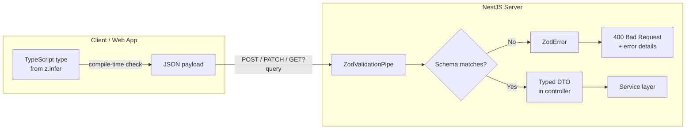
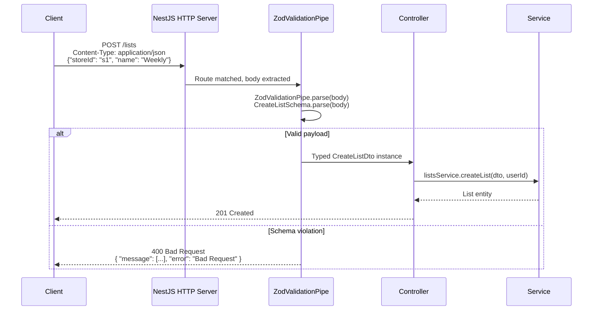

# DTO API Validation

## Purpose

Grocerun uses a single-source-of-truth approach to API input validation. All request-body and query-parameter shapes are defined as [Zod](https://zod.dev/) schemas in a shared DTO package (`@grocerun/dto`) and consumed by the NestJS server via `nestjs-zod`. The global `ZodValidationPipe` at the controller boundary automatically validates every incoming payload, returning structured 400 responses on failure.

This design ensures that:

- Validation logic lives in **one place** — never duplicated between client and server.
- TypeScript types are **derived from schemas** (`z.infer`) — they cannot drift from runtime rules.
- Service methods are **pure business logic** — they never re-validate inputs.
- The web app (and any future consumer) gets **the same types** the server uses.

## Scope and Non-Goals

### In Scope

- All 20 request-body DTOs across 7 domains (Lists, Sections, Stores, Households, Invitations, Items, Users).
- Query-parameter validation for `SearchItemsDto` and `GetTopItemsDto`.
- The shared schema definition pattern (`z.object` → `z.infer`).
- The server-side `createZodDto(Schema)` wrapper for NestJS integration.
- The `ZodValidationPipe` global registration in `main.ts`.
- The `.omit()` pattern for path parameters that are included in shared schemas but excluded from body DTOs.
- Validation error format (Zod error → HTTP 400).
- Client-side consumption of `@grocerun/dto` types.

### Out of Scope

- **Authentication / authorization** — JWT guards handle who can call an endpoint; validation handles _what_ they send.
- **Business-rule validation** — e.g., "cannot toggle an item on a completed list" lives in service methods.
- **Database-level constraints** — Prisma schema enforces column types and relations; Zod validation is the API boundary.
- **Response shape validation** — only request inputs are validated; response shapes are typed manually or via `@nestjs/swagger`.
- **Class-validator decorators** — the project migrated from `class-validator` to Zod; this document describes the current (Zod) approach only.

## Validation Model

A DTO is valid when its runtime value conforms to its Zod schema. The validation pipeline is a two-stage process:



### Schema Categories

Every shared schema uses one of three structural patterns:

| Pattern | Example | Shared schema includes |
|---------|---------|----------------------|
| **Body-only** | `CreateListSchema` | Only body fields |
| **Body + path param** | `UpdateSectionSchema` | Body fields + `id` (path param) |
| **Query** | `SearchItemsSchema` | Query-string parameters |

### The Omit Pattern

Endpoints like `PATCH /sections/:id` receive the resource ID via `@Param('id')`, not the request body. The shared schema includes `id` for type completeness, but the server DTO **omits** it:

```typescript
// apps/_shared/dtos/src/index.ts:82-87
export const UpdateSectionSchema = z.object({
  id: z.string().min(1, "ID is required"),
  name: z.string().min(1, "Name is required"),
});

// apps/server/src/sections/dto/section.dto.ts:5
export class UpdateSectionDto extends createZodDto(
  UpdateSectionSchema.omit({ id: true })
) {}
```

The controller then merges the two sources:

```typescript
// apps/server/src/sections/sections.controller.ts:28-35
@Patch(':id')
async updateSection(
  @Param('id') sectionId: string,
  @Body() dto: UpdateSectionDto,
) {
  return this.sectionsService.updateSection(sectionId, dto, user.userId!);
}
```

The `.omit()` call is always done on the **server side** so the shared schema remains the canonical superset.

The same pattern is used for:
- `ReorderSectionsSchema.omit({ storeId: true })` — `storeId` comes from `@Param('storeId')`
- `UpdateItemSchema.omit({ itemId: true })` — `itemId` comes from `@Param('id')`

## Call Sequence

The following sequence shows a complete request from HTTP arrival to service invocation:



For query-parameter validation, the flow is identical except the pipe reads from `@Query()`:

```typescript
// apps/server/src/items/items.controller.ts:22-28
@Get('search')
async searchItems(
  @Query() dto: SearchItemsDto,  // validated via ZodValidationPipe
)
```

## Layer Boundaries

```mermaid
flowchart TD
    subgraph Shared [@grocerun/dto]
        A[Zod schemas<br/>apps/_shared/dtos/src/index.ts]
        B[Inferred types<br/>z.infer<typeof Schema>]
    end

    subgraph Server [NestJS Server]
        C[Server DTO classes<br/>createZodDto(Schema.omit?)]
        D[Global ZodValidationPipe<br/>apps/server/src/main.ts:40]
        E[Controllers<br/>@Body() / @Query() with DTO type]
        F[Services<br/>Trust DTOs are valid]
    end

    subgraph Web [Web App]
        G[Import types from @grocerun/dto]
        H[API client uses types for request bodies]
        I[RxDB document shapes reference types]
    end

    A -->|z.infer| B
    A -->|import| C
    C -->|decorated on| E
    D -->|validates| E
    E -->|receives typed DTO| F
    B -->|npm package| G
    G --> H
    G --> I
```

### Direction of Dependencies

- **Server depends on shared**: Server DTO classes import schemas from `@grocerun/dto`.
- **Web depends on shared**: Web app imports inferred types from `@grocerun/dto`.
- **Shared depends on nothing**: The DTO package has only `zod` as a dependency.
- **Services depend on DTOs**: Service method signatures reference DTO types.
- **Services never validate**: Validation is complete at the controller boundary.

## Key Types and Objects

### Shared Schemas (`apps/_shared/dtos/src/index.ts`)

All 20 schemas are exported from a single barrel file. Each schema is a `z.ZodObject` and its inferred type is a named export:

```typescript
// apps/_shared/dtos/src/index.ts:3-8
export const CreateListSchema = z.object({
  storeId: z.string().min(1, "Store ID is required"),
  name: z.string().optional(),
});
export type CreateListDto = z.infer<typeof CreateListSchema>;
```

**Important convention**: The inferred type alias matches the schema's constant name suffixed with `Dto` (e.g., `CreateListSchema` → `CreateListDto`). This is not enforced by tooling but is a project-wide naming convention.

### Server DTO Classes

Each domain folder in `apps/server/src/` has a `dto/` subdirectory with classes extending `createZodDto(Schema)`:

| File | Classes | Omitted fields |
|------|---------|----------------|
| `lists/dto/create-list.dto.ts` | `CreateListDto` | — |
| `lists/dto/add-item.dto.ts` | `AddItemDto` | — (path param `listId` is in body for this endpoint) |
| `lists/dto/manage-items.dto.ts` | `ToggleItemDto`, `UpdateQuantityDto`, `RemoveItemDto`, `ListIdDto` | — |
| `sections/dto/section.dto.ts` | `CreateSectionDto`, `UpdateSectionDto`, `ReorderSectionsDto` | `UpdateSectionDto.omit({ id: true })`, `ReorderSectionsDto.omit({ storeId: true })` |
| `stores/dto/store.dto.ts` | `CreateStoreDto`, `UpdateStoreDto` | — |
| `households/dto/household.dto.ts` | `CreateHouseholdDto`, `UpdateHouseholdDto` | — |
| `invitations/dto/invitation.dto.ts` | `CreateInvitationDto`, `JoinHouseholdDto`, `RevokeInvitationDto` | — |
| `items/dto/update-item.dto.ts` | `UpdateItemDto` | `.omit({ itemId: true })` |
| `items/dto/query-items.dto.ts` | `SearchItemsDto`, `GetTopItemsDto` | — |
| `users/dto/user.dto.ts` | `UpdateProfileDto` | — |

### Global Pipe (`apps/server/src/main.ts:40`)

```typescript
app.useGlobalPipes(new ZodValidationPipe());
```

This single registration activates validation on every `@Body()` and `@Query()` decorated parameter across all controllers. Custom pipes for individual endpoints are unnecessary.

### Client Types

The web app imports the inferred types directly:

```typescript
import type { CreateListDto, AddItemDto } from '@grocerun/dto';
```

These types are used for:
- API client request bodies.
- RxDB document schema reference types.
- Frontend hook parameter types.

## Failure Modes

### 1. Missing Required Field

**Cause**: Client omits a field with `.min(1)` or no `.optional()`.

**Response** (400):
```json
{
  "message": ["Store ID is required"],
  "error": "Bad Request",
  "statusCode": 400
}
```

**Detection**: `ZodValidationPipe` calls `Schema.parse(body)`; Zod throws `ZodError` if parsing fails; nestjs-zod catches it and formats the response.

### 2. Wrong Type

**Cause**: Client sends a string where a number is expected, or vice versa.

**Response** (400):
```json
{
  "message": [
    "quantity must not be less than 0",
    "quantity must be a number conforming to the specified constraints"
  ],
  "error": "Bad Request",
  "statusCode": 400
}
```

### 3. Extra Unknown Fields

**Cause**: Client sends properties not defined in the schema.

**Effect**: The `ZodValidationPipe` (via nestjs-zod) **strips** unknown properties by default. If `forbidNonWhitelisted` behavior is needed, a custom pipe with Zod's `.strip()` / `.passthrough()` options would be required.

**Note**: Unlike the legacy `class-validator` approach (documented in `apps/server/VALIDATION-TEST.md`), Zod schemas **strip unknown keys by default**. To reject unknown properties, the schema must use `.strict()`.

### 4. Empty Array

**Cause**: Client sends `[]` for a field with `.min(1)`.

**Response** (400):
```json
{
  "message": ["orderedIds should not be empty"],
  "error": "Bad Request",
  "statusCode": 400
}
```

### 5. Out-of-Range Value

**Cause**: Client sends a number below `.min()` or above `.max()`.

**Response** (400):
```json
{
  "message": ["quantity must not be less than 0"],
  "error": "Bad Request",
  "statusCode": 400
}
```

### 6. Path Param in Body

**Cause**: Client sends a path-parameter field (e.g., `id`) in the body of an endpoint where it is omitted server-side.

**Effect**: The field is silently stripped by Zod (default `.strip()` behavior). The controller never sees it. The `@Param()` value is used instead.

### 7. Schema Definition Mismatch

**Cause**: A shared schema is updated but the server DTO's `.omit()` is not updated accordingly, or the controller's `@Param()` no longer matches the omitted field.

**Detection**: TypeScript compile-time check — the `createZodDto` wrapper preserves types, so omitted fields that no longer exist in the schema cause a type error.

### 8. No Validation for `@Param()` Values

**Cause**: Path parameters (e.g., `:listId`) are not validated by `ZodValidationPipe` — they are plain strings extracted by NestJS routing.

**Mitigation**: Service methods validate UUID format or existence in the database. This is a known gap — path-param validation could be added via a custom pipe or Zod schema applied to `@Param()`.

## Tests and Verification Hooks

### Validation Test Matrix (`apps/server/VALIDATION-TEST.md`)

A living document tracks per-endpoint validation coverage:

| Domain | DTO | Required Fields | Optional Fields | Type Checks |
|--------|-----|----------------|-----------------|-------------|
| Lists | CreateListDto | `storeId` | `name` | string |
| Lists | AddItemDto | `listId`, `name` | `sectionId`, `quantity` (≥0.1), `unit` | string + number |
| Lists | ToggleItemDto | `itemId`, `isChecked` | `purchasedQuantity` (≥0) | boolean + number |
| Lists | UpdateQuantityDto | `listItemId`, `quantity` (≥0.1) | `unit` | string + number |
| Sections | CreateSectionDto | `name`, `storeId` | `order` | string + number |
| Sections | ReorderSectionsDto | `orderedIds` (non-empty) | — | array of strings |
| Stores | CreateStoreDto | `name`, `householdId` | `location` | string |
| Items | SearchItemsDto | `storeId`, `query` | — | string |
| Items | GetTopItemsDto | `storeId` | `limit` (1-20, default 5), `threshold` (≥0, default 1) | string + number |
| Items | UpdateItemDto | `name` | `sectionId`, `defaultUnit` | string |

### Manual Verification

The `VALIDATION-TEST.md` document includes curl commands for testing:

```bash
# Test: missing required field
curl -X POST http://localhost:3001/stores \
  -H "Content-Type: application/json" \
  -H "Authorization: Bearer $TOKEN" \
  -d '{"location": "Downtown"}'
# Expected: 400 — "name should not be empty", "householdId should not be empty"
```

### Automated Test Hooks

- **Unit tests** for shared schemas: Each Zod schema can be tested with valid and invalid fixtures in `apps/_shared/dtos/src/__tests__/`.
- **E2E tests** (`apps/e2e/`): Playwright journeys exercise the full request/response cycle and verify 400 responses for invalid payloads.
- **TypeScript compilation**: The inferred types (`z.infer`) are checked at compile time. A schema change that breaks a consumer (server or web) is caught by `tsc`.
- **Lint rule** (`wiki/rules/coding-standards.md:109-110`): "All API boundaries must have Zod validation."

### Verification Hook Checklist

When adding a new endpoint:

1. Define the Zod schema in `apps/_shared/dtos/src/index.ts` (with `z.infer` type).
2. Create the server DTO class with `createZodDto(Schema)` in the appropriate `apps/server/src/<domain>/dto/` file.
3. If the schema includes a path-param field, apply `.omit({ field: true })` in the server DTO.
4. Decorate the controller parameter with `@Body()` or `@Query()` using the DTO class.
5. Add a row to the validation matrix in `apps/server/VALIDATION-TEST.md`.
6. Add a test case to `apps/e2e/` that sends an invalid payload and asserts the 400 response format.

## Related Docs

| Document | Location | Relevance |
|----------|----------|-----------|
| Shared DTO schemas | `apps/_shared/dtos/src/index.ts` | All 20 Zod schemas and inferred types |
| Coding standards (validation section) | `wiki/rules/coding-standards.md:107-111` | "All API boundaries must have Zod validation" |
| Validation test matrix | `apps/server/VALIDATION-TEST.md` | Per-endpoint validation coverage and manual test cases |
| NestJS `main.ts` global pipe | `apps/server/src/main.ts:40` | `app.useGlobalPipes(new ZodValidationPipe())` |
| Lists controller (usage example) | `apps/server/src/lists/lists.controller.ts:15-19` | `@Body() dto: CreateListDto` pattern |
| Sections DTO (omit example) | `apps/server/src/sections/dto/section.dto.ts:5` | `UpdateSectionSchema.omit({ id: true })` |
| Items DTO (omit example) | `apps/server/src/items/dto/update-item.dto.ts:4-6` | `UpdateItemSchema.omit({ itemId: true })` |
| Sections controller (omit usage) | `apps/server/src/sections/sections.controller.ts:28-35` | `@Param('id')` + `@Body() dto: UpdateSectionDto` |
| Items controller (query usage) | `apps/server/src/items/items.controller.ts:22-28` | `@Query() dto: SearchItemsDto` |
| Architecture overview | `wiki/architecture/README.md` | System-wide component view |
| nestjs-zod documentation | [npm: nestjs-zod](https://www.npmjs.com/package/nestjs-zod) | `createZodDto` and `ZodValidationPipe` reference |
| Zod documentation | [zod.dev](https://zod.dev) | Schema API reference |
