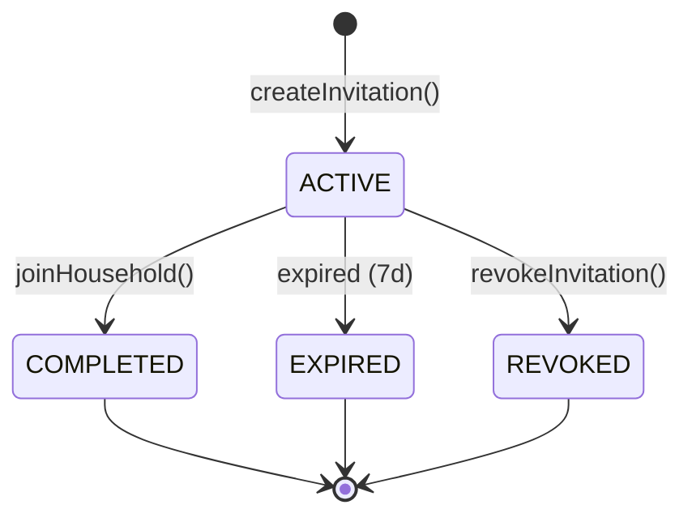
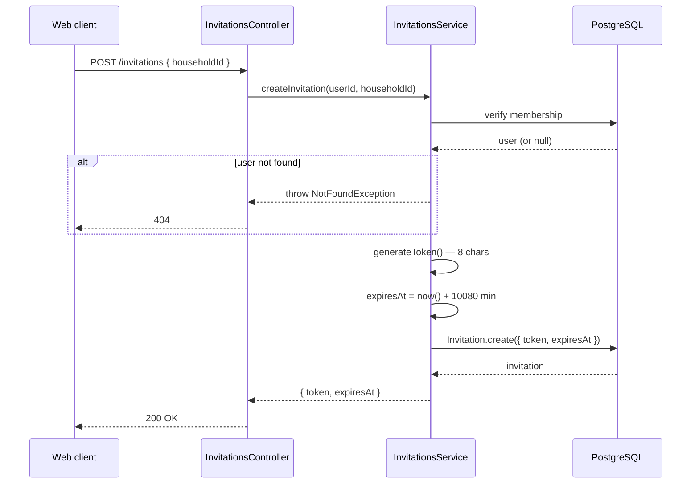
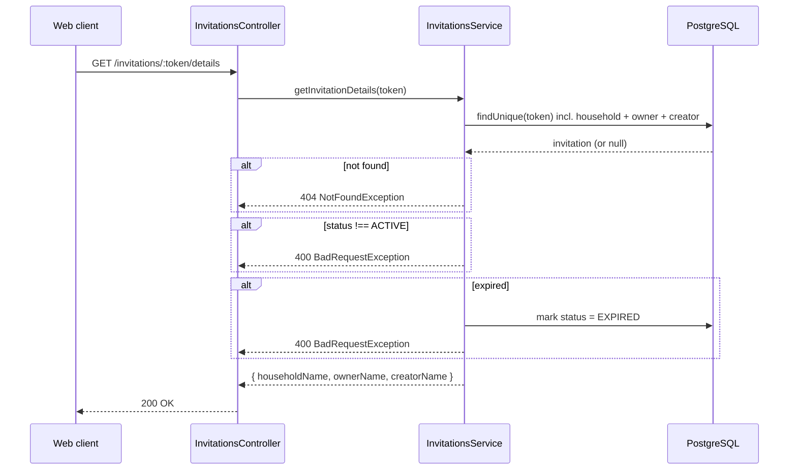
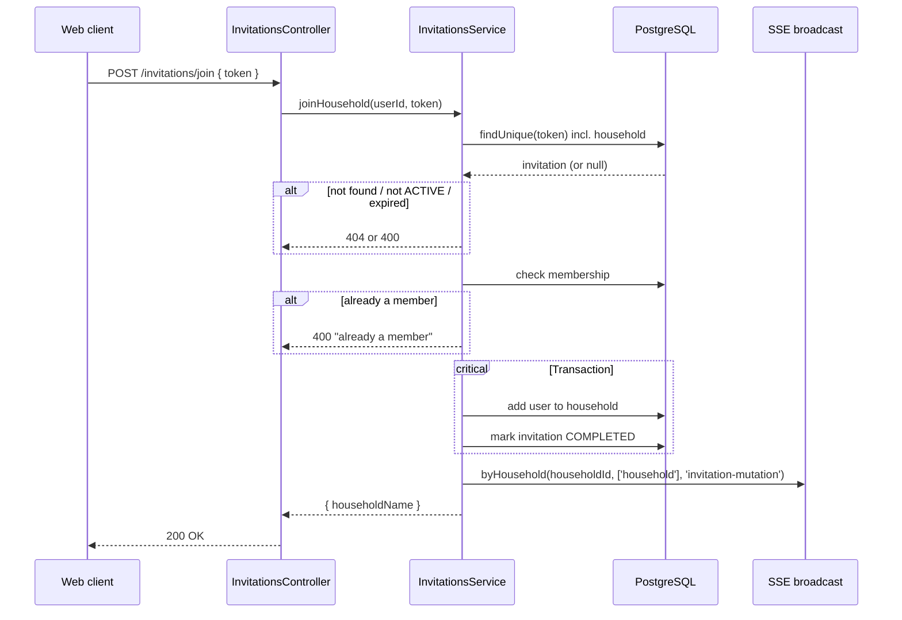
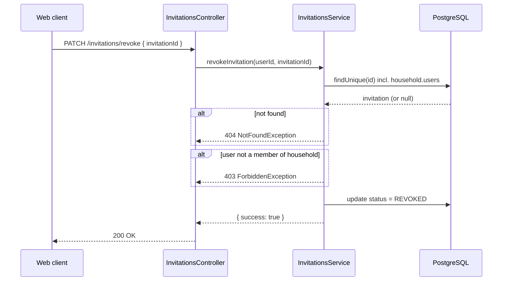
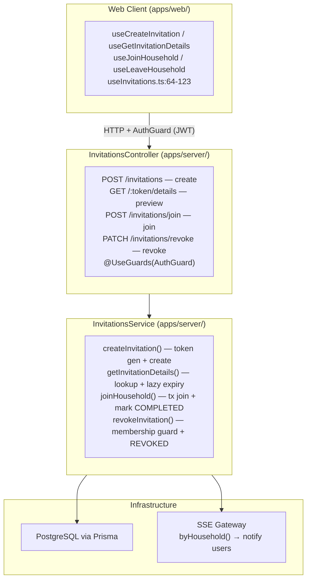

# Household Invitation Lifecycle

## Purpose

Invitations let a household member bring another user into their household. A shared 8-character token is generated and communicated out of band (copy/paste, messaging). The recipient enters the token to preview the household and confirm joining. Once joined, they gain access to all household lists, stores, and items.

This document covers the invitation lifecycle — token generation, status transitions, lazy expiry, revocation, and the individual endpoints that drive each transition.

## Scope and Non-Goals

### In scope

- Token generation algorithm and collision surface
- Four-state status machine: `ACTIVE → COMPLETED / EXPIRED / REVOKED`
- Lazy expiry evaluation (checked on access, no background cron)
- Service layer methods: `createInvitation`, `getInvitationDetails`, `joinHousehold`, `revokeInvitation`
- Calling sequence for each endpoint
- Frontend hooks that wrap each endpoint (`apps/web/src/features/households/hooks/useInvitations.ts:64-123`)
- Invitation-only join path (the only way a user enters a household)

### Out of scope / explicit non-goals

- **Leave / removal**: Leaving a household (`POST /households/:id/leave`) is a separate mechanism — invitations are one-directional entry. See `apps/web/src/features/households/hooks/useInvitations.ts:120-123` for the `useLeaveHousehold` hook, but the leave flow itself is not documented here.
- **Cascade on household soft-delete**: When a household is soft-deleted via `cascadeSoftDeleteHousehold`, existing invitations remain `ACTIVE`. This is a **known gap** (see [Failure Modes](#failure-modes)).
- **Rate limiting / invitation spam prevention**: No limit on the number of active invitations per household.
- **Configurable expiry**: The 7-day window is hardcoded at 10,080 minutes — no env var or household-level override exists.
- **Email or push delivery**: Tokens are shared out of band; the system does not send them.
- **Cryptographic randomness**: Token generation uses `randomInt`, not `crypto.randomBytes`. Acceptable for invitation codes (not security tokens).

## State Model



| State | Description | Terminal | Transitions to |
|-------|-------------|----------|----------------|
| `ACTIVE` | Usable invitation, within 7-day window | No | `COMPLETED`, `EXPIRED`, `REVOKED` |
| `COMPLETED` | Token was used to join — single-use enforcement | Yes | — |
| `EXPIRED` | Past the 7-day window. Set lazily on query | Yes | — |
| `REVOKED` | Manually cancelled by a household member | Yes | — |

**Key design note — no soft-delete**: Unlike domain models (`Household`, `Store`, `List`, `Item`), invitations use a status lifecycle instead of a `deleted` boolean. A `deleted` column would be redundant with `status IN ('EXPIRED', 'REVOKED')`. The Prisma enum `InvitationStatus` enforces exactly four values — see `apps/server/prisma/schema.prisma:189-209`.

## Call Sequence

### 4.1 Create invitation



**Implementation**: `apps/server/src/invitations/invitations.service.ts:25-56`

### 4.2 Preview invitation details



**Implementation**: `apps/server/src/invitations/invitations.service.ts:143-178`

### 4.3 Join household



**Implementation**: `apps/server/src/invitations/invitations.service.ts:58-117`

### 4.4 Revoke invitation



**Implementation**: `apps/server/src/invitations/invitations.service.ts:119-141`

## Layer Boundaries



### Key rules

- **Controllers must not contain business logic**. They parse the HTTP request, delegate to the service, and return the response.
- **Service methods throw HTTP exceptions** (`NotFoundException`, `BadRequestException`, `ForbiddenException`). Controllers let NestJS exception filters handle them — no try/catch wrapping.
- **DTOs are Zod-validated** at the controller boundary via `ZodValidationPipe` (see [`dto-api-validation.md`](./dto-api-validation.md)). The shared schemas live in `apps/_shared/dtos/src/index.ts:133-149`.
- **SSE notification** is emitted from the service layer after `joinHousehold` succeeds. The broadcast targets the `household` channel group because the membership change affects all users of that household.

## Key Types and Objects

### Prisma enum — InvitationStatus

```prisma
enum InvitationStatus {
  ACTIVE
  COMPLETED
  EXPIRED
  REVOKED
}
```

**File**: `apps/server/prisma/schema.prisma:202-207`

### Prisma model — Invitation

```prisma
model Invitation {
  id          String           @id @default(cuid())
  token       String           @unique
  householdId String
  household   Household        @relation(fields: [householdId], references: [id], onDelete: Cascade)
  creatorId   String
  creator     User             @relation(fields: [creatorId], references: [id])
  status      InvitationStatus @default(ACTIVE)
  expiresAt   DateTime
  createdAt   DateTime         @default(now())
  updatedAt   DateTime         @updatedAt
}
```

**File**: `apps/server/prisma/schema.prisma:189-200`

Key points:
- `token` is `@unique` — prevents duplicate tokens from being created (collision-resistant via 8^32 space).
- `onDelete: Cascade` on the household relation — if a household is deleted from the database (hard delete), invitations go too. However, household is soft-deleted in practice, so this cascade never fires during normal operation.
- No `deleted` field — see state model discussion above.

### Shared DTO schemas

```typescript
export const CreateInvitationSchema = z.object({
  householdId: z.string().min(1, "Household ID is required"),
});
export const JoinHouseholdSchema = z.object({
  token: z.string().min(1, "Token is required"),
});
export const RevokeInvitationSchema = z.object({
  invitationId: z.string().min(1, "Invitation ID is required"),
});
```

**File**: `apps/_shared/dtos/src/index.ts:133-149`

### Service method signatures (conceptual)

```typescript
createInvitation(userId: string, householdId: string): Promise<{ token: string; expiresAt: Date }>
getInvitationDetails(token: string): Promise<{ householdName: string; ownerName: string; creatorName: string }>
joinHousehold(userId: string, token: string): Promise<{ householdName: string }>
revokeInvitation(userId: string, invitationId: string): Promise<{ success: boolean }>
```

### Frontend hooks (`apps/web/src/features/households/hooks/useInvitations.ts:64-123`)

| Hook | Method | Success side-effect |
|------|--------|---------------------|
| `useCreateInvitation` | `POST /invitations` | Resyncs households + stores |
| `useGetInvitationDetails` | `GET /invitations/:token/details` | None (preview only) |
| `useJoinHousehold` | `POST /invitations/join` | `refreshAfterHouseholdChange()`, navigate to `/lists` |
| `useLeaveHousehold` | `POST /households/:id/leave` | `cleanupAfterLeaveHousehold(householdId)` |

## Failure Modes

### Table of failures

| Failure | Trigger | Response | Location |
|---------|---------|----------|----------|
| Token not found | Any operation with non-existent token | 404 `NotFoundException` | `getInvitationDetails` L147, `joinHousehold` L63 |
| Invitation not found by id | `revokeInvitation` with bad id | 404 `NotFoundException` | `revokeInvitation` L124 |
| Not a member (create) | User tries to invite for a household they don't belong to | 404 `NotFoundException` (no information leak) | `createInvitation` L29-36 |
| Not a member (revoke) | User tries to revoke an invitation for a household they don't belong to | 403 `ForbiddenException` | `revokeInvitation` L131-132 |
| Status not ACTIVE | `getInvitationDetails` or `joinHousehold` on COMPLETED/EXPIRED/REVOKED invitation | 400 `BadRequestException` | L156, L70 |
| Token expired | 7 days elapsed. Detected lazily on `getInvitationDetails` or `joinHousehold` | 400 `BadRequestException` + status set to `EXPIRED` | L159-169, L73-83 |
| Already a member | User calls `joinHousehold` with a valid token but is already in the household | 400 `BadRequestException("already a member")` | `joinHousehold` L93-95 |
| Token collision | `randomInt` generates the same 8-char string as an existing `ACTIVE` token | Prisma unique constraint violation. Retry is caller's responsibility | `createInvitation` token generation |

### Known gaps

1. **No `household.deleted: false` filter on `getInvitationDetails` or `joinHousehold`**: If a household is soft-deleted after an invitation is created, the invitation remains queryable and joinable. A user could join a deleted household. Source: `apps/server/src/invitations/invitations.service.ts:143-178` and `:58-117`.

2. **Invitations not revoked on household soft-delete**: When `cascadeSoftDeleteHousehold` runs, it does not touch invitations. Existing `ACTIVE` invitations continue to reference a soft-deleted household. There is no cascade from household to invitation on soft-delete.

3. **No `household.deleted: false` filter on `createInvitation` membership check**: The `findFirst` on line 27 only checks that the user is a member of the household — it does not verify the household is not deleted. A user in a soft-deleted household could still create invitations.

4. **Token not cryptographically random**: `randomInt(0, TOKEN_ALPHABET.length)` is sufficient for invitation codes (low-stakes, out-of-band delivery) but would not be acceptable for session tokens or password reset codes. Source: `apps/server/src/invitations/invitations.service.ts:8-16`.

### Prevention and mitigation

- **Token collision surface**: With a 32-character alphabet and 8-character tokens, there are 32^8 ≈ 6.3 × 10^28 possible combinations. Collision probability is negligible for any realistic number of active invitations. The `@unique` constraint provides a last-line defence.
- **Lazy expiry**: No cron job needed. Expired invitations are cleaned up only when accessed. This means the database may contain stale `ACTIVE` records past their `expiresAt`, but they will never be accepted because the expiry check runs before any state transition.
- **Status guard on both read and write**: Both `getInvitationDetails` and `joinHousehold` check `status !== 'ACTIVE'`. A `COMPLETED` or `REVOKED` invitation returns 400 even if it's not yet expired.

## Tests and Verification Hooks

### Test file

`apps/server/src/invitations/invitations.service.spec.ts` (not yet present — to be created).

### Scenario coverage needed

| Scenario | Covers |
|----------|--------|
| Create invitation as household member | Happy path — token format, expiry |
| Create invitation as non-member | 404 — no information leak |
| Get details of ACTIVE invitation | Returns household + owner + creator names |
| Get details of non-existent token | 404 |
| Get details of COMPLETED/REVOKED invitation | 400 |
| Get details of expired invitation | Lazy marks EXPIRED, returns 400 |
| Join household with valid ACTIVE token | Adds user, marks COMPLETED, SSE notification |
| Join household with expired token | Lazy marks EXPIRED, returns 400, no membership |
| Join household as existing member | 400 "already a member" |
| Join household of soft-deleted household | Currently succeeds (known gap) |
| Revoke invitation as household member | Sets REVOKED, returns `success: true` |
| Revoke invitation as non-member | 403 |
| Revoke already COMPLETED/EXPIRED invitation | Succeeds (idempotent — no ACTIVE guard) |
| Token generation uniqueness | Verifies 32-char alphabet, 8-char length, no confusing chars |
| Token collision surfaces | Verify `@unique` constraint via Prisma |

### Verification hooks

- The SSE notification after `joinHousehold` can be verified by subscribing to the household channel and confirming the `invitation-mutation` event is emitted.
- The "already a member" path can be verified by joining once, then attempting to join again with the same token.

## Related Docs

| Document | Topic |
|----------|-------|
| [`soft-delete-cascade.md`](./soft-delete-cascade.md) | Household soft-delete mechanics — explains why invitation cleanup does not happen on delete |
| [`dto-api-validation.md`](./dto-api-validation.md) | Zod validation pipeline used by all invitation DTOs |
| [`rxdb-sync-protocol.md`](./rxdb-sync-protocol.md) | SSE broadcast mechanism triggered by `joinHousehold` |
| `apps/_shared/dtos/src/index.ts` (lines 133-149) | Shared Zod schemas for invitation DTOs |
| `apps/server/prisma/schema.prisma` (lines 189-209) | Invitation model and InvitationStatus enum |
| `apps/server/src/invitations/invitations.service.ts` | Full service implementation (179 lines) |
| `apps/server/src/invitations/invitations.controller.ts` | Controller endpoints (43 lines) |
| `apps/web/src/features/households/hooks/useInvitations.ts` | Frontend hooks wrapping each endpoint |
