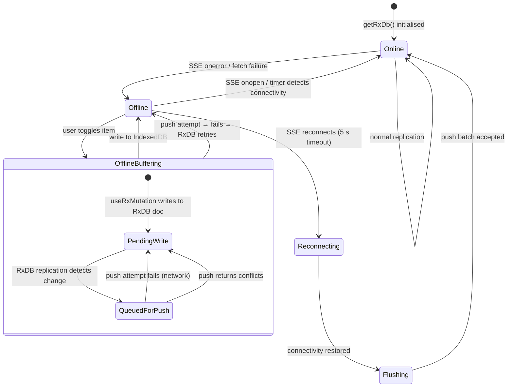
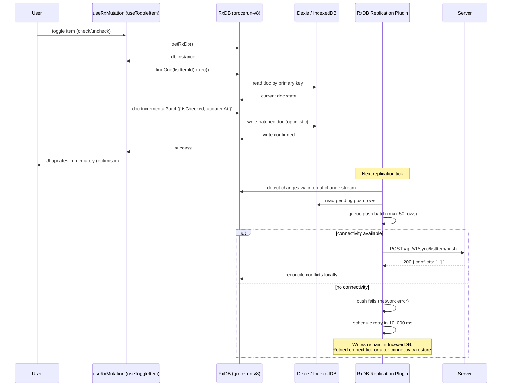
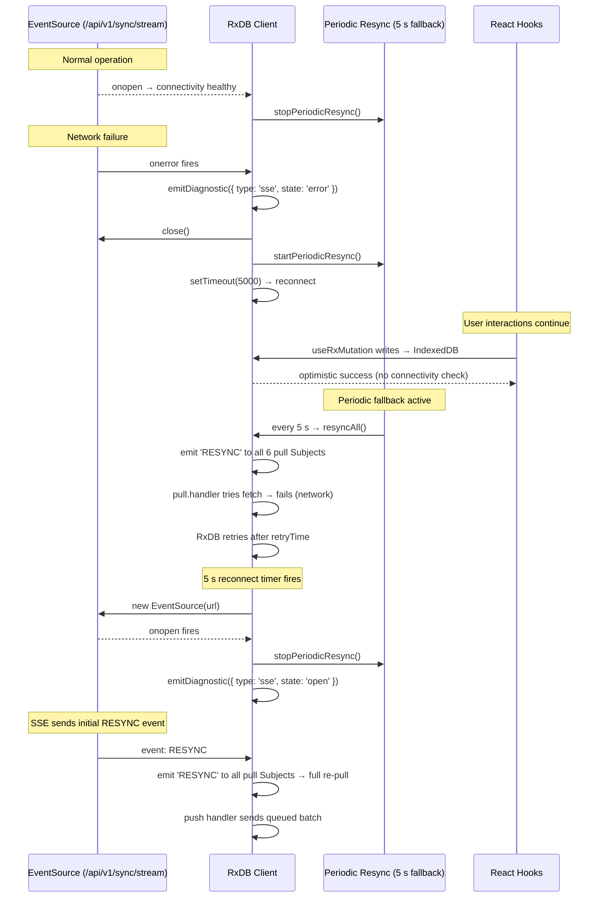
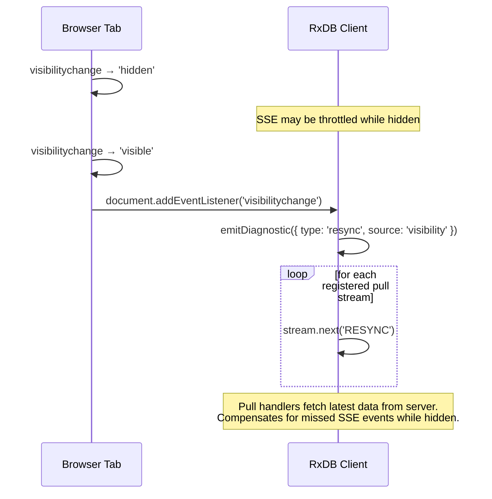
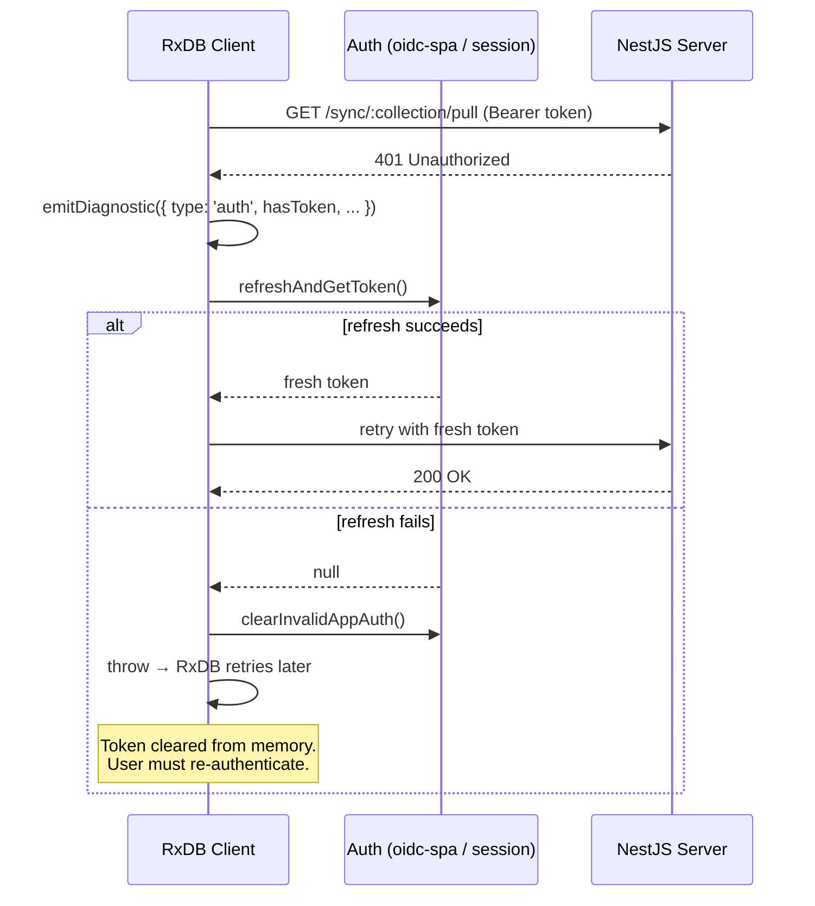
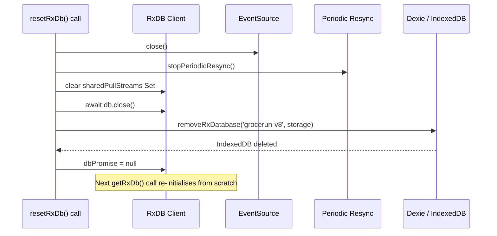
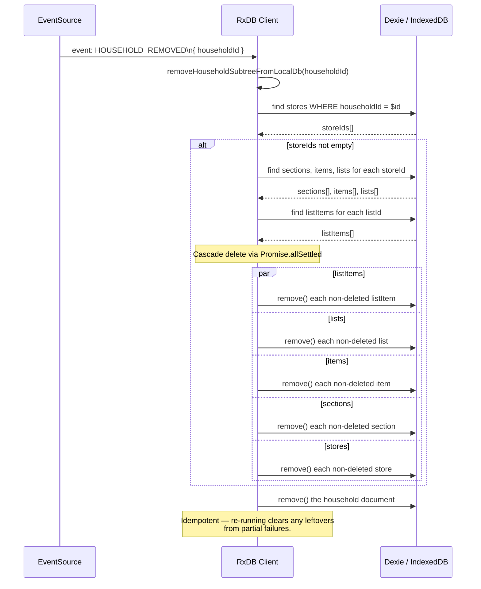
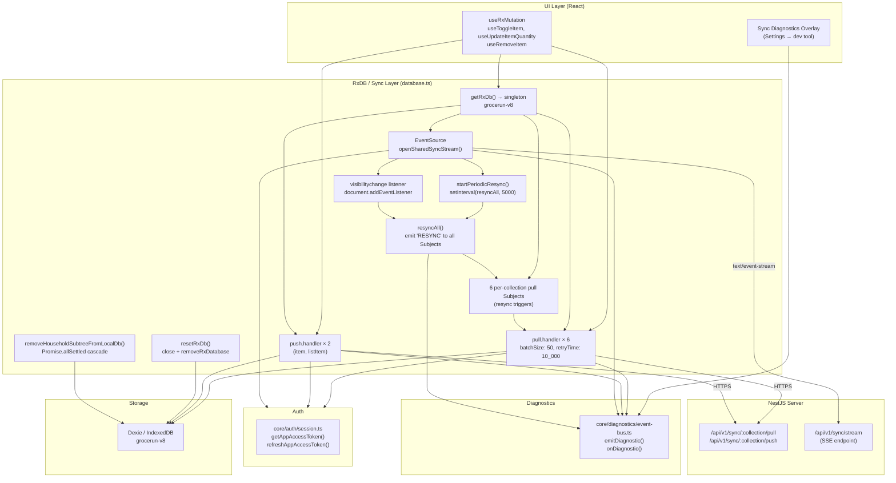
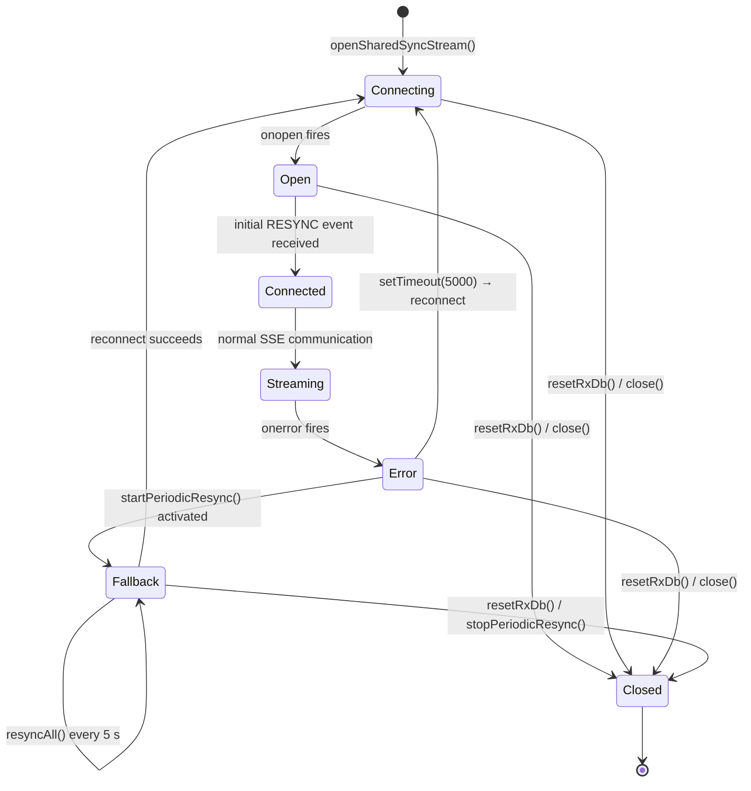

# Offline Persistence

## Purpose

Grocerun's web client uses RxDB (backed by Dexie/IndexedDB) as a local-first database.
This document describes what happens when the browser loses network connectivity — how
local writes are buffered, how the client detects connectivity loss and recovery, how
queued writes flush on reconnect, and the diagnostic instrumentation that supports
debugging offline behaviour.

It is distinct from [`rxdb-sync-protocol.md`](./rxdb-sync-protocol.md), which focuses
on the server↔client replication protocol (checkpoint pagination, push conflict
detection, SSE broadcast). This document focuses on the **offline client experience**
and the mechanisms that keep local data consistent despite intermittent connectivity.

## Scope and Non-Goals

### In scope

- The **local-first write flow** for `item` and `listItem`: optimistic IndexedDB writes,
  push queue, and flush on connectivity.
- **Connectivity health detection** using the SSE connection as the primary signal.
- **Periodic resync polling** (5 s `setInterval`): when and why it runs.
- **Visibility-change resync**: compensating for missed events when the tab is backgrounded.
- **SSE reconnect behaviour**: automatic reconnect after 5 s, starting/stopping the
  periodic fallback.
- **Diagnostic events** emitted throughout the sync pipeline (`emitDiagnostic` calls).
- **RxDB reset** (`resetRxDb`): tearing down the local database, clearing IndexedDB.
- **Household subtree removal** from local storage on `HOUSEHOLD_REMOVED` SSE event.
- **Auth token lifecycle** in the offline context: 401 detection, single refresh retry,
  token expiry during disconnect.

### Out of scope / non-goals

- **Replication protocol mechanics**: Checkpoint pagination, push conflict
  detection via `assumedMasterState`, pull query construction — these are covered in
  [`rxdb-sync-protocol.md`](./rxdb-sync-protocol.md).
- **Server-side SSE broadcast**: Registered connections, fan-out, heartbeat — see
  `sse-broadcast.service.ts` and [`rxdb-sync-protocol.md`](./rxdb-sync-protocol.md).
- **RxDB internals**: How `replicateRxCollection()` manages checkpoints, conflict
  tombstones, or retry backoff — see [RxDB Replication docs](https://rxdb.info/replication.html).
- **Schema or migration details**: RxJsonSchema definitions live in
  `apps/web/src/core/rxdb/schema.ts`. All six collections are at schema version 0.
- **Multi-tab coordination**: Each browser tab maintains its own RxDB instance. There is
  no `BroadcastChannel` or `SharedWorker` coordination between tabs.
- **Service Worker / Cache API**: Offline support is IndexedDB-only via Dexie. No
  Service Worker cache strategy is used for sync data.

## Persistence Model

### Storage layer

All local data is stored in a single IndexedDB database named `grocerun-v8` managed
through the [Dexie](https://dexie.org/) adapter (`getRxStorageDexie()`).

```
Browser tab
  └── RxDB (grocerun-v8)
        └── Dexie
              └── IndexedDB database "grocerun-v8"
                    ├── sections    (pull-only, server-authoritative)
                    ├── items       (push-enabled, local-first)
                    ├── lists       (pull-only, server-authoritative)
                    ├── listItems   (push-enabled, local-first)
                    ├── households  (pull-only, server-authoritative)
                    └── stores      (pull-only, server-authoritative)
```

| Aspect | Detail |
|--------|--------|
| Database name | `grocerun-v8` (defined as `RXDB_NAME` in `database.ts:130`) |
| Storage adapter | `getRxStorageDexie()` — Dexie wrapping IndexedDB |
| Dev mode | `wrappedValidateZSchemaStorage({ storage: base })` — adds schema validation |
| Production | Raw Dexie storage (no validation overhead) |
| Persistence | Survives page reloads. Cleared only via `resetRxDb()` or browser storage clear. |

### Authoritative split

Six collections split into two categories that determine offline behaviour:

| Category | Collections | Offline writes | Sync direction |
|----------|-------------|----------------|----------------|
| **Local-first** | `item`, `listItem` | Yes — written optimistically to IndexedDB, pushed later | Push + Pull (bidirectional) |
| **Server-authoritative** | `section`, `list`, `store`, `household` | No — all mutations go through REST only | Pull-only (unidirectional) |

For **server-authoritative** collections, offline means stale data: the last pulled
state remains visible in the UI until connectivity returns and a re-pull completes.
No local writes are accepted.

For **local-first** collections, offline means optimistic writes continue to work.
Writes accumulate in IndexedDB and flush when connectivity returns.

### Offline write lifecycle



Key transitions:

1. **Online**: SSE connection is open, periodic resync is stopped. Normal pull/push
   replication runs.
2. **Offline**: SSE `onerror` fires, or any fetch fails. The client starts the
   5-second periodic resync fallback and attempts SSE reconnect after 5 s.
3. **OfflineBuffering**: User mutations via `useRxMutation` write to IndexedDB
   immediately. RxDB's replication plugin detects the writes and queues them for push.
   Push attempts fail with network errors — RxDB retries after `retryTime: 10_000` ms.
4. **Reconnecting**: The 5-second reconnect timer fires and opens a new SSE connection.
5. **Flushing**: On SSE `onopen`, periodic resync stops. The next push replication tick
   sends the accumulated batch.
6. **Back to Online**: Push succeeds or returns conflicts. Normal replication resumes.

## Call Sequence

### Offline write — optimistic local mutation



**Files**:
- `apps/web/src/core/lib/useRxMutation.ts` — The generic mutation hook (119 lines)
- `apps/web/src/features/lists/hooks/useLists.ts:34-77` — `useToggleItem`, `useUpdateItemQuantity`, `useRemoveItem`
- `apps/web/src/core/rxdb/database.ts:375-469` — Push handler registration and implementation

### Connectivity loss detection and recovery



**Files**:
- `apps/web/src/core/rxdb/database.ts:523-581` — `openSharedSyncStream()`
- `apps/web/src/core/rxdb/database.ts:511-521` — `startPeriodicResync()` / `stopPeriodicResync()`
- `apps/web/src/core/rxdb/database.ts:504-509` — `resyncAll()`

### Visibility-change resync



**File**: `apps/web/src/core/rxdb/database.ts:487-497`

### Aggressive token refresh on 401



**Files**:
- `apps/web/src/core/rxdb/database.ts:400-410` — Pull handler 401 retry
- `apps/web/src/core/rxdb/database.ts:441-453` — Push handler 401 retry
- `apps/web/src/core/rxdb/database.ts:54-63` — `refreshAndGetToken()`
- `apps/web/src/core/auth/session.ts` — `getAppAccessToken()` / `refreshAppAccessToken()` / `clearInvalidAppAuth()`

### RxDB reset (full local clear)



**File**: `apps/web/src/core/rxdb/database.ts:148-166`

### Household subtree removal (local cascade)



**File**: `apps/web/src/core/rxdb/database.ts:583-629`

## Layer Boundaries



### Boundary rules

1. **UI never checks connectivity**: React hooks (`useRxMutation`) write optimistically
   to IndexedDB without checking online status. The replication layer handles batching
   and retry transparently.
2. **SSE is the single source of connectivity truth**: There is no separate heartbeat
   or `navigator.onLine` check. SSE `onopen` / `onerror` drive the start/stop of the
   periodic fallback timer.
3. **Periodic resync is universal and unguarded**: When active, `resyncAll()` emits
   `'RESYNC'` into all six pull Subjects regardless of connectivity. Each pull handler
   independently fails on network error and retries after `retryTime`.
4. **Token refresh is shared but single-shot**: Both pull and push handlers use the same
   `refreshAndGetToken()` helper. On 401, both attempt one refresh and one retry. A
   second 401 triggers `clearInvalidAppAuth()` — no further retries in that tick.
5. **Diagnostics are fire-and-forget**: `emitDiagnostic()` iterates listeners
   synchronously. A crashing listener never propagates to the sync layer (try/catch
   wrapper in the bus).
6. **Household removal is idempotent**: `removeHouseholdSubtreeFromLocalDb()` uses
   find-before-delete and `Promise.allSettled`. Running it multiple times on the same
   householdId is safe — subsequent runs find no non-deleted documents to remove.

## Key Types

### Diagnostic events (`apps/web/src/core/diagnostics/event-bus.ts`)

```typescript
type DiagnosticEvent =
  | { type: 'sse'; state: 'connecting' | 'open' | 'closed' | 'error'; at: number }
  | {
      type: 'pull'
      collection: string
      status: number
      docCount: number
      checkpoint: { id: string; updatedAt: string } | null
      durationMs: number
      error?: string
      at: number
    }
  | {
      type: 'push'
      collection: string
      status: number
      rowCount: number
      conflictCount: number
      durationMs: number
      error?: string
      at: number
    }
  | { type: 'auth'; hasToken: boolean; expiresAt: number | null; userId: string | null; at: number }
  | { type: 'resync'; source: 'sse' | 'visibility' | 'periodic' | 'manual'; at: number }
```

### Connective state module (`apps/web/src/core/rxdb/database.ts`)

```typescript
// Shared state
let dbPromise: Promise<GrocerunDatabase> | null = null        // cached singleton
const RXDB_NAME = 'grocerun-v8'                               // IndexedDB database name
let sharedSyncStreamOpened = false                             // SSE connection flag
let periodicResyncTimer: ReturnType<typeof setInterval> | null  // polling timer handle
let visibilityListenerAdded = false                            // one-time listener guard
let sharedSyncEventSource: EventSource | null                 // current SSE connection
const sharedPullStreams = new Set<Subject<RxReplicationPullStreamItem<any, any>>>()
```

### `useRxMutation` config (`apps/web/src/core/lib/useRxMutation.ts`)

```typescript
type RxMutationConfig<TPatch> = {
  collection: 'items' | 'listItems'     // only local-first collections
  deriveDocId: (variables: TPatch) => string
  mode?: 'patch' | 'remove'             // default 'patch'
  derivePatch?: (variables: TPatch, doc) => Record<string, unknown>
  notFoundMsg?: string
  onSuccess?: () => unknown
  onError?: (error: unknown) => unknown
}

type RxMutationReturn<TPatch> = {
  mutate: (variables: TPatch, callbacks?) => void
  mutateAsync: (variables: TPatch, callbacks?) => Promise<{ success: true }>
  isPending: boolean
}
```

### EventSource connection state

| State | Triggered by | Action taken |
|-------|-------------|--------------|
| `connecting` | `new EventSource(url)` | Emit diagnostic. No other action. |
| `open` | SSE `onopen` fires | Stop periodic resync. Emit diagnostic. |
| `error` | SSE `onerror` fires | Close EventSource. Start periodic resync. Schedule reconnect in 5 s. Emit diagnostic. |
| `closed` | `src.close()` called (manual) | No auto-reconnect. Timer leftovers cleared by caller (e.g. `resetRxDb`). |

### EventSource lifecycle state machine



## Failure Modes

### Offline write failures

| Scenario | Detection | Behaviour | Source |
|----------|-----------|-----------|--------|
| User mutates while offline | No detection at write time | Optimistic write succeeds locally. Push fails with network error → RxDB retries after `retryTime: 10_000` ms. | `database.ts:375`, `useRxMutation.ts` |
| Push rejected by server (validation) | Server returns 4xx (non-401) | Push handler throws. RxDB retries after `retryTime`. If persistent, RxDB flags the document as conflicting. | `database.ts:455-458` |
| Push succeeds with conflicts | Server returns conflict documents | RxDB stores conflict tombstones locally. Next pull fetches server-authoritative version. | `database.ts:461-463` |
| Document not found locally | `findOne(docId).exec()` returns null | `useRxMutation` throws `"${collection} doc not found"`. UI shows error toast. | `useRxMutation.ts:72-74` |
| Write to server-authoritative collection | Not possible — no `useRxMutation` config for those collections | UI only exposes REST-based mutations for section/list/store/household. Local mutations are structurally impossible. | `useRxMutation.ts:18` |

### Connectivity detection failures

| Scenario | Detection | Behaviour | Source |
|----------|-----------|-----------|--------|
| SSE connection drops silently | `EventSource.onerror` fires | Closes EventSource. Starts periodic resync (5 s). Schedules reconnect in 5 s. | `database.ts:565-580` |
| SSE never connects (first load offline) | EventSource `onerror` on initial connection | No periodic resync started (relies on `startPeriodicResync` after `initDatabase`). Timer runs at 5 s regardless. | `database.ts:216`, `database.ts:565-580` |
| Browser tab hidden → SSE throttled | Browser throttles EventSource while tab is backgrounded | `visibilitychange` → `visible` triggers `resyncAll()` on all collections, compensating for missed events. | `database.ts:487-497` |
| SSE heartbeat missing | No client-side detection | EventSource stays open. No keepalive timeout on the client. Heartbeat is purely server-side (25 s interval). | `sync.controller.ts:60-68` |
| `navigator.onLine` false but SSE open | No detection — SSE is the source of truth | No action. SSE `onerror` will fire if actual connectivity is lost. | No `navigator.onLine` usage in sync code |
| SSE reconnects with expired token | SSE endpoint returns error → EventSource closes | Auto-reconnect fires again after 5 s. New connection attempt uses `getAccessToken()` which may return a fresh token. | `database.ts:524` |

### Periodic resync failures

| Scenario | Detection | Behaviour | Source |
|----------|-----------|-----------|--------|
| Network unavailable during resync | `pull.handler` fetch fails | Throws to RxDB. RxDB retries after `retryTime`. No cascading effect — other pull handlers run independently. | `database.ts:412-416` |
| Periodic resync continues while SSE is open | `startPeriodicResync()` guard prevents this | `stopPeriodicResync()` is called in SSE `onopen`. Duplicate calls to `startPeriodicResync()` are no-ops. | `database.ts:512`, `database.ts:562` |
| `setInterval` battery concern on mobile | Known design trade-off | 5-second polling can impact battery on mobile when SSE is down. Mitigated by SSE being the primary mechanism — polling only runs during SSE gaps. | `database.ts:511-521` |

### Auth token failures during offline periods

| Scenario | Detection | Behaviour | Source |
|----------|-----------|-----------|--------|
| Token expires while offline | Detected on first push/pull after reconnect | 401 handler attempts one `refreshAndGetToken()`. If refresh succeeds, retry succeeds. If refresh fails, `clearInvalidAppAuth()` runs — user must re-authenticate. | `database.ts:400-410`, `database.ts:441-453` |
| Token refresh also fails | `refreshAndGetToken()` returns null | Push/pull handler throws. RxDB retries after `retryTime`. In the worst case, the user sees stale data until they re-authenticate. | `database.ts:54-63` |
| SSE token param expired | SSE endpoint closes connection | EventSource auto-reconnects. New connection includes token from `getAccessToken()`. | `database.ts:524` |

### Data integrity failures during offline periods

| Scenario | Detection | Behaviour | Source |
|----------|-----------|-----------|--------|
| Partial household subtree removal | `Promise.allSettled` partial failure | Failures logged to console. Remaining documents are not deleted. Function is idempotent — re-running clears leftovers. | `database.ts:604-618` |
| Conflicting writes in two tabs while offline | Server-side detection on first push | First tab to push wins (`assumedMasterState.updatedAt` matches). Second tab receives conflict tombstones and re-pulls. | `item-sync.ts:90-110`, `list-item-sync.ts:120-140` |
| Push batch exceeds server capacity | Server returns 413 or timeout | RxDB retries entire batch. No batch splitting — batch size is 50 by default. | `database.ts:427` |
| IndexedDB quota exceeded | `Dexie` / browser throws `QuotaExceededError` | Write fails. RxDB error surfaces. The mutation is lost. No graceful degradation — this is an extreme edge case for document data. | No explicit handling |
| `resetRxDb()` called while writes are queued | Caller explicitly invokes `resetRxDb()` | Pending writes in IndexedDB are deleted. No flush attempt. Callers should only call `resetRxDb()` on logout or explicit user action. | `database.ts:148-166` |

## Tests and Verification Hooks

### Client-side tests

| File | What it covers | Status |
|------|---------------|--------|
| `apps/web/test/core/rxdb/replication.spec.ts` | Pull handler construction, push handler construction, token refresh on 401, SSE event routing, periodic resync lifecycle | To be written |
| `apps/web/test/core/rxdb/removeHousehold.spec.ts` | `removeHouseholdSubtreeFromLocalDb` cascade order and idempotent retry | To be written |
| `apps/web/test/core/rxdb/useRxMutation.spec.ts` | Offline write — optimistic local update, error when doc not found, patch derivation | To be written |
| `apps/web/test/core/rxdb/connectivity.spec.ts` | SSE onopen/onerror → periodic resync start/stop, visibilitychange → resyncAll | To be written |

### Server-side tests (relevant to offline)

| File | What it covers | Status |
|------|---------------|--------|
| `apps/server/test/sync/item-push.spec.ts` | Push items: create, update, delete, restore-on-create, conflict detection | Written |
| `apps/server/test/sync/listitem-push.spec.ts` | Push listItems: shopping lock violations, `updatedAt` pin, conflict detection | Written |
| `apps/server/test/sync/sse-broadcast.spec.ts` | SSE broadcast service: register, notify, unregister | Written |

### E2E tests

| File | What it covers | Status |
|------|---------------|--------|
| `apps/e2e/tests/sync-offline.spec.ts` | Offline writes queued locally, pushed on reconnect, conflicts resolved | Written |
| `apps/e2e/tests/sync-push-pull.spec.ts` | Full round-trip: write locally → push → pull → verify server state | Written |
| `apps/e2e/tests/sync-sse.spec.ts` | SSE connection, mutation triggers SYNC_CHANGED, client re-pulls | Written |
| `apps/e2e/tests/sync-household-removal.spec.ts` | Household deletion cascades via SSE → client removes subtree | Written |

### Running the tests

```bash
# Web RxDB tests
npx vitest run apps/web/test/core/rxdb/

# Server sync tests
npx vitest run apps/server/test/sync/

# E2E sync tests (requires `npm run dev`)
npx playwright test apps/e2e/tests/sync-*.spec.ts
```

### Verification hooks

Key debug and observability points:

1. **Diagnostics overlay**: Settings → "Sync diagnostics" checkbox (developer tool only).
   Subscribes to `onDiagnostic()` and displays the event stream in real time.
   File: `apps/web/src/core/diagnostics/event-bus.ts`.

2. **Console logging**: Pull/push handlers log request URLs and abbreviated payloads at
   `debug` level. Set `localStorage.debug = 'grocerun:rxdb:*'` to enable.

3. **Periodic resync handle**: The `setInterval` handle is stored on
   `window.__grocerun_resync_timer` for manual inspection in devtools
   (database.ts:513 sets this in `startPeriodicResync`).

4. **Test mode bypass**: Setting `sessionStorage.__grocerun_test_token__` before page load
   bypasses real auth token resolution — useful for local manual testing and E2E tests.

5. **SSE event trace**: All SSE events are logged via `emitDiagnostic` at the point of
   reception. The `resync` diagnostic includes the source (`'sse'`, `'visibility'`,
   `'periodic'`, `'manual'`).

6. **RxDB devtools**: In development, `wrappedValidateZSchemaStorage` runs schema
   validation on every write. Validation errors surface immediately in the console.

## Related Docs

- `apps/web/src/core/rxdb/database.ts` — Client RxDB setup, replication config, SSE
  connection, periodic resync (630 lines).
- `apps/web/src/core/rxdb/schema.ts` — Six RxJsonSchema definitions, version 0
  (238 lines).
- `apps/web/src/core/lib/useRxMutation.ts` — Generic mutation hook for local-first
  collections (119 lines).
- `apps/web/src/core/auth/session.ts` — `getAppAccessToken()` / `refreshAppAccessToken()`
  used by sync handlers.
- `apps/web/src/core/diagnostics/event-bus.ts` — Diagnostic event types and pub/sub bus
  (67 lines).
- `apps/web/src/features/lists/hooks/useLists.ts` — Use-case hooks (useToggleItem,
  useUpdateItemQuantity, useRemoveItem) built on `useRxMutation`.
- `apps/server/src/sync/sync.controller.ts` — Pull, push, and stream endpoints
  (142 lines).
- `apps/server/src/sync/sse-broadcast.service.ts` — In-memory SSE fan-out service
  (61 lines).
- [`wiki/technical-design/rxdb-sync-protocol.md`](./rxdb-sync-protocol.md) — Replication
  protocol, checkpoint pagination, push conflict detection, SSE + polling fallback.
- [`wiki/technical-design/soft-delete-cascade.md`](./soft-delete-cascade.md) — Soft-delete
  lifecycle, cascade order, restore-on-create pattern, and tombstone window rationale.
- [`wiki/technical-design/shopping-mode-lock.md`](./shopping-mode-lock.md) — Shopping lock
  enforcement in sync push.
- [`wiki/architecture/data-sync-and-concurrency.md`](../architecture/data-sync-and-concurrency.md) —
  High-level sync architecture and concurrency model.
- [RxDB Replication](https://rxdb.info/replication.html) — Official RxDB replication
  protocol documentation.
- [Dexie.js](https://dexie.org/) — IndexedDB wrapper used as RxDB storage adapter.
