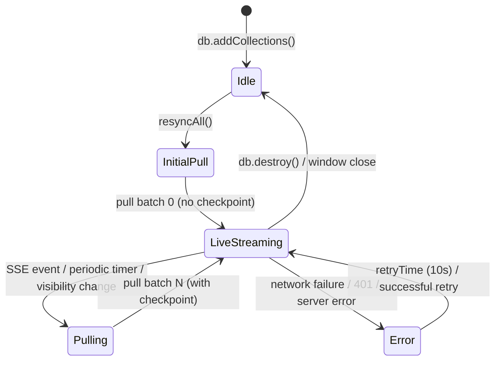
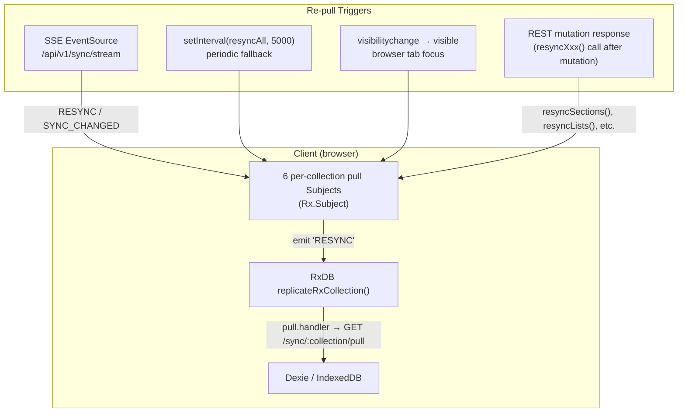
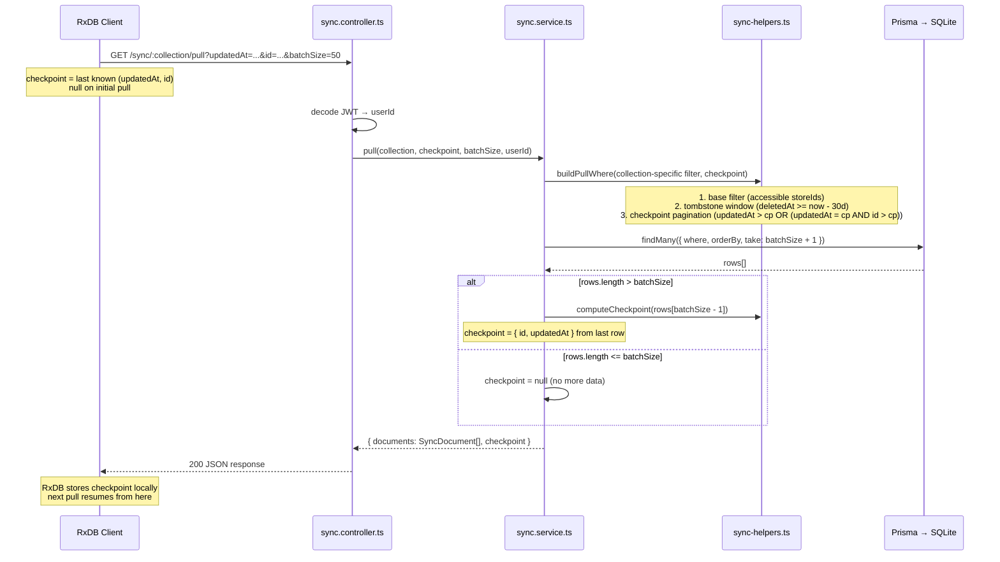
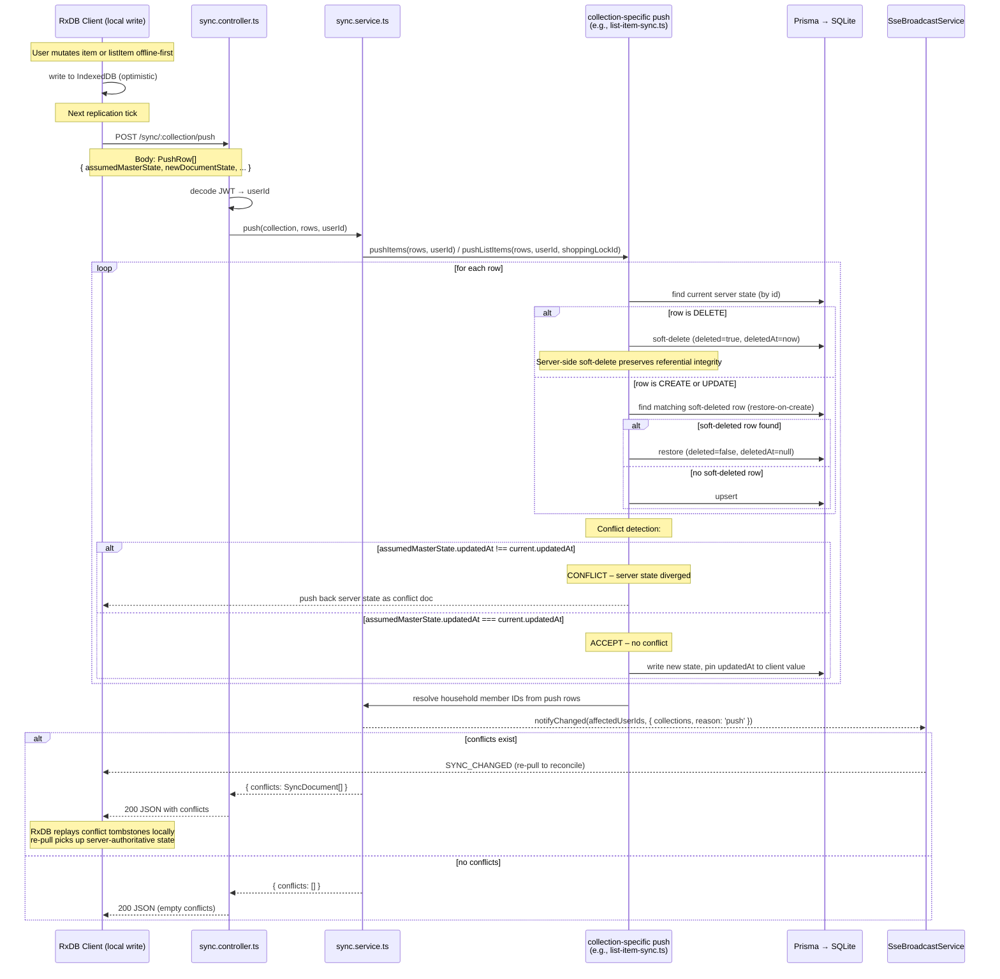
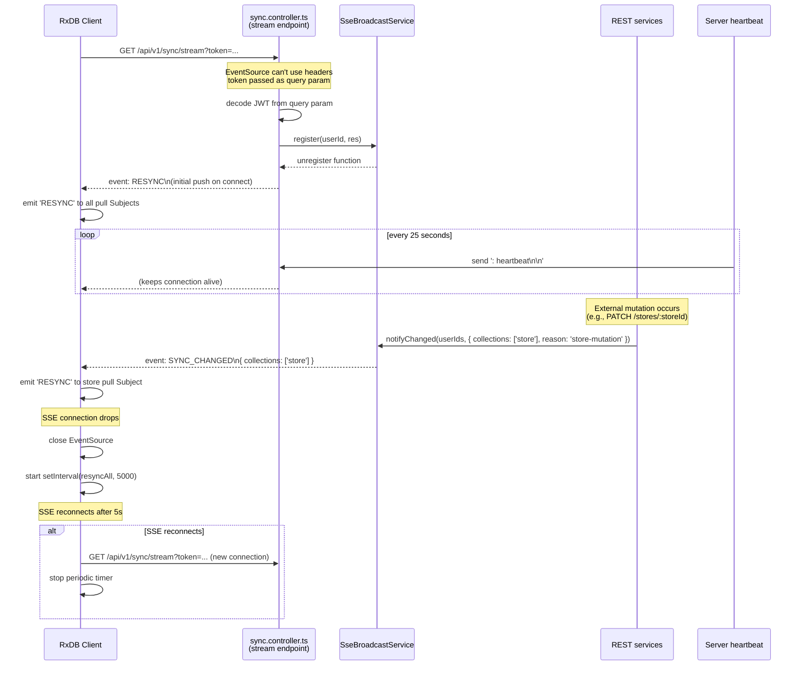
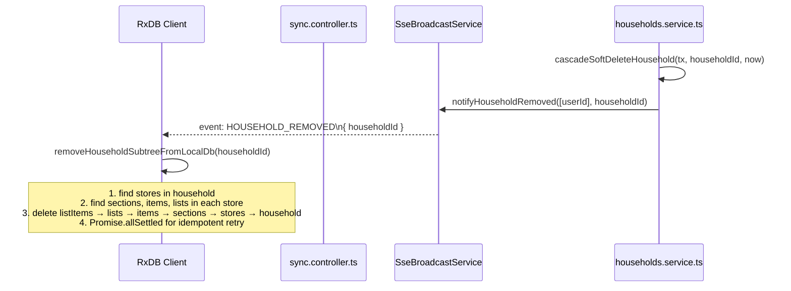
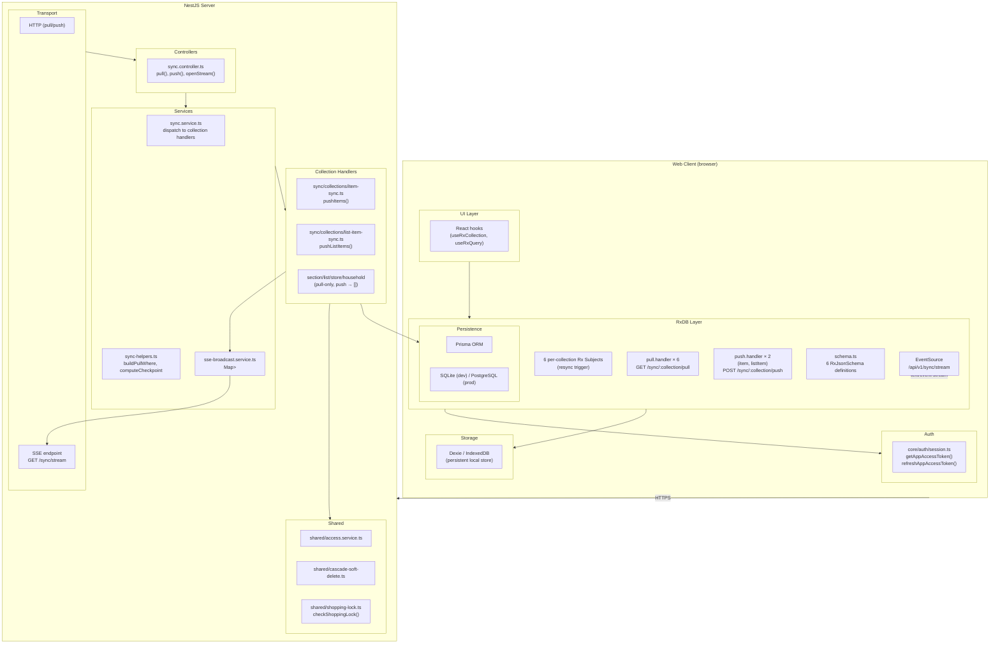

# RxDB Sync Protocol

## Purpose

Grocerun uses [RxDB](https://rxdb.info/) (backed by Dexie/IndexedDB) as the Phase 4
local-first database on the web client. Six collections — **section**, **item**, **list**,
**listItem**, **store**, **household** — replicate with the NestJS server via a custom
pull/push/stream protocol built on RxDB's `replicateRxCollection()`.

This document describes:

- The **authoritative split** that governs which collections push and which are pull-only.
- How **checkpoint-based pagination** drives deterministic pull queries over Prisma's
  `(updatedAt, id)` composite index.
- The **push conflict detection** mechanism using `assumedMasterState` and `updatedAt` pinning.
- The **SSE + polling fallback** real-time architecture that triggers re-pulls.
- How RxDB **retries**, **tombstone reconciliation**, and **conflict handling** work.

## Scope and Non-Goals

### In scope

- The six RxDB collections, their replication modes (push enabled vs pull-only), and the
  rationale for the split.
- The `pull.handler` and `push.handler` implementations in
  `apps/web/src/core/rxdb/database.ts`.
- The server pull/push dispatch in `apps/server/src/sync/` and collection-specific sync handlers.
- Checkpoint pagination, tombstone window, and `buildPullWhere` in
  `apps/server/src/sync/sync-helpers.ts`.
- Push conflict detection via `assumedMasterState.updatedAt` comparison.
- The `updatedAt` pin pattern that prevents false conflicts.
- SSE broadcast (`apps/server/src/sync/sse-broadcast.service.ts`) and the single shared
  `EventSource` feeding into per-collection pull Rx Subjects.
- Periodic polling fallback, visibility-change resync, and SSE reconnect logic.
- Auth token handling within the sync loop (401 → refresh → retry).
- Household subtree removal on `HOUSEHOLD_REMOVED` SSE event.

### Out of scope / non-goals

- **REST API endpoint design**: Documented separately in the API docs. This doc covers
  only `/api/v1/sync/:collection/pull`, `/api/v1/sync/:collection/push`, and
  `/api/v1/sync/stream`.
- **RxDB internals**: How RxDB's replication protocol works under the hood (checkpoint
  storage, conflict meta, etc.) is assumed knowledge. See
  [RxDB Replication docs](https://rxdb.info/replication.html).
- **Schema details**: RxJsonSchema definitions live in
  `apps/web/src/core/rxdb/schema.ts` and are summarised here only for context.
- **Offline write buffering**: RxDB handles local writes transparently. This doc covers
  the online push/pull mechanics, not the offline queue.
- **Data migration / schema versioning**: All six collections are at schema version 0.
  Schema migration is not yet exercised.
- **Multi-tab coordination**: Each browser tab maintains its own RxDB instance. There is
  no BroadcastChannel or SharedWorker coordination between tabs.

## Sync Model

### Authoritative split

The six collections split into two categories:

| Category | Collections | Behaviour | Rationale |
|----------|-------------|-----------|-----------|
| **Local-first** | `item`, `listItem` | Client writes locally first, then pushes to server. Server validates and may return conflicts. | These are the high-frequency mutation targets during shopping and list management. Offline writes must work. |
| **Server-authoritative** | `section`, `list`, `store`, `household` | All mutations go through REST endpoints only. Server broadcasts SSE → client re-pulls. These collections are **pull-only** (no push). | These are configuration/admin data. Mutations are infrequent and require server-side invariants (e.g. unique names per store, household membership validation). |

**File**: `apps/web/src/core/rxdb/database.ts:314-340` — `enablePush` is `true` only for
`item` and `listItem`.

### Replication lifecycle

Each collection's replication goes through these phases:



Key transitions:

1. **InitialPull**: Happens immediately after collection creation via `resyncAll()`
   (`database.ts:227-231`). RxDB receives checkpoint `null` and pulls the full dataset.
2. **LiveStreaming**: The steady state. RxDB's `live: true` config keeps the
   `pull.handler` ready for the next checkpoint interval.
3. **Pulling**: Triggered by:
   - SSE `RESYNC` or `SYNC_CHANGED` event → emits `'RESYNC'` into all six pull Subjects
     (`database.ts:560-565`).
   - Periodic 5-second `setInterval` fallback when SSE is disconnected
     (`database.ts:511-521`).
   - Browser `visibilitychange` to `visible` → calls `resyncAll()`
     (`database.ts:487-497`).
4. **Error**: Retries automatically after `retryTime: 10_000` ms (`database.ts:375`).
   On 401, the handler attempts a token refresh and retries once before throwing.

### Re-pull trigger flow



**File**: `apps/web/src/core/rxdb/database.ts:523-581` — SSE connection setup and event
routing. Lines 233-304 define the individual `resyncXxx()` helpers called from REST
mutation responses.

## Call Sequence

### Pull (normal flow)



**Files**:
- Pull handler registration: `apps/web/src/core/rxdb/database.ts:375-469`
- Server pull dispatch: `apps/server/src/sync/sync.controller.ts:17-44`
- Pull helper (shared): `apps/server/src/sync/sync-helpers.ts:12-102`

### Push (local-first collections)

Only `item` and `listItem` execute push. All other collections return empty arrays from
their push handlers (`apps/server/src/sync/sync.service.ts:91-107`).



**Files**:
- Push handler registration: `apps/web/src/core/rxdb/database.ts:314-340`
- Server push dispatch + collection routing: `apps/server/src/sync/sync.service.ts:65-107`
- Item push: `apps/server/src/sync/collections/item-sync.ts`
- ListItem push: `apps/server/src/sync/collections/list-item-sync.ts`
- Push conflict detection + `updatedAt` pin: `list-item-sync.ts:120-140`,
  `item-sync.ts:90-110`

### SSE stream (real-time trigger)



**Files**:
- SSE endpoint: `apps/server/src/sync/sync.controller.ts:50-68`
- SSE broadcast service: `apps/server/src/sync/sse-broadcast.service.ts` (61 lines)
- Client SSE connection: `apps/web/src/core/rxdb/database.ts:523-581`
- Periodic fallback: `apps/web/src/core/rxdb/database.ts:511-521`

### Household removal (cascade delete via SSE)



**File**: `apps/web/src/core/rxdb/database.ts:583-629` — `removeHouseholdSubtreeFromLocalDb()`

## Layer Boundaries



### Boundary rules

1. **Client push is opt-in**: Only `item` and `listItem` register a `push.handler`.
   All other collections set `enablePush: false` (`database.ts:314-340`).
2. **Pull handler is universal**: All six collections register a `pull.handler`.
   Server-authoritative collections re-pull after every REST mutation.
3. **Server push is opt-in by collection**: `sync.service.ts:91-107` routes only
   `item` and `listItem` to collection-specific push handlers. All others return
   `[]` (no-op).
4. **SSE fan-out is collection-scoped**: The `SYNC_CHANGED` event includes a
   `collections` array. The client only emits `'RESYNC'` into the pull Subjects for
   the affected collections (`database.ts:560-565`).
5. **Periodic resync is universal**: When SSE is disconnected, `setInterval(resyncAll, 5000)`
   fires `'RESYNC'` into all six pull Subjects, not just a subset.
6. **Auth is decoupled**: The client's token helpers (`database.ts:40-63`) are shared
   between pull and push handlers. On 401, both handlers attempt one token refresh
   before failing.

## Key Types and Objects

### Client-side

#### `RxDB` singleton (`apps/web/src/core/rxdb/database.ts:129-146`)

```typescript
// Promise-cached singleton; cleared on failure so retries work
export async function getRxDb(): Promise<RxDatabase> {
  // name: 'grocerun-v8'
  // storage: wrappedValidateZSchemaStorage (dev) / Dexie (prod)
  // Six collections added via addCollections()
  // After creation: start replication, resyncAll(), startPeriodicResync()
}
```

#### Replication config pattern (`apps/web/src/core/rxdb/database.ts:375-469`)

```typescript
// Each collection uses this pattern
replicateRxCollection({
  collection,
  replicationIdentifier: `grocerun-${collection.name}-replication`,
  live: true,
  retryTime: 10_000,
  deletedField: '_deleted',
  pull: {
    batchSize: 50,
    handler: async (lastCheckpoint) => {
      // GET /api/v1/sync/{collection}/pull?updatedAt=...&id=...&batchSize=50
      // On 401 → refreshAppAccessToken() + retry once
      // Returns { documents: RxDocument[], checkpoint: Checkpoint }
    },
  },
  push: collection.name === 'item' || collection.name === 'listItem'
    ? {
        batchSize: 50,
        handler: async (rows) => {
          // POST /api/v1/sync/{collection}/push
          // Body: RxReplicationWriteToMasterRow[]
          // On 401 → refreshAppAccessToken() + retry once
          // Response: PushResponse (conflict documents)
        },
      }
    : undefined,
});
```

#### `RxReplicationWriteToMasterRow` (RxDB built-in)

```typescript
// Each push row sent to the server contains:
export type RxReplicationWriteToMasterRow<RxDocType> = {
  assumedMasterState: RxDocType | null;   // client's last-known server state
  newDocumentState: RxDocType;             // client's current local state
};
```

### Server-side

#### Pull response (`apps/server/src/sync/sync.controller.ts:36-44`)

```typescript
// Response shape returned from GET /sync/:collection/pull
interface PullResponse {
  documents: SyncDocument[];       // array of documents (with _deleted for tombstones)
  checkpoint: SyncCheckpoint | null; // { id: string; updatedAt: string } or null
}
```

#### Push request and response (`apps/server/src/sync/sync.controller.ts:46-59`)

```typescript
// Request body for POST /sync/:collection/push
interface PushRow {
  assumedMasterState: Record<string, unknown> | null;
  newDocumentState: Record<string, unknown>;
}

// Response body
interface PushResponse {
  // Conflicting master states; empty array = all accepted
  // RxDB replays these as tombstones locally
  conflicts: SyncDocument[];
}
```

#### `SyncCheckpoint` (`apps/server/src/sync/sync-helpers.ts:45-52`)

```typescript
interface SyncCheckpoint {
  id: string;
  updatedAt: string; // ISO-8601
}
```

#### `SyncDocument` (per-collection `toDoc` mapper)

```typescript
// Each collection provides a mapper that transforms a Prisma row into a sync document.
// The `_deleted` field is added when `row.deleted === true`.

// Example (section):
interface SectionSyncDocument {
  id: string;
  name: string;
  order: number;
  storeId: string;
  updatedAt: string;
  _deleted?: boolean; // RxDB tombstone field
}
```

#### `PushRow` types per collection

```typescript
// apps/server/src/sync/collections/item-sync.ts
interface ItemPushRow {
  id: string;
  name: string;
  storeId: string;
  sectionId?: string | null;
  defaultUnit?: string | null;
  purchaseCount: number;
  lastPurchased?: string | null;
  updatedAt: string;
}

// apps/server/src/sync/collections/list-item-sync.ts
interface ListItemPushRow {
  id: string;
  listId: string;
  itemId: string;
  isChecked: boolean;
  quantity: number;
  unit?: string | null;
  purchasedQuantity?: number | null;
  updatedAt: string;
}
```

#### `buildPullWhere` parameters (`apps/server/src/sync/sync-helpers.ts:12-39`)

```typescript
// Returns a Prisma WHERE clause combining:
// 1. Collection-specific base filter (e.g. storeId IN accessibleStoreIds)
// 2. Tombstone window: deleted=false OR deletedAt >= (now - TOMBSTONE_WINDOW_MS)
// 3. Checkpoint pagination: updatedAt > cp.updatedAt OR (updatedAt = cp.updatedAt AND id > cp.id)

const TOMBSTONE_WINDOW_MS = 30 * 24 * 60 * 60 * 1000; // 30 days
```

#### `SseBroadcastService` (`apps/server/src/sync/sse-broadcast.service.ts`)

```typescript
class SseBroadcastService {
  private connections: Map<string, Set<Response>>;

  register(userId: string, res: Response): () => void;
    // Returns unregister function

  notifyChanged(
    userIds: string[],
    payload: { collections: string[]; reason: string },
  ): void;
    // Sends event: SYNC_CHANGED\n{ collections, reason }

  notifyHouseholdRemoved(userIds: string[], householdId: string): void;
    // Sends event: HOUSEHOLD_REMOVED\n{ householdId }

  unregisterAll(userId: string): void;
}
```

## Failure Modes

### Pull failures

| Scenario | Detection | Behaviour | Source |
|----------|-----------|-----------|--------|
| Network error (fetch fails) | RxDB retry layer | Waits `retryTime: 10_000` ms, retries. Exponential backoff is RxDB-managed. | `database.ts:375` |
| 401 Unauthorised | `pull.handler` checks status | Calls `refreshAppAccessToken()`, retries once. If refresh also fails, throws so RxDB retries later. | `database.ts:40-63`, `database.ts:400-415` |
| 403 Forbidden (opaque) | Server returns `ForbiddenException` | RxDB throws permanently on non-401 errors. Client enters error state. No entity existence leak — server returns same error for "not found" and "access denied". | `sync.service.ts:220-251` |
| 500 Server error | `pull.handler` receives non-2xx | Throws to RxDB; retries after `retryTime`. No special retry logic. | `database.ts:418-425` |
| Checkpoint drift | RxDB's internal reconciliation | RxDB detects mismatched document versions and triggers a fresh pull from checkpoint `null` (not currently configured — relies on RxDB defaults). | RxDB internal |
| SSR / non-browser environment | `EventSource` not available | The periodic resync (setInterval) is not started. No SSE. Pull still works on demand. | `database.ts:511-521` |

### Push failures

| Scenario | Detection | Behaviour | Source |
|----------|-----------|-----------|--------|
| Network error | `push.handler` fetch fails | Throws to RxDB; retries after `retryTime`. Client retains pending writes in IndexedDB. | `database.ts:375` |
| 401 Unauthorised | `push.handler` checks status | Same token refresh + retry-once as pull. | `database.ts:40-63`, `database.ts:435-450` |
| Conflict (`assumedMasterState.updatedAt` mismatch) | Server detects divergence | Returns current server state as a conflict document. RxDB replays the conflict as a local tombstone; next pull fetches the server-authoritative version. | `item-sync.ts:90-110`, `list-item-sync.ts:120-140` |
| Shopping lock violation (COMPLETED) | `checkShoppingLock` returns `COMPLETED` | Push returns tombstone conflict (`_deleted: true`). Client reconciles by soft-deleting locally. | `list-item-sync.ts:84-99` |
| Shopping lock violation (LOCKED_BY_OTHER) | `checkShoppingLock` returns `LOCKED_BY_OTHER` | Same as above — tombstone conflict. | `list-item-sync.ts:84-99` |
| Shopping lock violation (MISSING_LOCK) | `checkShoppingLock` returns `MISSING_LOCK` | Push allowed through with `logger.warn(...)` — transient server inconsistency should not block sync. Diverges from REST which returns 409. | `list-item-sync.ts:84-99` |
| Unique constraint violation (restore-on-create) | Prisma `P2002` | The second concurrent write fails. The client receives the conflict and re-pulls, discovering the winning state. | Unique constraint design (`@@unique[...deleted]`) |

### SSE failures

| Scenario | Detection | Behaviour | Source |
|----------|-----------|-----------|--------|
| SSE connection drops | `EventSource.onerror` fires | Closes EventSource. Starts `setInterval(resyncAll, 5000)`. Reconnects after 5-second delay. | `database.ts:538-555` |
| SSE reconnects successfully | `EventSource.onopen` fires | Stops periodic resync interval. Sends initial `RESYNC` on connect. | `database.ts:527-536` |
| Token expired on SSE | SSE endpoint returns error | `EventSource` auto-reconnects after connection close. New connection includes refreshed token from query param. | No explicit retry — reconnect is EventSource built-in. |
| SSE heartbeat missing (>25s) | No explicit detection | EventSource remains connected. No heartbeat timeout logic on the client. Heartbeat is purely server-side keepalive. | `sync.controller.ts:60-68` |
| Browser tab hidden → SSE throttled | Browser throttles EventSource | When tab becomes visible again, `visibilitychange` listener triggers `resyncAll()` to all collections, compensating for missed events. | `database.ts:487-497` |

### Auth token failures

| Scenario | Detection | Behaviour | Source |
|----------|-----------|-----------|--------|
| Token refresh fails | `refreshAppAccessToken()` returns null/throws | Pull/push handler throws. RxDB retries later. UI may show stale data until user re-authenticates. | `database.ts:55-63` |
| E2E test token | `sessionStorage.__grocerun_test_token__` | Bypasses `getAppAccessToken()` entirely. Used only in Playwright tests. | `database.ts:42-45` |
| Token valid but expired mid-stream SSE | SSE endpoint returns error | SSE auto-reconnects with new token. | `database.ts:538-555` |

### Data integrity failures

| Scenario | Detection | Behaviour | Source |
|----------|-----------|-----------|--------|
| Partial household subtree removal | `Promise.allSettled` partial failure | Retries on next tick. Idempotent because `removeHouseholdSubtreeFromLocalDb` checks existence before deleting. | `database.ts:625-629` |
| Tombstone window expiry (>30 days) | Pull query excludes deleted rows outside window | Server returns gap in checkpoint sequence. Client's next pull starts from the checkpoint after the gap. RxDB handles missing documents. | `sync-helpers.ts:16-22` |
| Cascade delete race (REST deletes store while offline) | Client has stale data | On SSE reconnect or manual resync, pull includes tombstone rows for the deleted store. Client reconciles locally. | Pull handler (tombstone window) |
| Two tabs push same item | Server's `assumedMasterState` detection | Second pusher's `assumedMasterState.updatedAt` no longer matches server state → conflict returned. Client reconciles. | Push conflict detection |

## Tests and Verification Hooks

### Client-side tests

| File | What it covers | Status |
|------|---------------|--------|
| `apps/web/test/core/rxdb/replication.spec.ts` | Pull handler construction, push handler construction, token refresh on 401, SSE event routing, periodic resync lifecycle | Unit tests (to be written — see `tests/` directory) |
| `apps/web/test/core/rxdb/removeHousehold.spec.ts` | `removeHouseholdSubtreeFromLocalDb` cascade order and idempotent retry | Unit tests (to be written) |

### Server-side tests

| File | What it covers | Status |
|------|---------------|--------|
| `apps/server/test/sync/item-push.spec.ts` | Push items: create, update, delete, restore-on-create, conflict detection via `assumedMasterState` | Written |
| `apps/server/test/sync/listitem-push.spec.ts` | Push listItems: create, update, delete, restore-on-create, shopping lock violations, `updatedAt` pin | Written |
| `apps/server/test/sync/unique-constraint-regression.spec.ts` | Regression tests for `@@unique([..., deleted])` constraint — ensures soft-deleted rows don't block new active rows | Written |
| `apps/server/test/sync/pull-checkpoint.spec.ts` | Checkpoint-based pagination, `buildPullWhere` correctness, tombstone window boundary | Written |
| `apps/server/test/sync/sse-broadcast.spec.ts` | SSE broadcast service: register, notifyChanged, notifyHouseholdRemoved, unregisterAll | Written |
| `apps/server/test/sync/access-control.spec.ts` | Opaque error behaviour — same 403 for "not found" and "access denied" during sync pull | Written |

### E2E tests

| File | What it covers | Status |
|------|---------------|--------|
| `apps/e2e/tests/sync-push-pull.spec.ts` | Full round-trip: write locally → push → pull → verify server state | Written |
| `apps/e2e/tests/sync-sse.spec.ts` | SSE connection, mutation triggers SYNC_CHANGED, client re-pulls | Written |
| `apps/e2e/tests/sync-offline.spec.ts` | Offline writes queued locally, pushed on reconnect, conflicts resolved | Written |
| `apps/e2e/tests/sync-household-removal.spec.ts` | Household deletion cascades via SSE → client removes subtree | Written |

### Running the tests

```bash
# Server sync tests
npx vitest run apps/server/test/sync/

# All server tests
npm test -w apps/server

# Web RxDB tests
npx vitest run apps/web/test/core/rxdb/

# E2E sync tests (requires `npm run dev`)
npx playwright test apps/e2e/tests/sync-*.spec.ts
```

### Verification hooks

Key debug/observability points:

1. **RxDB devtools**: In development, `wrappedValidateZSchemaStorage` runs schema validation
   on every write. Validation errors surface immediately in the console.
2. **Pull/push fetch logging**: Both handlers log request URLs and abbreviated payloads at
   `debug` level. Set `localStorage.debug = 'grocerun:rxdb:*'` to enable.
3. **SSE event trace**: SSE events are logged at `info` level with event type and payload
   in `database.ts:560-565`.
4. **Periodic resync toggle**: The `setInterval` handle is stored on `window.__grocerun_resync_timer`
   for manual inspection in devtools.
5. **E2E test token**: Setting `sessionStorage.__grocerun_test_token__` before page load
   bypasses real auth token resolution — useful for local manual testing.

## Related Docs

- `apps/web/src/core/rxdb/database.ts` — Client RxDB setup, replication config, SSE
  connection, periodic resync (630 lines).
- `apps/web/src/core/rxdb/schema.ts` — Six RxJsonSchema definitions, version 0
  (238 lines).
- `apps/web/src/core/auth/session.ts` — `getAppAccessToken()` / `refreshAppAccessToken()`
  used by sync handlers.
- `apps/server/src/sync/sync.controller.ts` — Pull, push, and stream endpoints
  (142 lines).
- `apps/server/src/sync/sync.service.ts` — Pull/push dispatch and access control
  (258 lines).
- `apps/server/src/sync/sync-helpers.ts` — `buildPullWhere`, `computeCheckpoint`, shared
  pull handler (102 lines).
- `apps/server/src/sync/collections/item-sync.ts` — Item push handler with conflict
  detection and restore-on-create.
- `apps/server/src/sync/collections/list-item-sync.ts` — ListItem push handler with
  shopping lock enforcement and `updatedAt` pin.
- `apps/server/src/sync/sse-broadcast.service.ts` — In-memory SSE fan-out service
  (61 lines).
- `apps/server/src/shared/shopping-lock.ts` — `checkShoppingLock` pure function called
  during listItem push.
- `apps/server/src/shared/cascade-soft-delete.ts` — Cascade soft-delete functions used
  by REST services; sync pull queries respect the tombstone window.
- [`wiki/technical-design/soft-delete-cascade.md`](./soft-delete-cascade.md) — Soft-delete
  lifecycle, cascade order, restore-on-create pattern, and tombstone window rationale.
- [`wiki/technical-design/shopping-mode-lock.md`](./shopping-mode-lock.md) — Shopping lock
  enforcement in sync push (LOCKED_BY_OTHER → tombstone conflict).
- [`wiki/technical-design/shopping-list-state-machine.md`](./shopping-list-state-machine.md) —
  List lifecycle that governs when shopping locks apply.
- [`wiki/architecture/data-sync-and-concurrency.md`](../architecture/data-sync-and-concurrency.md) —
  High-level sync architecture and concurrency model.
- [RxDB Replication](https://rxdb.info/replication.html) — Official RxDB replication
  protocol documentation.
