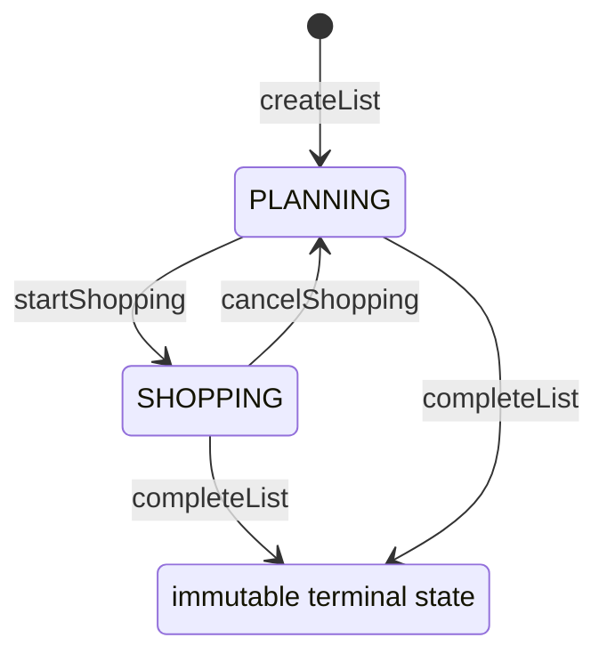
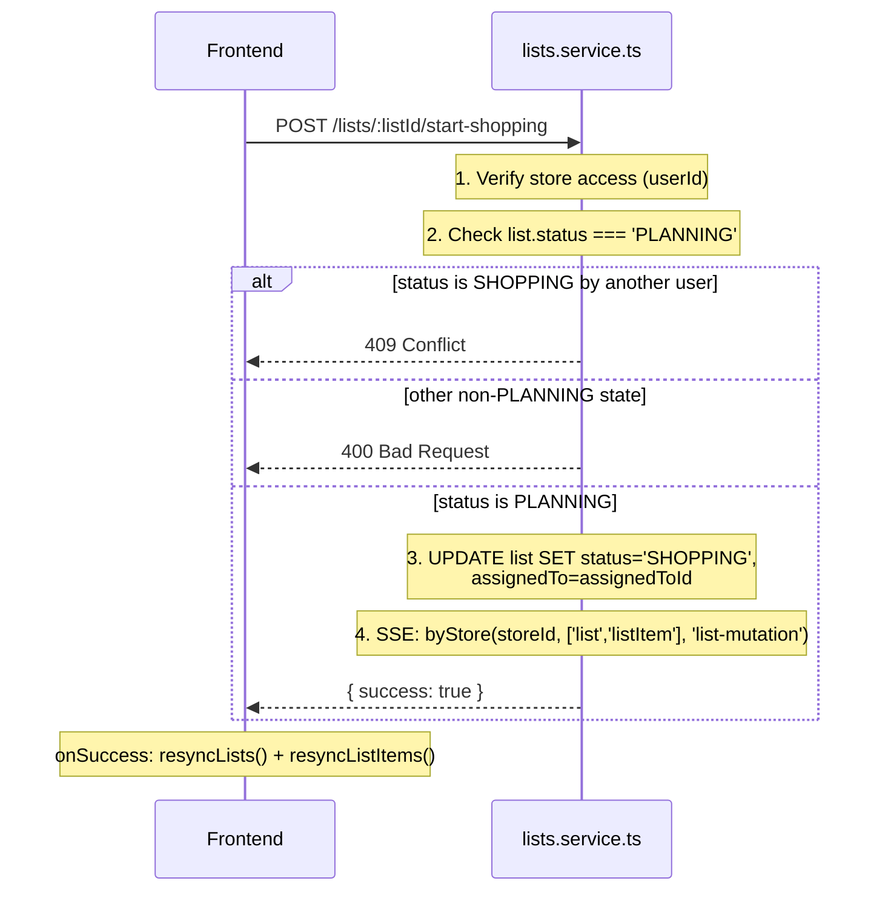
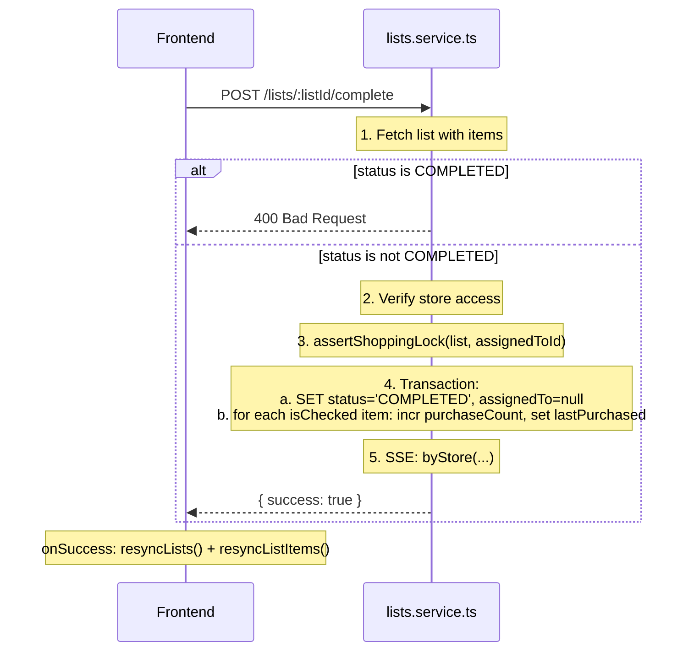
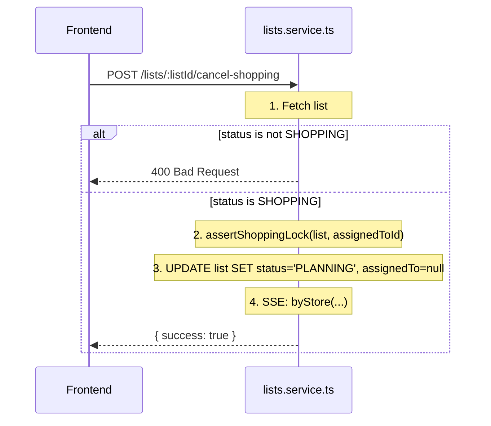
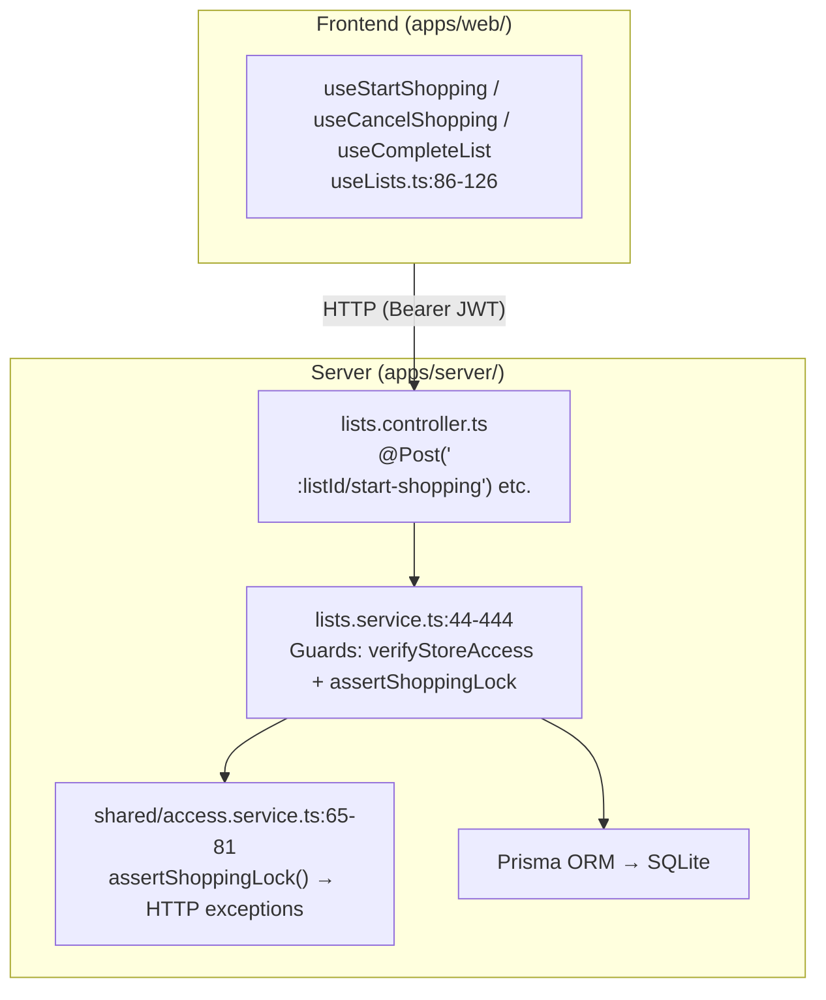

# Shopping List State Machine

## Purpose

The shopping list state machine governs the lifecycle of a single shopping trip within
Grocerun. It enforces an ordering of operations: users plan a list, optionally take it
shopping (acquiring an exclusive lock), and finally complete the trip. The state machine
prevents concurrent edits to the same list, guarantees immutability of completed lists,
and preserves the invariant of one active (non-completed) list per store.

## Scope and Non-Goals

### In scope

- The three states: `PLANNING`, `SHOPPING`, `COMPLETED` — their transitions, guards,
  and associated side effects.
- The shopping lock: who holds it, how it is asserted, and how it is released.
- Mutation guards that block edits on `COMPLETED` lists.
- The one-active-list-per-store invariant enforced at list creation.
- SSE notification sent after each transition.
- Frontend mutation hooks that trigger resync after state transitions.

### Out of scope

- List item CRUD mechanics (toggle, quantity, add/remove) beyond their guard logic.
- Catalog item creation and auto-learning (covered in
  `wiki/technical-design/add-item-flow.md` once written).
- RxDB replication and pull/push mechanics (covered in
  [`wiki/architecture/data-sync-and-concurrency.md`](../architecture/data-sync-and-concurrency.md)).
- Household invitation and membership checks (covered by `AccessService` — see
  `apps/server/src/shared/access.service.ts`).

## State Model



### State definitions

| State | `assignedTo` | Meaning |
|-------|-------------|---------|
| `PLANNING` | `null` | List is being prepared. Items can be added/removed freely by any household member. |
| `SHOPPING` | `userId` (lock holder) | Active shopping trip. Only the lock holder can mutate items. `cancelShopping` returns to `PLANNING`. |
| `COMPLETED` | `null` | Trip finished. No further mutations allowed. Lock released. `purchaseCount` incremented on catalog items. |

### Transition rules summary

| From | To | Method | Key guard | Side effects |
|------|----|--------|-----------|-------------|
| (new) | `PLANNING` | `createList` | One active list per store | SSE `list-mutation` |
| `PLANNING` | `SHOPPING` | `startShopping` | Status must be `PLANNING` | Sets `assignedTo`; SSE |
| `SHOPPING` | `PLANNING` | `cancelShopping` | Only lock holder | Clears `assignedTo`; SSE |
| `SHOPPING` | `COMPLETED` | `completeList` | Asserts lock | Clears `assignedTo`; increments `purchaseCount`; sets `lastPurchased`; SSE |
| `PLANNING` | `COMPLETED` | `completeList` | None (shopping not required) | Same as SHOPPING→COMPLETED |
| `COMPLETED` | (any) | — | Immutable terminal state | Blocked with 400 |

## Call Sequence

### PLANNING → SHOPPING (`startShopping`)



### SHOPPING → COMPLETED (`completeList`)



### SHOPPING → PLANNING (`cancelShopping`)



## Layer Boundaries



### Boundary rules

1. **Frontend never computes state.** It sends commands (REST POSTs); the server
   determines validity.
2. **State transitions are atomic.** All data writes for a transition happen in a
   single request/response cycle (`completeList` uses a Prisma `$transaction`).
3. **SSE notifications are fire-and-forget.** After a successful transition, the
   server emits to all connected clients for that store. If a client is offline,
   it resyncs on reconnect via RxDB replication.
4. **Item mutations also go through SSR.** The frontend uses React Query for list
   state mutations but goes local-first via RxDB for individual item toggles
   (checked status, purchased quantity). The server still enforces the state machine
   guards when it receives push replication changes.

## Key Types and Objects

### Prisma model (`apps/server/prisma/schema.prisma:103-126`)

```prisma
model List {
  id         String     @id @default(cuid())
  name       String     @default("Shopping List")
  storeId    String
  store      Store      @relation(fields: [storeId], references: [id], onDelete: Cascade)
  status     ListStatus @default(PLANNING)
  assignedTo String?
  createdAt  DateTime   @default(now())
  updatedAt  DateTime   @updatedAt
  deleted    Boolean    @default(false)
  deletedAt  DateTime?
  items      ListItem[]
}

enum ListStatus {
  PLANNING
  SHOPPING
  COMPLETED
}
```

### Shopping lock semantics

The shopping lock is **not a separate database lock or row**. It is the combination of:

- `list.status === 'SHOPPING'` signals that a trip is active.
- `list.assignedTo` identifies the lock holder (the Google OIDC `sub` who called
  `startShopping`).

The guard logic lives in `checkShoppingLock()` (used by
`access.service.ts:65-81`):

| Condition | Result |
|-----------|--------|
| `status === 'COMPLETED'` | Throws `BadRequestException` ("List is completed") |
| `assignedTo === null` and `status !== 'COMPLETED'` | Throws `ConflictException` ("Shopping lock is missing") |
| `assignedTo !== lockId` | Throws `ForbiddenException` ("locked by another shopper") |
| `assignedTo === lockId` | **Allowed** |

The lock is acquired by `startShopping` (sets `assignedTo`) and released by both
`completeList` and `cancelShopping` (set `assignedTo: null`).

### DTOs and API contract

All state-transition endpoints accept no body and return:

```json
{ "success": true }
```

Error responses follow NestJS conventions:

```json
{
  "statusCode": 400,
  "message": "List must be in PLANNING state to start shopping",
  "error": "Bad Request"
}
```

### Frontend hooks

File: `apps/web/src/features/lists/hooks/useLists.ts:86-126`

| Hook | Endpoint | On success |
|------|----------|------------|
| `useStartShopping` | `POST /lists/:listId/start-shopping` | `resyncLists()`, `resyncListItems()` |
| `useCancelShopping` | `POST /lists/:listId/cancel-shopping` | `resyncLists()`, `resyncListItems()` |
| `useCompleteList` | `POST /lists/:listId/complete` | `resyncLists()`, `resyncListItems()` |

## Failure Modes

| Scenario | Guard | Result | Source |
|----------|-------|--------|--------|
| `startShopping` on `SHOPPING` list (self) | `list.status !== 'PLANNING'` | 400 Bad Request | `lists.service.ts:402-406` |
| `startShopping` on `SHOPPING` list (other user) | `list.assignedTo !== assignedToId` | 409 Conflict | `lists.service.ts:403-405` |
| `startShopping` on `COMPLETED` list | `list.status !== 'PLANNING'` | 400 Bad Request | `lists.service.ts:402-406` |
| `completeList` on `COMPLETED` list | `list.status === 'COMPLETED'` | 400 Bad Request | `lists.service.ts:358-360` |
| `cancelShopping` on `PLANNING` list | `list.status !== 'SHOPPING'` | 400 Bad Request | `lists.service.ts:430-432` |
| `cancelShopping` on `COMPLETED` list | `list.status !== 'SHOPPING'` | 400 Bad Request | `lists.service.ts:430-432` |
| Non-lock holder tries to `cancelShopping` | `assertShoppingLock` | 403 Forbidden | `lists.service.ts:434` |
| Non-lock holder tries to `completeList` | `assertShoppingLock` | 403 Forbidden | `lists.service.ts:363` |
| Toggle/update/remove on `COMPLETED` list | `list.status === 'COMPLETED'` | 400 Bad Request | `lists.service.ts:252-254, 297-299, 327-329` |
| Non-lock holder toggles item during shopping | `assertShoppingLock` | 403 Forbidden | `lists.service.ts:257` |
| Non-existent list ID | `findFirst` returns null | 404 Not Found | Every method first checks existence |
| `createList` when active list exists | Returns existing list | 200 (not 201) | `lists.service.ts:47-58` |

### SSE notification failure

SSE notification (`this.notify.byStore(...)`) is fire-and-forget. If the SSE
connection is down for a particular client, that client will catch up via RxDB
replication on reconnect. The server does not retry failed SSE pushes.

## Tests and Verification Hooks

File: `apps/server/test/lists/state-machine.spec.ts` (353 lines, 19 tests)

### Test coverage

| # | Test | Method | Source |
|---|------|--------|--------|
| 1 | Transitions PLANNING→SHOPPING, sets `assignedTo` | `startShopping` | `state-machine.spec.ts:83-95` |
| 2 | Returns 400 when already SHOPPING | `startShopping` | `state-machine.spec.ts:97-105` |
| 3 | Returns 409 when another user is shopping | `startShopping` | `state-machine.spec.ts:107-122` |
| 4 | Returns 400 for COMPLETED list | `startShopping` | `state-machine.spec.ts:124-133` |
| 5 | Transitions SHOPPING→COMPLETED, clears `assignedTo` | `completeList` | `state-machine.spec.ts:141-156` |
| 6 | Does not error when completing | `completeList` | `state-machine.spec.ts:158-167` |
| 7 | Returns 400 when already COMPLETED | `completeList` | `state-machine.spec.ts:169-178` |
| 8 | Completing PLANNING list directly (allowed) | `completeList` | `state-machine.spec.ts:180-191` |
| 9 | Transitions SHOPPING→PLANNING, clears `assignedTo` | `cancelShopping` | `state-machine.spec.ts:198-212` |
| 10 | Returns 400 when PLANNING | `cancelShopping` | `state-machine.spec.ts:214-220` |
| 11 | Returns 400 when COMPLETED | `cancelShopping` | `state-machine.spec.ts:222-231` |
| 12 | COMPLETED immutability: toggle blocked (400) | — | `state-machine.spec.ts:239-250` |
| 13 | COMPLETED immutability: addItem blocked (400) | — | `state-machine.spec.ts:252-262` |
| 14 | COMPLETED immutability: removeItem blocked (400) | — | `state-machine.spec.ts:264-274` |
| 15 | Lock holder can toggle items | — | `state-machine.spec.ts:282-295` |
| 16 | Lock holder can update quantity | — | `state-machine.spec.ts:297-309` |
| 17 | Lock holder can remove items | — | `state-machine.spec.ts:311-322` |
| 18 | List retrieval returns correct status after each transition | — | `state-machine.spec.ts:330-348` |
| 19 | Returns 404 for non-existent list | — | `state-machine.spec.ts:350-352` |

### Running tests

```bash
# Run just the state machine tests
npx vitest run apps/server/test/lists/state-machine.spec.ts

# Run all list-related tests
npx vitest run apps/server/test/lists/
```

### Test fixtures

Tests use a shared test harness (`apps/server/test/helpers`):
- `createTestApp()` — boots a NestJS testing module with an isolated PostgreSQL
  database.
- `seedBaseFixtures()` — creates a household, default user, and other seed data.
- `clearDomainData()` — wipes domain tables between tests (leaves seed fixtures
  intact).

Each test creates its own store and section to avoid cross-test pollution.

## Related Docs

- [Architecture: Domain Model](../architecture/domain-model.md) — Core entities
  and relationships (List, ListItem, Item, Store).
- [Architecture: Data Sync and Concurrency](../architecture/data-sync-and-concurrency.md)
  — RxDB replication, SSE-triggered resync, and conflict handling mechanics.
- [Architecture: System Overview](../architecture/system-overview.md) — Broader
  system context for the SPA, API/server, and deployment.
- [ADR 004: Phase 2 API Approach (Simple REST + Zod)](../adr/001-phase2-api-approach.md)
  — Rationale for the REST API design used by these endpoints.
- [ADR 007: Phase 4 Local-First Strategy](../adr/007-phase4-local-first-strategy.md)
  — Rationale for RxDB and the local-first architecture.
- `apps/server/src/lists/lists.service.ts` — All transition method implementations.
- `apps/server/src/shared/access.service.ts` — Shopping lock and store access guards.
- `apps/server/prisma/schema.prisma` — `List` and `ListStatus` schema definitions.
- `apps/server/test/lists/state-machine.spec.ts` — Integration tests.
- `apps/web/src/features/lists/hooks/useLists.ts` — Frontend mutation hooks.
