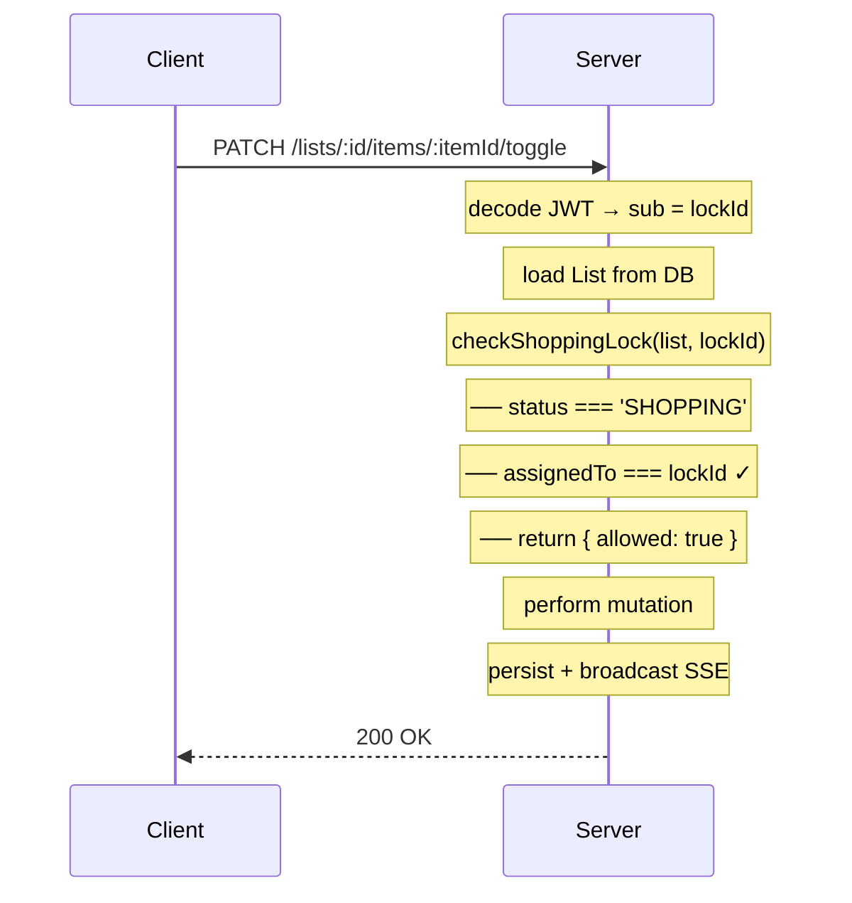
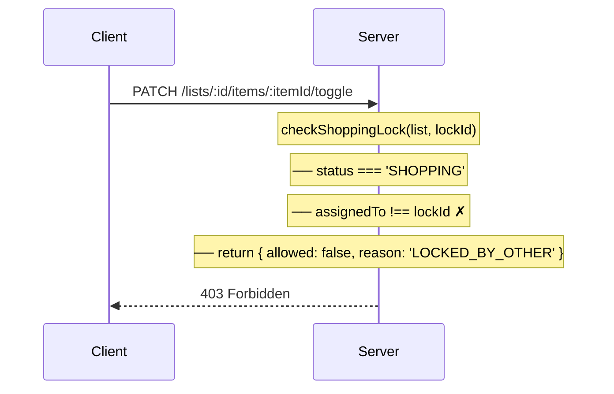
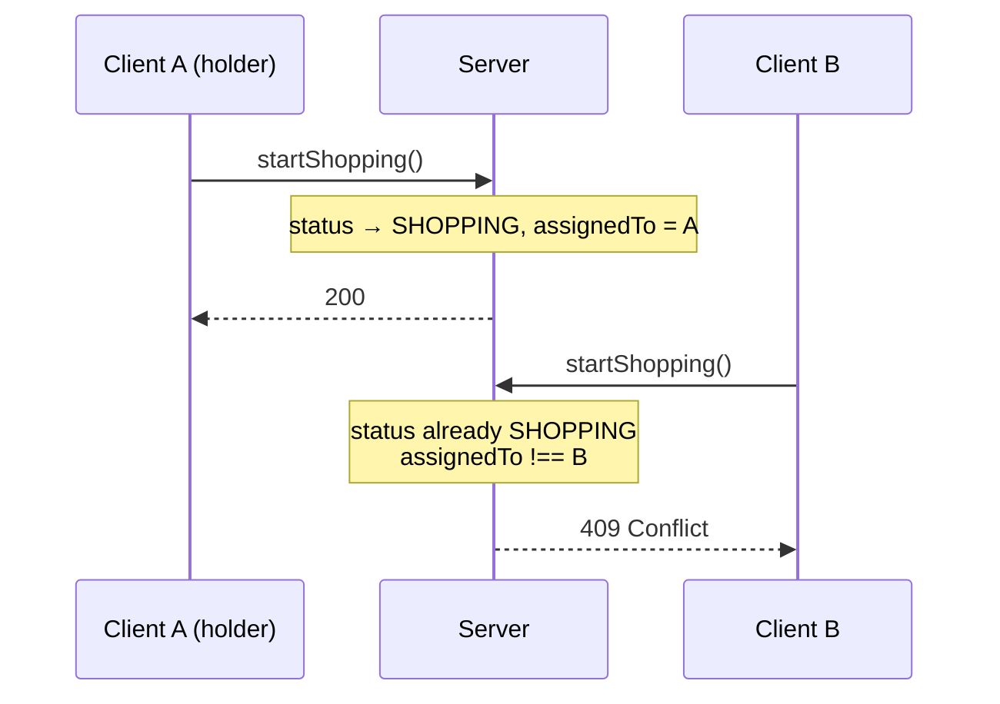
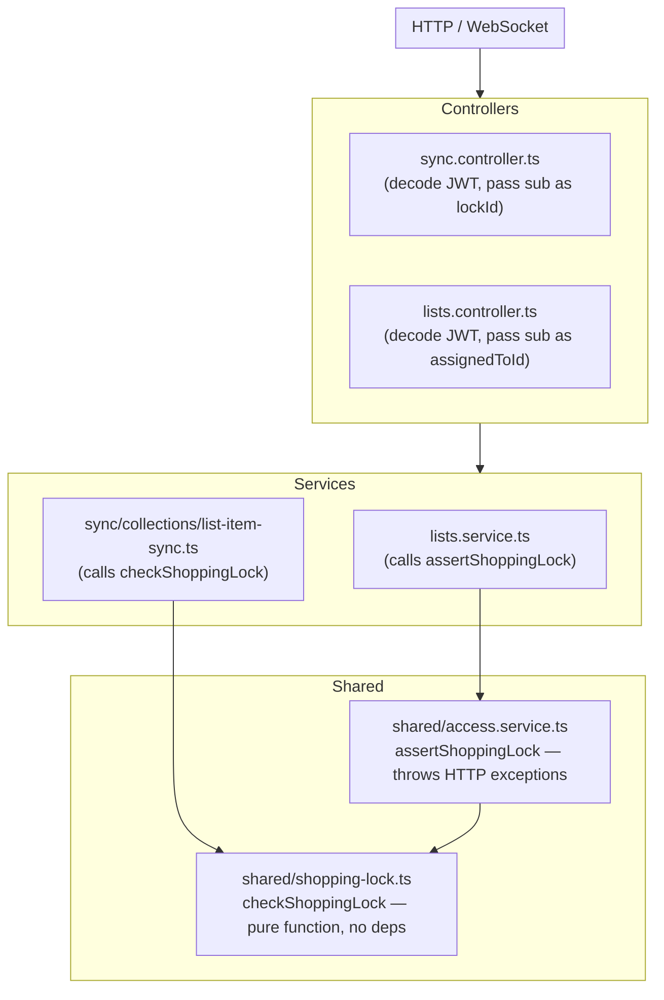

# Shopping Mode Lock

## Purpose

The shopping mode lock serialises write access to a list while it is in the `SHOPPING`
state. Only the user who initiated shopping (the **lock holder**) may mutate list items,
mark the list as complete, or cancel shopping. All other users see live updates via SSE
but are blocked from making changes.

The lock is enforced by a single pure function, `checkShoppingLock`, shared between the
REST API and the sync subsystem — guaranteeing identical policy logic regardless of
the entry point.

## Scope and Non-Goals

### In scope

- Preventing concurrent mutations by non-holders during `SHOPPING` mode.
- Defining the lock identity (Google OIDC `sub` claim), lifecycle, and enforcement points.
- Documenting the difference in failure behaviour between REST and sync for each lock
  violation reason.

### Out of scope / non-goals

- **Co-shopping / multi-holder**: Only one user can hold the lock at a time. Collaborative
  shopping with concurrent writes is not supported.
- **Session-based locks**: The lock is identity-based (OIDC `sub`), not bound to a server
  session or WebSocket connection.
- **Offline lock acquisition**: The lock can only be acquired or released while online
  (REST call to `startShopping` / `cancelShopping` / `completeList`).
- **Lock timeout / auto-release**: There is no server-side timeout. The lock is released
  explicitly by `completeList` or `cancelShopping`. A future enhancement may add
  heartbeat-based expiry.
- **Conflict resolution for concurrent lock attempts**: If two users call `startShopping`
  simultaneously, the first to persist the state wins; the second receives a 409. No
  merge or queue is attempted.

## State Model

The lock is governed by the `assignedTo` field on the `List` entity and the list's
`status` field. The following table summarises the valid combinations and their
behaviour:

| `list.status` | `list.assignedTo` | Lock enforced? | Who can edit?                           |
|---------------|-------------------|----------------|------------------------------------------|
| `PLANNING`    | `null`            | No             | Any authenticated user                   |
| `SHOPPING`    | `<sub>`           | Yes            | Only the holder whose `sub` matches      |
| `SHOPPING`    | `null`            | Yes (partial)  | No one — this is a transient inconsistency; REST rejects, sync warns-and-allows |
| `COMPLETED`   | (cleared)         | No (immutable) | No one — list is read-only               |

Lock lifecycle steps:

1. **PLANNING, no holder** — `assignedTo` is `null`. The "Start shopping" action is
   available in the UI. All mutations are allowed.
2. **Lock acquired** — `startShopping` transitions status from `PLANNING` to `SHOPPING`
   and sets `assignedTo` to the caller's OIDC `sub`. The caller is now the lock holder.
3. **Lock enforced** — While `SHOPPING`, every mutating endpoint checks
   `checkShoppingLock`. Non-holders receive HTTP errors (REST) or tombstone conflicts
   (sync).
4. **Lock released (complete)** — `completeList` transitions `SHOPPING` → `COMPLETED`
   and clears `assignedTo`. The list is now immutable.
5. **Lock released (cancel)** — `cancelShopping` transitions `SHOPPING` → `PLANNING` and
   clears `assignedTo`. The list returns to editable-by-anyone.

## Call Sequence

### REST — Mutation by lock holder



### REST — Mutation by non-holder



### Sync — Mutation against a locked list

```mermaid
sequenceDiagram
    participant SC as Sync Client
    participant SS as Sync Server

    SC->>SS: Push batch (item mutations)<br/>shoppingLockId: &lt;sub&gt;
    Note over SS: iterate items
    Note over SS: checkShoppingLock(list, shoppingLockId)
    Note over SS: ── LOCKED_BY_OTHER
    Note over SS: ── push tombstone conflict { _deleted: true }
    Note over SS: ✓ allowed items processed normally
    SS-->>SC: response with conflicts<br/>client reconciles tombstones locally
```

### REST — `startShopping` with existing holder



## Layer Boundaries



Key separation: `checkShoppingLock` is the pure policy function in
`apps/server/src/shared/shopping-lock.ts`. It has zero I/O and no imports from NestJS.
The REST layer layers exception-throwing on top via `assertShoppingLock` in
`apps/server/src/shared/access.service.ts`. The sync layer calls `checkShoppingLock`
directly and maps denial to conflict tombstones instead of HTTP errors.

## Key Types and Objects

### `LockResult` (`apps/server/src/shared/shopping-lock.ts`)

```typescript
export type LockResult =
  | { allowed: true }
  | { allowed: false; reason: 'COMPLETED' | 'LOCKED_BY_OTHER' | 'MISSING_LOCK' }
```

### `checkShoppingLock` — pure function

```typescript
// apps/server/src/shared/shopping-lock.ts
export function checkShoppingLock(
  list: { status: string; assignedTo?: string | null },
  lockId: string,
): LockResult
```

### `assertShoppingLock` — REST wrapper

```typescript
// apps/server/src/shared/access.service.ts (lines 61–81)
assertShoppingLock(
  list: { status: string; assignedTo?: string | null },
  lockId: string,
  message?: string,
): void
```

Throws:
- `BadRequestException` on `COMPLETED`
- `ConflictException` on `MISSING_LOCK`
- `ForbiddenException` on `LOCKED_BY_OTHER`

### Lock identity

Type: `string` — Google OIDC `sub` claim.

- **REST**: decoded from `req.user.sub` in the controller, passed as `assignedToId` to
  service methods (e.g. `ListsService.toggleListItem(listId, itemId, assignedToId ?? userId)`).
- **Sync**: passed as `shoppingLockId` from `SyncController` to
  `ListItemSyncService.push()`.

### `List.assignedTo`

- Set by `startShopping` (in `ListsService`, around line 402–405) when transitioning
  `PLANNING` → `SHOPPING`.
- Cleared by `completeList` (line 363+) and `cancelShopping` (line 434+).
- Exposed as part of the `List` DTO returned from `getList` — the frontend uses it
  to determine whether to show the "locked by another user" banner.

## Failure Modes

| Condition | `checkShoppingLock` returns | REST behaviour | Sync behaviour |
|-----------|----------------------------|----------------|----------------|
| COMPLETED list | `{ allowed: false, reason: 'COMPLETED' }` | `400 BadRequestException` | Tombstone conflict (`_deleted: true`) |
| Different `assignedTo` (LOCKED_BY_OTHER) | `{ allowed: false, reason: 'LOCKED_BY_OTHER' }` | `403 ForbiddenException` | Tombstone conflict (`_deleted: true`) |
| `SHOPPING` status but `assignedTo` is null (MISSING_LOCK) | `{ allowed: false, reason: 'MISSING_LOCK' }` | `409 ConflictException` — "Shopping lock is missing. Refresh and try again." | Push allowed through with `logger.warn(...)` — transient server-side inconsistency should not block sync |

**Rationale for MISSING_LOCK divergence**: A `SHOPPING` list with no `assignedTo` is
a transient server state inconsistency (e.g. partial write during a previous operation).
The REST layer fails closed to surface the bug immediately. The sync layer is more
lenient because blocking a sync push on a transient server bug could cause unrecoverable
client-side data loss; the warning log preserves observability without sacrificing
availability.

## Tests and Verification Hooks

### Unit / integration tests

**File**: `apps/server/test/lists/state-machine.spec.ts`

**Section**: "Shopping lock enforcement" (lines 281–323)

Covers:

- Lock holder can toggle items → 200
- Lock holder can update quantity → 200
- Lock holder can remove items → 200
- Another user calling `startShopping` → 409
- Shopping lock blocks `startShopping` when another user already holds it → 409
- Cancel requires lock holder

### Recommended additional tests (not yet written)

| Test | Expected behaviour |
|------|-------------------|
| Sync push with `LOCKED_BY_OTHER` returns tombstone conflict | Conflict entry in response with `_deleted: true` |
| Sync push with `COMPLETED` returns tombstone conflict | Conflict entry in response with `_deleted: true` |
| Sync push with `MISSING_LOCK` succeeds (no conflict) | Push processed, warning logged |
| REST mutation on `COMPLETED` list | `400 BadRequestException` |
| REST mutation with `MISSING_LOCK` | `409 ConflictException` |
| Non-holder REST mutation on `SHOPPING` list | `403 ForbiddenException` |
| Lock holder calling `completeList` clears `assignedTo` | List transitions to `COMPLETED`, `assignedTo` is `null` |
| Lock holder calling `cancelShopping` clears `assignedTo` | List transitions to `PLANNING`, `assignedTo` is `null` |

## Related Docs

- [`wiki/technical-design/shopping-list-state-machine.md`](../technical-design/shopping-list-state-machine.md) — the state machine the lock protects
- [`wiki/architecture/data-sync-and-concurrency.md`](../architecture/data-sync-and-concurrency.md) — broader sync and concurrency context
- [`wiki/adr/006-phase3-auth-strategy.md`](../adr/006-phase3-auth-strategy.md) — JWT decode and OIDC `sub` on API calls
- [`planning/brainstorm/2026-06-13T0000_ux-refinement-local-first-shopping.md`](../../planning/brainstorm/2026-06-13T0000_ux-refinement-local-first-shopping.md) — UX audit findings related to the shopping lock
