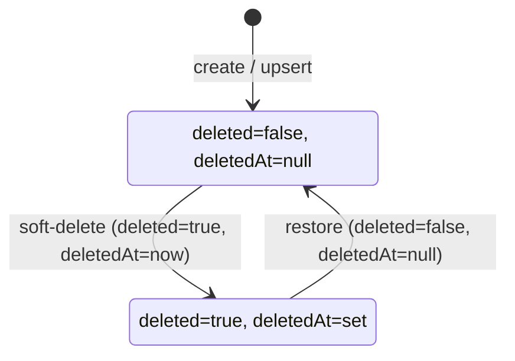
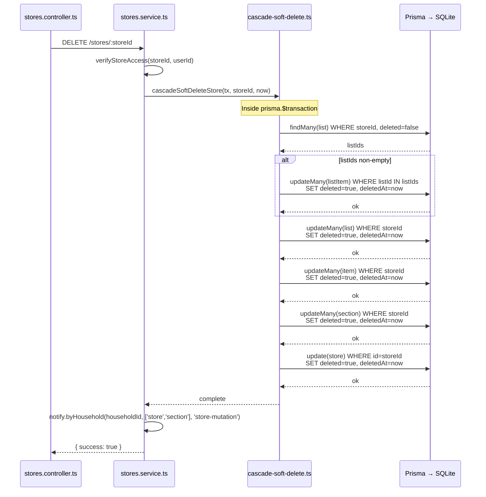
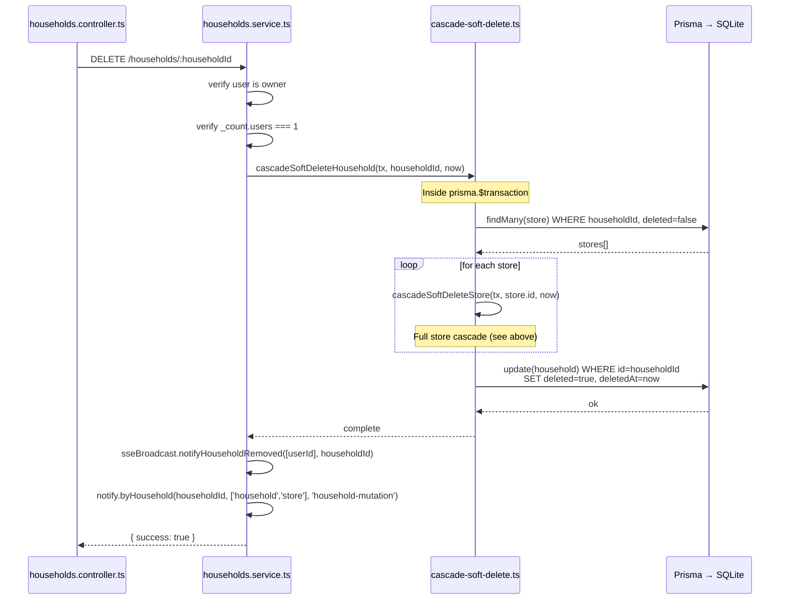
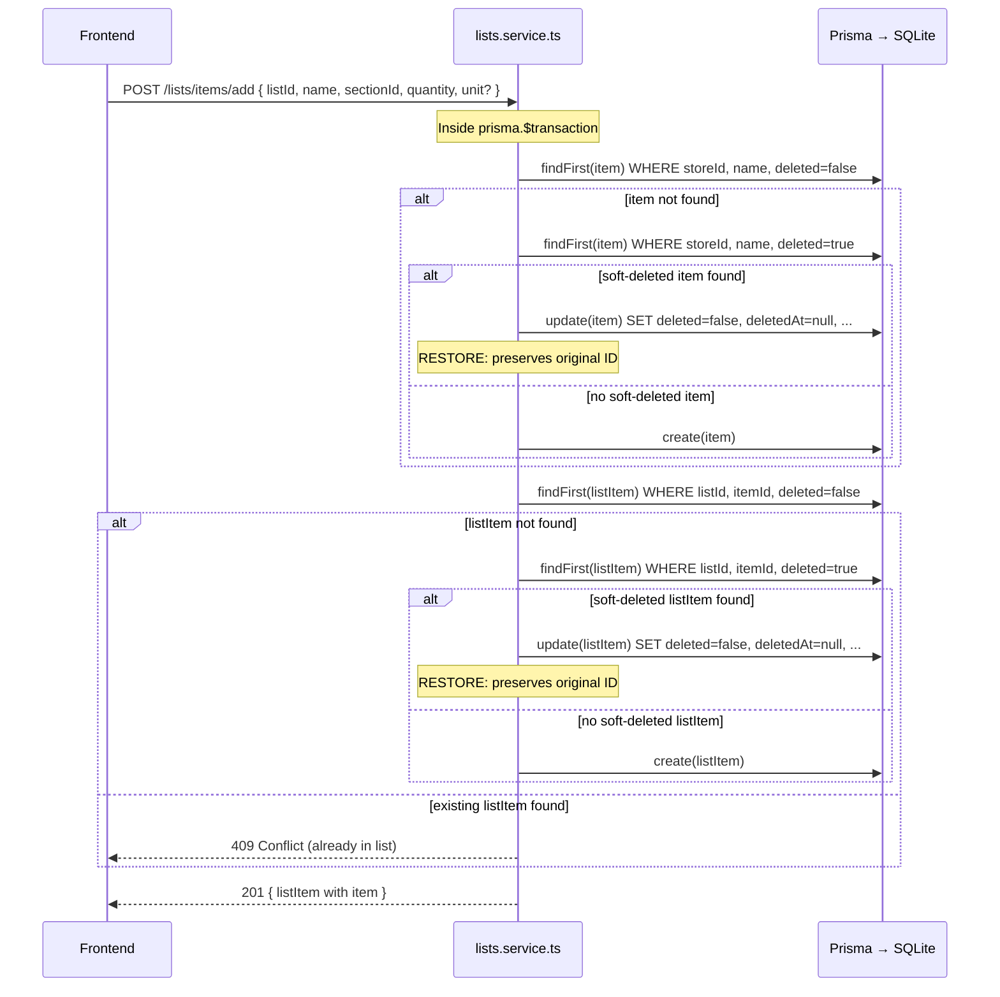
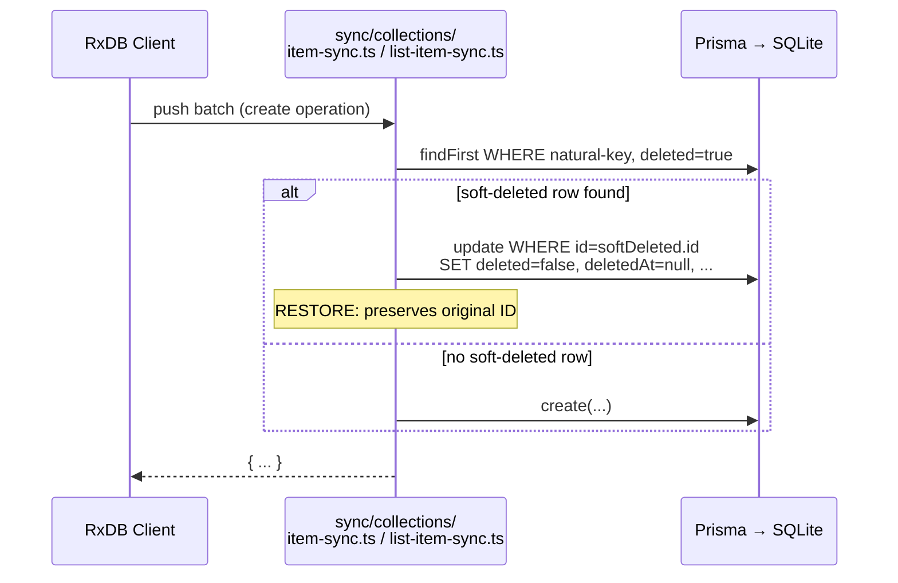
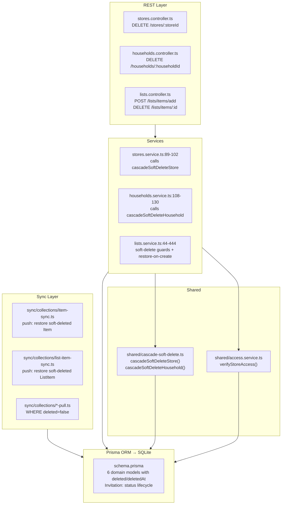

# Soft-Delete Cascade

## Purpose

All six domain models in Grocerun (User, Household, Store, Section, Item, List, ListItem)
use a **soft-delete** pattern: rows are never physically removed from the database. Instead,
each row carries a `deleted` boolean and a `deletedAt` timestamp. This design preserves
referential integrity across sync boundaries, avoids orphaned client-side documents, and
enables safe offline-first semantics — a deleted row can be restored by setting
`deleted` back to `false` without losing its original ID or relationships.

When a parent entity is deleted (Store or Household), all dependent entities must be
soft-deleted in child-first order to avoid foreign-key constraint violations. The
cascade functions in `apps/server/src/shared/cascade-soft-delete.ts` encapsulate this
order and are always called inside a Prisma `$transaction`.

## Scope and Non-Goals

### In scope

- The two cascade soft-delete functions: `cascadeSoftDeleteStore` and
  `cascadeSoftDeleteHousehold` — their order, transaction requirement, and call sites.
- The **restore-on-create** pattern used in both REST (`lists.service.ts`) and sync
  (`item-sync.ts`, `list-item-sync.ts`) — soft-deleted rows are resurrected rather than
  duplicated, preserving ID continuity.
- The `where: { deleted: false }` query filter convention enforced across all service
  and sync pull handlers.
- The invitation exception: `Invitation` uses a status lifecycle instead of soft-delete.
- Unique constraint design: `@@unique([storeId, name, deleted])` on Item and
  `@@unique([listId, itemId, deleted])` on ListItem allow one soft-deleted row per
  natural key without blocking creation of a new active row.

### Out of scope

- **Hard deletion**: The application never issues `DELETE FROM` on domain tables.
  Physical deletion of test fixtures is done in `clearDomainData()` (test helper), but
  production code uses soft-delete exclusively.
- **Cascade on non-domain relations**: `Account`, `Session`, `VerificationToken`, and
  `Invitation` are not domain models and do not participate in the cascade.
- **Section deletion**: Deleting a Section soft-deletes only the section row itself and
  nulls `sectionId` on dependent Items (via `onDelete: SetNull` in the Prisma schema).
  Items are preserved — they are children of the Store, not the Section.
- **List deletion**: Deleting a List soft-deletes its ListItems but does not cascade to
  Items (catalog items survive). List deletion without store deletion is handled as a
  single-entity soft-delete in `lists.service.ts:336`.
- **Data migration or pruning**: There is no background job to permanently remove
  soft-deleted rows. This doc covers the application-level cascade logic only.

## State Model

Every domain model has the same two fields:

| Field | Type | Default | Meaning |
|-------|------|---------|---------|
| `deleted` | `Boolean` | `false` | Whether the row is logically deleted |
| `deletedAt` | `DateTime?` | `null` | When the row was soft-deleted (set atomically with `deleted`) |

The state space for each domain row is:



**Restore preserves the original ID.** When the application re-creates a previously
deleted entity (same natural key), it finds the soft-deleted row and flips the flag
in-place. This is critical for the sync protocol — clients reference rows by ID, and
a new ID would leave dangling references.

### Cascade tree

The parent–child relationships determine cascade scope:

```
Household
 └── Store
      ├── Section (soft-delete nulls sectionId on Item; Item survives)
      ├── Item
      │    └── ListItem
      └── List
           └── ListItem (ListItem has two parents: Item + List)
```

**Notable**: `ListItem` belongs to both `Item` and `List`. The cascade deletes it
via the `List` path (by `listId`), which is sufficient because a ListItem always has
a parent List. Deleting a Store cascades to Lists, which cascade to ListItems.

## Call Sequence

### Store deletion (`cascadeSoftDeleteStore`)

Called from `stores.service.ts:95` inside `prisma.$transaction`.



### Household deletion (`cascadeSoftDeleteHousehold`)

Called from `households.service.ts:122` inside `prisma.$transaction`, but only when
the caller is the household owner and the sole member.



### Restore-on-create (REST `addItemToList`)

When a user adds an item to a list, the service first checks whether the catalog Item
or the ListItem was previously soft-deleted. If so, it flips `deleted` back to `false`
instead of creating a new row.



### Restore-on-create (sync push)

Both `item-sync.ts:111-118` and `list-item-sync.ts:149-158` follow the same pattern:
before creating a new row, they query for a matching soft-deleted row and restore it
in-place.



## Layer Boundaries



### Boundary rules

1. **Cascade functions never call I/O directly.** They receive a `Prisma.TransactionClient`
   and operate purely through it. They do not import NestJS, emit SSE events, or perform
   access checks.
2. **Services own the transaction boundary.** The caller (`stores.service.ts` /
   `households.service.ts`) opens the `$transaction`, passes the `tx` client to the
   cascade function, then performs any post-cascade side effects (SSE notification) after
   the transaction commits.
3. **Transaction-or-nothing.** Cascade functions must always be called inside a
   `$transaction`. Calling them with the bare `PrismaService` (not a `TransactionClient`)
   would cause each `updateMany` to auto-commit individually, risking partial deletes.
4. **Sync and REST share the same Prisma models.** Both layers query `deleted: false`
   on read and restore soft-deleted rows on create. The cascade functions are only used
   by REST services, not by sync push handlers (sync only deletes individual rows, never
   cascades).

## Key Types and Objects

### Cascade functions (`apps/server/src/shared/cascade-soft-delete.ts:11-83`)

```typescript
// Cascade order: ListItem → List → Item → Section → Store
export async function cascadeSoftDeleteStore(
  tx: Prisma.TransactionClient,
  storeId: string,
  now: Date,
): Promise<void>;

// Calls cascadeSoftDeleteStore for each store, then deletes the household
export async function cascadeSoftDeleteHousehold(
  tx: Prisma.TransactionClient,
  householdId: string,
  now: Date,
): Promise<void>;
```

Both functions accept a `Date` parameter for `deletedAt`. The caller computes `new Date()`
once and passes it to ensure all rows in the cascade share the same timestamp.

### Call sites

| Call site | File | Line | Context |
|-----------|------|------|---------|
| `cascadeSoftDeleteStore` | `stores.service.ts:95` | Inside `$transaction` after verifying store access | |
| `cascadeSoftDeleteHousehold` | `households.service.ts:122` | Inside `$transaction` after owner + sole-member check | |

### Prisma models with soft-delete

All six domain models share the same two fields (shown here from
`apps/server/prisma/schema.prisma`):

```prisma
model User {
  deleted     Boolean      @default(false)
  deletedAt   DateTime?
  // ...
}

model Household {
  deleted     Boolean      @default(false)
  deletedAt   DateTime?
  // ...
}

model Store {
  deleted     Boolean      @default(false)
  deletedAt   DateTime?
  // ...
}

model Section {
  deleted     Boolean      @default(false)
  deletedAt   DateTime?
  // ...
}

// Item uses a composite unique key that includes `deleted`:
// @@unique([storeId, name, deleted])
// This allows one deleted row per natural key alongside an active row.
model Item {
  deleted       Boolean    @default(false)
  deletedAt     DateTime?
  // ...
}

model List {
  deleted    Boolean    @default(false)
  deletedAt  DateTime?
  // ...
}

// ListItem uses a composite unique key that includes `deleted`:
// @@unique([listId, itemId, deleted])
model ListItem {
  deleted           Boolean  @default(false)
  deletedAt         DateTime?
  // ...
}
```

### Invitation exception (`apps/server/prisma/schema.prisma:185-209`)

```prisma
// Invitation uses a status lifecycle (ACTIVE → COMPLETED/EXPIRED/REVOKED)
// instead of soft-delete. Unlike domain models, invitations have a finite
// lifecycle with explicit terminal states — a `deleted` column would be
// redundant with `status IN ('EXPIRED', 'REVOKED')`.
model Invitation {
  status      InvitationStatus @default(ACTIVE)
  // No deleted / deletedAt fields
}
```

### Unique constraint design

Two models use composite unique keys that include the `deleted` column:

| Model | Unique constraint | Rationale |
|-------|-------------------|-----------|
| `Item` | `@@unique([storeId, name, deleted])` | One item name per store. A soft-deleted item with the same name does not block creating a new active item. |
| `ListItem` | `@@unique([listId, itemId, deleted])` | An item can appear in a list only once. If the previous ListItem was soft-deleted, a new active row can be created. |

## Failure Modes

| Scenario | Guard | Result | Source |
|----------|-------|--------|--------|
| Delete store that does not exist | `verifyStoreAccess` → `findFirst` returns null | 404 Not Found | `stores.service.ts:90` |
| Delete household with other members | `household._count.users > 1` | 400 Bad Request | `households.service.ts:115-117` |
| Delete household as non-owner | `household.ownerId !== userId` | 403 Forbidden | `households.service.ts:108-111` |
| Cascade called outside transaction | No compile-time guard — uses `Prisma.TransactionClient` type | Partial delete possible if passed a bare PrismaService | Design rule (type-level) |
| Transaction fails mid-cascade | Prisma rolls back all `updateMany` calls | All or nothing — no partial cascade | `$transaction` atomicity |
| Restore-on-create: two concurrent adds | Unique constraint on natural key | Second insert fails with Prisma `P2002` — caller returns 409 Conflict | Prisma unique constraint |
| Restore-on-create: soft-deleted row not found | `findFirst` returns null | Normal creation path — no issue | All restore handlers |
| Query missing `deleted: false` | Review convention, not enforced at type level | Soft-deleted rows leak into API responses | Coding standard (`wiki/rules/coding-standards.md:155-169`) |
| SSE broadcast after cascade fails | Fire-and-forget | Deleting client misses SSE event; client catches up on reconnect via RxDB replication | `stores.service.ts:99` |

## Tests and Verification Hooks

### Soft-delete smoke tests

**File**: `apps/server/test/smoke/soft-delete.spec.ts` (233 lines, 4 test suites)

| # | Scenario | Verifies | Source |
|---|----------|----------|--------|
| 1 | Delete a ListItem | Row still exists with `deleted=true`, `deletedAt` set; disappears from API response | `soft-delete.spec.ts:84-110` |
| 2 | Delete a Section | Section soft-deleted; Items in section have `sectionId` nulled | `soft-delete.spec.ts:116-154` |
| 3 | Delete a Store (full cascade) | Store, Section, Item, List, ListItem all `deleted=true` | `soft-delete.spec.ts:160-197` |
| 4 | Re-add removed item (upsert resurrection) | Adding same item name after soft-delete succeeds without unique constraint error; catalog item restored | `soft-delete.spec.ts:203-233` |

### Other relevant tests

| File | What it covers |
|------|----------------|
| `apps/server/test/lists/state-machine.spec.ts` | List CRUD operations that filter `deleted: false` |
| `apps/server/test/sync/item-push.spec.ts` | Sync push that restores soft-deleted Items |
| `apps/server/test/sync/listitem-push.spec.ts` | Sync push that restores soft-deleted ListItems |
| `apps/server/test/sync/unique-constraint-regression.spec.ts` | Regression tests for the `@@unique([..., deleted])` constraint design |

### Running the tests

```bash
# Run just the soft-delete smoke tests
npx vitest run apps/server/test/smoke/soft-delete.spec.ts

# Run all smoke tests
npx vitest run apps/server/test/smoke/

# Run all tests
npm test
```

### Test fixtures

Tests use the shared test harness in `apps/server/test/helpers.ts`:

- `createTestApp()` — boots NestJS with isolated test database (PostgreSQL in CI,
  SQLite locally).
- `seedBaseFixtures()` — creates household `test-household-id` and default user.
- `clearDomainData()` — wipes domain tables (ListItem → List → Item → Section → Store)
  in FK-safe order. Leaves User/Account/Session rows intact as stable fixtures.

`clearDomainData` is the **only place** in the codebase that performs hard deletes on
domain data, and only in test setup — never in production code.

## Related Docs

- [Coding Standard: Soft-Delete Rule](../rules/coding-standards.md#soft-delete) —
  Mandatory `deleted: false` filter on all Prisma queries (lines 155–169).
- `apps/server/src/shared/cascade-soft-delete.ts` — The two cascade functions (83 lines).
- `apps/server/src/stores/stores.service.ts` — `deleteStore` call site (line 95).
- `apps/server/src/households/households.service.ts` — `deleteHousehold` call site
  (line 122).
- `apps/server/src/lists/lists.service.ts` — Restore-on-create in `addItemToList`
  (lines 176–233) and single-entity soft-delete (line 336).
- `apps/server/src/sync/collections/item-sync.ts` — Sync restore-on-create (lines 111–118).
- `apps/server/src/sync/collections/list-item-sync.ts` — Sync restore-on-create
  (lines 149–158).
- `apps/server/prisma/schema.prisma` — `deleted`/`deletedAt` on all 6 domain models
  and Invitation status lifecycle (lines 185–209).
- `apps/server/prisma/migrations/20260323120224_add_soft_delete_columns/migration.sql` —
  Migration that added the soft-delete columns.
- `apps/server/test/smoke/soft-delete.spec.ts` — Smoke tests for cascade and restore
  behaviour.
- `apps/server/test/helpers.ts` — `clearDomainData()` hard-delete helper for test
  isolation (line 140).
- [`wiki/technical-design/shopping-list-state-machine.md`](./shopping-list-state-machine.md) —
  List lifecycle; soft-deleted lists with status `COMPLETED` are also filtered from
  queries by `status: { not: 'COMPLETED' }`.
- [`wiki/architecture/data-sync-and-concurrency.md`](../architecture/data-sync-and-concurrency.md) —
  RxDB replication and pull/push mechanics that consume the soft-delete filtered data.
