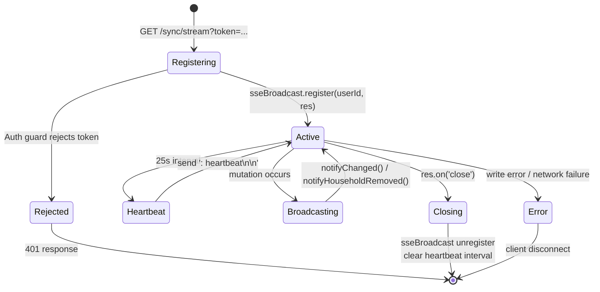
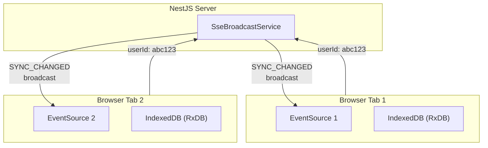
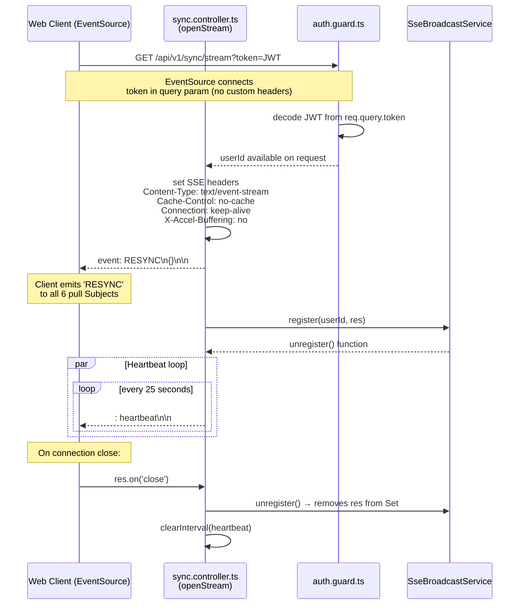
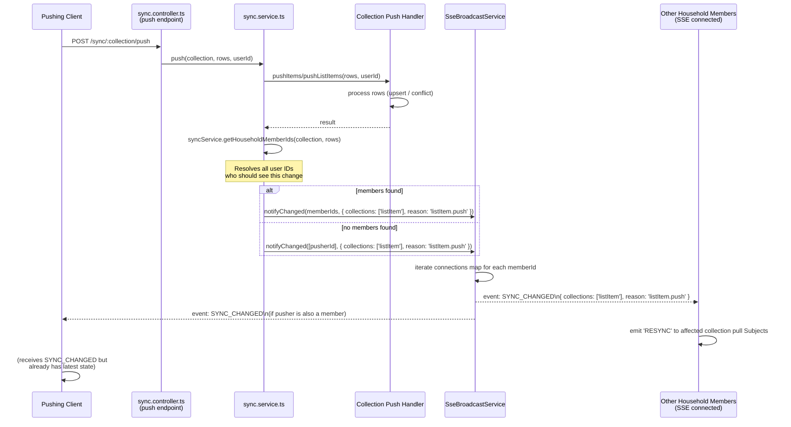
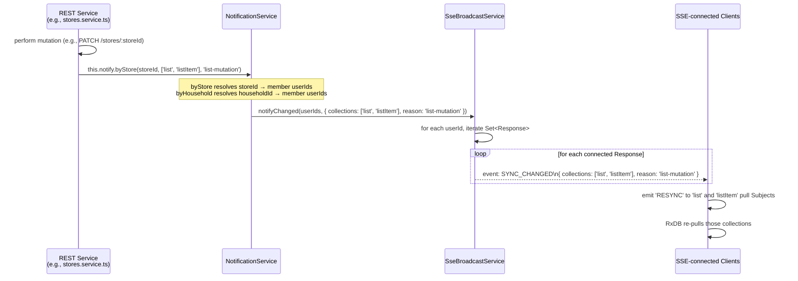
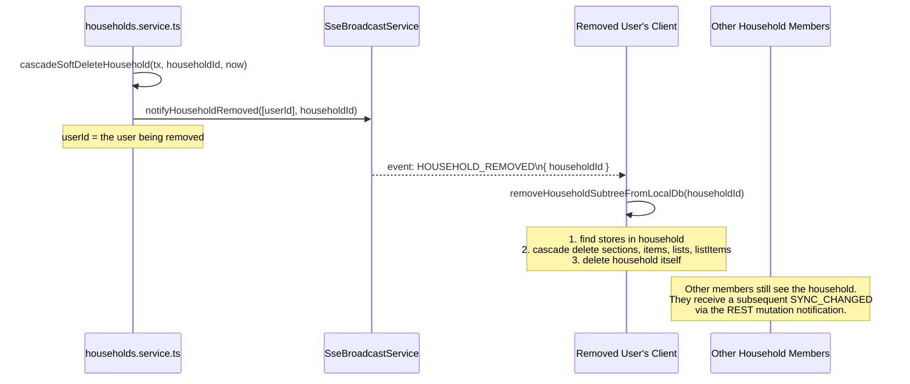
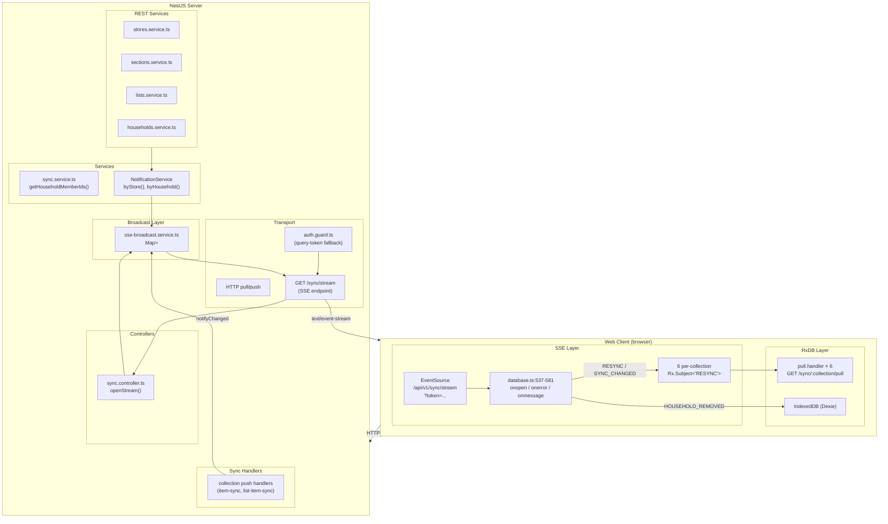

# SSE Resync Broadcast

## Purpose

The SSE (Server-Sent Events) resync broadcast system bridges server-side mutations — both
push-triggered and REST-triggered — to real-time client notification via a single shared
`EventSource` connection per browser session.

It solves three problems:

1. **REST mutations happen server-side only.** Collection-authoritative writes (section,
   store, list, household) run through REST endpoints. The client has no local write to
   push. SSE signals the client to re-pull the affected collections.

2. **Push mutations affect multiple users.** When one user pushes a changed `item` or
   `listItem`, other household members must learn about it without polling. SSE fans out
   the `SYNC_CHANGED` event to all connected members.

3. **Household membership changes require client-side cascade.** When a user is removed
   from a household, the client must delete the entire household subtree from IndexedDB.
   SSE delivers the `HOUSEHOLD_REMOVED` event with the `householdId`.

The broadcast service is an **in-memory, single-process** fan-out (`Map<string, Set<Response>>`).
It carries no persistence and does not retry failed writes. Clients that disconnect miss
intermediate events and catch up on reconnect via a full pull (triggered by the initial
`RESYNC` event).

**Files:**
- `apps/server/src/sync/sse-broadcast.service.ts` — 61-line broadcast service
- `apps/server/src/sync/sync.controller.ts:97-141` — SSE endpoint (`openStream`)
- `apps/web/src/core/rxdb/database.ts:523-581` — Client `EventSource` consumption

## Scope and Non-Goals

### In scope

- In-memory `Map<userId, Set<Response>>` connection registry — register, broadcast,
  unregister, unregisterAll.
- Three SSE event types: `RESYNC` (initial connect), `SYNC_CHANGED` (data mutation),
  `HOUSEHOLD_REMOVED` (household membership change).
- Single SSE endpoint (`GET /sync/stream`) consumed by one shared `EventSource` per
  browser session.
- Heartbeat mechanism (25-second interval) to keep connections alive through proxies
  and load balancers.
- Token-as-query-param auth for SSE (`?token=...`) — the only endpoint that accepts
  query-token auth because `EventSource` cannot set custom headers.
- Fire-and-forget broadcast: writes to SSE `Response` are not retried on failure.
- Cleanup on connection close: auto-removes `Response` from the user's Set; deletes
  the userId entry when the Set empties.
- Notification routing from REST services via `NotificationService` (`notify.byStore()`,
  `notify.byHousehold()`) which resolves to `SseBroadcastService.notifyChanged()`.

### Out of scope / non-goals

- **Cross-process broadcast**: No Redis pub/sub or message queue. The service comment
  explicitly says "for multi-process deployments, replace with Redis pub/sub."
- **Message persistence / replay**: If a client is disconnected it misses events. Catch-up
  happens via the initial `RESYNC` on reconnect, which triggers a full re-pull.
- **Per-collection SSE endpoints**: A single `/sync/stream` feeds all six collections.
  The `SYNC_CHANGED` event carries a `collections` array to scope the re-pull.
- **Retry logic**: SSE writes that fail (e.g., client disconnected mid-write) are silently
  dropped. No write queue or retry scheduler.
- **Backpressure**: The service does not monitor TCP buffer capacity. If the client is
  slow to consume, data may accumulate in kernel buffers.
- **Multi-tab coordination**: Each browser tab opens its own `EventSource`. There is no
  `BroadcastChannel` or `SharedWorker` to deduplicate across tabs.
- **Heartbeat monitoring on client**: The client has no heartbeat timeout. Heartbeat is
  purely server-side keepalive for proxies/load balancers.

## Connection Model

### SSE connection lifecycle



### Multiple connections per user



One `userId` maps to a `Set<Response>`. Each tab registers its own `Response`. When a
broadcast occurs, the service iterates the entire Set and writes to every response.
Cleanup is per-connection: when one tab closes, only that `Response` is removed from
the Set. The userId entry persists as long as at least one connection remains.

### Connection registry state

| State | Condition | Behaviour |
|-------|-----------|-----------|
| **Empty** | `connections` map has no entry for userId | Broadcast is a no-op for that user |
| **Active (1 connection)** | `Set` has size 1 | Broadcast writes to one `Response` |
| **Active (N connections)** | `Set` has size > 1 | Broadcast writes to all N `Response` objects |
| **Draining** | Connection `close` event fired | Remove `Response` from Set; if Set empties, delete userId entry |

## Call Sequence

### Connection registration and initial RESYNC



### Broadcast after push mutation



### Broadcast after REST mutation



### Household removal broadcast



## Layer Boundaries



### Boundary rules

1. **SSE events are fire-and-forget.** The `SseBroadcastService` writes to `Response`
   objects without awaiting or retrying. Failed writes (closed connection) are silently
   dropped.

2. **Broadcast resolution is userId-based.** REST services call `NotificationService`
   with a `storeId` or `householdId`; the service resolves to affected `userId[]`. The
   broadcast service does not know about stores or households — it only knows
   `userId → Set<Response>`.

3. **Push broadcasts are collection-scoped.** The push handler resolves member IDs via
   `syncService.getHouseholdMemberIds(collection, rows)` and passes the collection name
   in the `SYNC_CHANGED` payload. The client uses the `collections` array to emit
   `'RESYNC'` only into affected pull Subjects.

4. **REST broadcasts are reason-scoped.** Services pass a `reason` string (e.g.,
   `'list-mutation'`, `'invitation-mutation'`) for observability. The client currently
   treats all `SYNC_CHANGED` events identically (emits `'RESYNC'` to all Subjects), but
   the payload schema supports collection-scoped re-pull in the future.

5. **The SSE endpoint is the only query-token auth user.** The auth guard checks
   `req.query.token` only as a fallback when no `Authorization` header is present.
   This is because `EventSource` cannot set custom headers. No other endpoint accepts
   query-token auth.

6. **Cleanup is event-driven per-connection.** The `unregister()` function returned by
   `register()` is called in the SSE response's `close` event. This ensures cleanup
   happens even if the process restarts (the connection dies, firing the event).

7. **No cross-process isolation.** The in-memory `Map` is process-local. In a multi-process
   deployment (e.g., multiple Node.js instances behind a load balancer), SSE connections
   for the same user could land on different processes and never see each other's broadcasts.
   The service comment explicitly flags this as a Redis pub/sub replacement point.

## Key Types and Objects

### `SseBroadcastService` (`apps/server/src/sync/sse-broadcast.service.ts`)

```typescript
@Injectable()
class SseBroadcastService {
  private connections: Map<string, Set<Response>>;

  /**
   * Register an SSE Response for a userId.
   * Returns an unregister function for cleanup.
   */
  register(userId: string, res: Response): () => void;
  // 1. Gets or creates Set<Response> for userId
  // 2. Adds res to Set
  // 3. Returns () => {
  //      res.end();
  //      connections.get(userId)?.delete(res);
  //      if (Set empties) connections.delete(userId);
  //    }

  /**
   * Broadcast SYNC_CHANGED event to all connections for the given userIds.
   */
  notifyChanged(
    userIds: string[],
    payload: { collections: string[]; reason: string },
  ): void;
  // 1. For each userId in userIds:
  //    - Get Set<Response> from connections map
  //    - For each Response: res.write(`event: SYNC_CHANGED\n`)
  //    - Silently skip if write fails or Response is destroyed

  /**
   * Broadcast HOUSEHOLD_REMOVED event to all connections for the given userIds.
   */
  notifyHouseholdRemoved(userIds: string[], householdId: string): void;
  // 1. For each userId in userIds:
  //    - Same pattern as notifyChanged
  //    - Writes: `event: HOUSEHOLD_REMOVED\ndata: { householdId }\n\n`

  /**
   * Unregister all connections for a userId (used during logout / account deletion).
   */
  unregisterAll(userId: string): void;
  // 1. Get Set<Response> for userId
  // 2. res.end() for each Response
  // 3. Delete userId from connections map
}
```

### SSE event types

| Event | Sent When | Payload | Client Action | Source |
|-------|-----------|---------|---------------|--------|
| `RESYNC` | Initial connect (`sync.controller.ts:125`) | `{}` | Emit `'RESYNC'` to all 6 pull Subjects — full re-pull | `database.ts:545-550` |
| `SYNC_CHANGED` | After push mutation (`sync.controller.ts:76-79`); after REST mutation via `NotificationService` | `{ collections: string[], reason: string }` | Emit `'RESYNC'` to all pull Subjects (currently all 6; future: collection-scoped) | `database.ts:555-565` |
| `HOUSEHOLD_REMOVED` | When user is removed from a household | `{ householdId: string }` | `removeHouseholdSubtreeFromLocalDb(householdId)` — cascade delete from IndexedDB | `database.ts:570-575` |
| `: heartbeat` | Every 25s via `setInterval` | (comment line — ignored by `EventSource`) | Keeps TCP connection alive through proxies/load balancers | `sync.controller.ts:130-135` |

### SSE endpoint headers (`sync.controller.ts:116-120`)

```typescript
// Set by openStream() before any data is sent
res.setHeader('Content-Type', 'text/event-stream');
res.setHeader('Cache-Control', 'no-cache');
res.setHeader('Connection', 'keep-alive');
res.setHeader('X-Accel-Buffering', 'no'); // Disable Nginx buffering
```

### Notification service routing

```typescript
// apps/server/src/sync/notification.service.ts (conceptual)
class NotificationService {
  /**
   * Resolve store members and broadcast.
   * Used by REST services after store-scoped mutations.
   */
  byStore(
    storeId: string,
    collections: string[],
    reason: string,
  ): void;

  /**
   * Resolve household members and broadcast.
   * Used by REST services after household-scoped mutations.
   */
  byHousehold(
    householdId: string,
    collections: string[],
    reason: string,
  ): void;
}
```

### Auth guard query-token fallback (`auth.guard.ts:95-115`)

```typescript
// Only the SSE endpoint uses this path
if (!token && req.query?.token) {
  token = req.query.token as string;
}
// This is checked AFTER Authorization header is absent
// No other endpoint should accept query-token auth
```

### Client-side EventSource setup (`database.ts:523-581`)

```typescript
// Single shared EventSource per browser session
const url = `${API_BASE}/sync/stream?token=${encodeURIComponent(token)}`;
const source = new EventSource(url);

source.addEventListener('RESYNC', () => {
  // Emit 'RESYNC' to all 6 pull Subjects
  subjects.forEach(subj => subj.next('RESYNC'));
});

source.addEventListener('SYNC_CHANGED', (event) => {
  const { collections } = JSON.parse(event.data);
  // Currently emits to all Subjects regardless of collections
  subjects.forEach(subj => subj.next('RESYNC'));
});

source.addEventListener('HOUSEHOLD_REMOVED', (event) => {
  const { householdId } = JSON.parse(event.data);
  removeHouseholdSubtreeFromLocalDb(householdId);
});

source.onopen = () => {
  // SSE healthy → stop periodic resync fallback
  clearInterval(periodicResyncTimer);
};

source.onerror = () => {
  // SSE disconnected → start periodic resync, reconnect after 5s
  source.close();
  startPeriodicResync();
  setTimeout(() => { source = new EventSource(url); }, 5000);
};
```

## Failure Modes

### SSE connection failures

| Scenario | Detection | Behaviour | Source |
|----------|-----------|-----------|--------|
| Network drops | `EventSource.onerror` fires | Closes EventSource. Starts `setInterval(resyncAll, 5000)`. Reconnects after 5-second delay. | `database.ts:538-555` |
| Token expired on connect | SSE endpoint returns 401 | `EventSource` fires `onerror`. Client reconnects after 5s with fresh token from memory. | `database.ts:538-555`; implicit reconnect |
| Token expires mid-stream | SSE endpoint terminates connection | Same as above — `EventSource.onerror` fires, reconnect cycle begins with refreshed token. | Auto-reconnect |
| Browser tab hidden → SSE throttled | Browser throttles EventSource events | When tab becomes visible again, `visibilitychange` listener triggers `resyncAll()` to all collections, compensating for missed events. | `database.ts:487-497` |
| Proxy / load balancer timeout | No explicit detection; heartbeat prevents it | 25s heartbeat keeps connection alive. If heartbeat is also dropped, `EventSource.onerror` fires. | `sync.controller.ts:130-135` |
| Nginx buffering enabled | SSE events delayed/batched | `X-Accel-Buffering: no` header disables Nginx response buffering. | `sync.controller.ts:119` |

### Broadcast failures

| Scenario | Detection | Behaviour | Source |
|----------|-----------|-----------|--------|
| Write to disconnected client | `res.write()` throws or `res.destroyed` is true | Silently skipped. No retry. The `unregister()` cleanup will eventually remove the stale Response on the `close` event. | `sse-broadcast.service.ts` (implicit) |
| Write to slow consumer (buffer full) | Node.js internal buffer pressure | No backpressure handling. Data may be lost if the kernel buffer overflows. In practice, heartbeat and small event payloads make this unlikely. | No explicit handling |
| Broadcast to empty userId | `connections.get(userId)` returns `undefined` | No-op. Iteration of `userIds` continues to next entry. | `sse-broadcast.service.ts` (implicit) |
| Race: close fires mid-broadcast | `Response` removed from Set while iterating | Iteration uses `Set.forEach()` which copies references. If `close` fires during iteration, the `res.write()` on the removed response may throw — caught and silently dropped. | `sse-broadcast.service.ts` |

### Multi-process / horizontal scaling failures

| Scenario | Detection | Behaviour | Source |
|----------|-----------|-----------|--------|
| User connected to process A; mutation arrives at process B | Broadcast on process B has no connection for user | User on process A never receives the event. On next pull (periodic timer or manual resync), the user catches up. Comment: "replace with Redis pub/sub". | `sse-broadcast.service.ts` header comment |
| Process restarts mid-session | All in-memory connections destroyed | Client `EventSource` detects dropped connection via `onerror`, reconnects to the new process, receives initial `RESYNC`, and re-pulls all collections. | `database.ts:538-555` |

### Notification routing failures

| Scenario | Detection | Behaviour | Source |
|----------|-----------|-----------|--------|
| `getHouseholdMemberIds` returns empty array | `sync.service.ts` checks length | Falls back to broadcasting to the pushing user only. | `sync.controller.ts:72-79` |
| `NotificationService.byStore` called with invalid storeId | Prisma query returns no members | No-op broadcast (empty userId array). Mutation still succeeds. | `notification.service.ts` (implied) |
| Wrong `collections` array in payload | Client receives `SYNC_CHANGED` for wrong collections | Currently harmless — client re-pulls all 6 collections regardless. Future collection-scoped re-pull could cause stale data if a collection is not listed. | `database.ts:560-565` |

## Tests and Verification Hooks

### Server-side tests

| File | What it covers | Status |
|------|---------------|--------|
| `apps/server/test/sync/sse-broadcast.spec.ts` | SSE broadcast service: register, notifyChanged, notifyHouseholdRemoved, unregisterAll, cleanup on close | Written |

### E2E tests

| File | What it covers | Status |
|------|---------------|--------|
| `apps/e2e/tests/sync-sse.spec.ts` | SSE connection lifecycle, mutation triggers SYNC_CHANGED, client re-pulls | Written |
| `apps/e2e/tests/sync-household-removal.spec.ts` | Household deletion cascades via SSE → client removes subtree from IndexedDB | Written |

### Running the tests

```bash
# SSE broadcast unit tests
npx vitest run apps/server/test/sync/sse-broadcast.spec.ts

# All server sync tests
npx vitest run apps/server/test/sync/

# E2E SSE tests (requires `npm run dev`)
npx playwright test apps/e2e/tests/sync-sse.spec.ts
npx playwright test apps/e2e/tests/sync-household-removal.spec.ts
```

### Verification hooks

1. **SSE event trace in console**: The client logs SSE events at `info` level in
   `database.ts:560-565`. Set `localStorage.debug = 'grocerun:rxdb:*'` to enable verbose
   SSE logging.

2. **Connection registry inspection**: In devtools, the `SseBroadcastService` connections
   map can be inspected via the Node.js debugger or by adding a temporary debug endpoint.

3. **Heartbeat observability**: The server-side heartbeat interval writes `: heartbeat\n\n`
   every 25s. These are visible in the Network tab of browser devtools as data frames on
   the SSE stream.

4. **Periodic resync toggle**: The `setInterval` handle for periodic fallback resync is
   stored on `window.__grocerun_resync_timer` for manual inspection in devtools.

5. **Token refresh logging**: Auth token refresh attempts are logged at `debug` level in
   `database.ts:55-63`. If SSE reconnection fails due to token issues, the log shows the
   refresh attempt and its outcome.

## Related Docs

- `apps/server/src/sync/sse-broadcast.service.ts` — In-memory SSE fan-out service (61 lines).
- `apps/server/src/sync/sync.controller.ts` — Pull, push, and stream endpoints; `openStream()`
  at lines 114-141 (142 lines).
- `apps/server/src/sync/sync.service.ts` — Pull/push dispatch, `getHouseholdMemberIds()`
  for push-triggered broadcasts (258 lines).
- `apps/server/src/auth/auth.guard.ts` — JWT auth guard with query-token fallback for SSE
  (lines 95-115).
- `apps/web/src/core/rxdb/database.ts` — Client RxDB setup, EventSource connection,
  periodic resync, `removeHouseholdSubtreeFromLocalDb()` (630 lines).
- `apps/web/src/core/auth/session.ts` — `getAppAccessToken()` / `refreshAppAccessToken()`
  used to obtain the SSE token query parameter.
- [`wiki/technical-design/rxdb-sync-protocol.md`](./rxdb-sync-protocol.md) — Full RxDB
  pull/push/stream protocol, checkpoint pagination, conflict detection, and sync model.
- [`wiki/technical-design/soft-delete-cascade.md`](./soft-delete-cascade.md) — Soft-delete
  lifecycle and cascade order; relevant because `HOUSEHOLD_REMOVED` triggers client-side
  cascade delete matching the server's cascade order.
- [`wiki/technical-design/household-invitation-lifecycle.md`](./household-invitation-lifecycle.md) —
  Invitation flow; household removal events flow from the same lifecycle.
- [`wiki/architecture/data-sync-and-concurrency.md`](../architecture/data-sync-and-concurrency.md) —
  High-level sync architecture and concurrency model.
- [EventSource MDN](https://developer.mozilla.org/en-US/docs/Web/API/EventSource) — Client
  API documentation for the SSE consumer.
