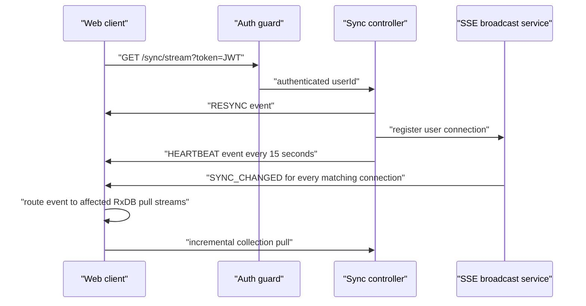

# SSE Resync Broadcast

## Purpose

The SSE resync broadcast protocol tells connected browsers which RxDB collections must pull canonical server state after a mutation. It covers both local-first sync pushes and server-authoritative REST mutations.

The protocol prioritizes convergence over avoiding a redundant pull. A client that writes a change still receives the corresponding `SYNC_CHANGED` event because the server can add or restore canonical fields that are absent from the push response. All connections for that user, including other tabs and devices, receive the event.

## Ownership and Scope

- `SseBroadcastService` is the single, app-wide connection registry. It is provided by global `SharedModule`; feature modules and `SyncModule` consume that provider and must not register another provider instance.
- `SseSyncBroadcastService` resolves a store or household to member user IDs, then delegates to `SseBroadcastService`.
- `SyncController` registers the browser's stream connection and broadcasts accepted sync pushes.
- `database.ts` owns one `EventSource` per browser session and routes events to the registered RxDB pull streams.
- The connection registry is in-memory and process-local. A multi-process deployment needs a shared pub/sub transport such as Redis.

## Event Contract

| Event | Server payload | Client action |
|---|---|---|
| `RESYNC` | `{}` | Pull every registered collection. Sent immediately after connecting. |
| `SYNC_CHANGED` | `{ collections: SyncCollection[], reason: string }` | Pull only the named collections. Malformed, empty, or missing `collections` falls back to every collection. |
| `HEARTBEAT` | `{}` | Reset the SSE inactivity watchdog. No pull. Sent every 15 seconds. |
| `HOUSEHOLD_REMOVED` | `{ householdId: string }` | Remove that household and its subtree from local RxDB. |

`EventSource` does not surface SSE comment frames to application code. The server therefore sends a named `HEARTBEAT` event instead of `: heartbeat` comments. The client watchdog is 20 seconds; a healthy 15-second heartbeat prevents false reconnects and the full `RESYNC` pulls they would otherwise cause.

## Connection Lifecycle


```mermaid
sequenceDiagram
    participant C as "Web client"
    participant A as "Auth guard"
    participant S as "Sync controller"
    participant B as "SSE broadcast service"

    C->>A: "GET /sync/stream?token=JWT"
    A->>S: "authenticated userId"
    S->>C: "RESYNC event"
    S->>B: "register user connection"
    S->>C: "HEARTBEAT event every 15 seconds"
    B->>C: "SYNC_CHANGED for every matching connection"
    C->>C: "route event to affected RxDB pull streams"
    C->>S: "incremental collection pull"
```

`register(userId, response)` stores a response in `Map<userId, Set<Response>>` and returns a cleanup callback. The controller calls the callback and clears the heartbeat interval when the HTTP response closes. A user can have any number of connections; a broadcast writes to each response in that user's set.

## Broadcast Semantics

### Sync pushes

After an accepted `item` or `listItem` push, `SyncController` resolves the affected household members and broadcasts:

```text
SYNC_CHANGED { collections: [pushedCollection], reason: "<collection>.push" }
```

The pusher is included. This is deliberate:

- another tab or device for the same user must converge;
- server-generated fields, restore-on-create behavior, and canonical conflict results can require a pull even for the originating client;
- collection scoping confines this reconciliation to one pull stream rather than forcing every collection to pull.

### REST mutations and manifests

`apps/server/src/shared/sync-change.ts` defines the typed `SYNC_CHANGE` manifests. A manifest is a correctness contract: it lists every replicated document type the operation can mutate directly or indirectly. Services must use these constants instead of inline arrays.

| Operation class | Manifest |
|---|---|
| Store create or update | `store` |
| Store soft-delete cascade | `store`, `section`, `item`, `list`, `listItem` |
| Section create, update, or reorder | `section` |
| Section delete with item reassignment | `section`, `item` |
| Catalog item update | `item` |
| List create, start shopping, or cancel shopping | `list` |
| List-item add or restore, including catalog-item creation or update | `item`, `listItem` |
| List-item toggle, quantity update, or soft-delete | `listItem` |
| List completion with catalog purchase-stat updates | `list`, `item`, `listItem` |
| Household create, rename, leave, or member removal | `household` |
| Household soft-delete cascade or invitation join | all replicated collections |

The local REST mutation hooks issue the same immediate resyncs for cascade and side-effect operations. SSE remains the source of remote-client convergence and the recovery path for a missed local resync.

## Failure and Recovery Model

- Broadcast writes are fire-and-forget and are not retried. A disconnected client catches up from its initial `RESYNC` after reconnecting.
- `EventSource` errors close the source, start the 5-second periodic pull fallback, and schedule a reconnect.
- When the source opens, periodic fallback polling stops.
- When the tab becomes hidden, the client closes the source and starts fallback polling. When visible again, it performs an all-collection resync and reopens the source.
- The client treats malformed `SYNC_CHANGED` payloads as a safe all-collection resync rather than silently leaving data stale.

## Sync Access Query Memoization

`SyncService` is a singleton. Each `pull()` or `push()` therefore creates a fresh dependency object with an operation-local cache for accessible store and household IDs. Calls repeated within that one operation share a promise; concurrent operations do not clear, reuse, or evict one another's cache entries.

## Security

The standard API uses bearer authorization. The SSE endpoint additionally accepts a JWT query parameter because browser `EventSource` cannot attach custom headers. Query-token handling is restricted to the sync stream fallback in `AuthGuard`; it must not be extended to other endpoints.

## Tests

- `apps/server/test/sync/sse-broadcast.spec.ts` verifies fan-out to every household member and every same-user connection.
- `apps/server/test/sync/sse-notify.spec.ts` verifies push delivery to the pusher and REST manifests for store cascades, section reassignment, list-item catalog effects, and list completion effects.
- `apps/server/test/sync/sync.service.spec.ts` verifies within-operation memoization and independent overlapping operation caches.
- `apps/web/src/core/rxdb/__tests__/sync-stream.test.ts` verifies collection routing, defensive fallback routing, registration replacement semantics, and heartbeat watchdog behavior with fake timers.

## Non-Goals

- Cross-process fan-out or durable event replay.
- Per-connection self-notify suppression. Implementing it safely requires a client connection ID and proof that the push response contains every canonical server mutation.
- Backpressure management or retrying failed response writes.
- An end-to-end multi-browser suite. The server integration and web stream tests cover the protocol; a manual two-tab check remains useful before a release that changes this transport.
